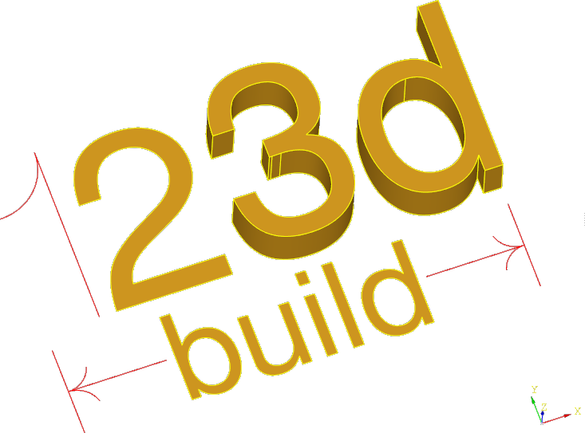

build123d is an alternate to the [CadQuery](https://cadquery.readthedocs.io/en/latest/index.html)
Fluent API. It has several advantages over this API but the largest one is that build123d
enables the full python toolbox when designing objects - for loops, references to objects,
list sorting and filtering, etc. - unconstrained by the limitations of method chaining
used in CadQuery 2.x.

The documentation for **build123d** can found at [readthedocs](https://build123d.readthedocs.io/en/latest/index.html).

To install **build123d** from github:
```
python3 -m pip install git+https://github.com/gumyr/build123d.git#egg=build123d
```