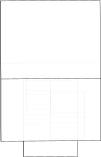
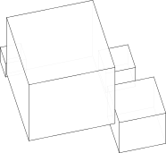
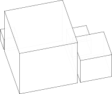

.. _assembly:

##########
Assemblies
##########

Most CAD designs consist of more than one part which are naturally arranged in
some type of assembly. Once parts have been assembled in a :class:`~topology.Compound` object
they can be treated as a unit - i.e. :meth:`~topology.Shape.moved` or exported.

To create an assembly in build123d, one needs to
create a tree of parts by simply assigning either a :class:`~topology.Compound` object's ``parent`` or
``children`` attributes. To illustrate the process, we'll extend the
:ref:`Joint Tutorial <joint_tutorial>`.

****************
Assigning Labels
****************

In order keep track of objects one can assign a ``label`` to all :class:`~topology.Shape` objects.
Here we'll assign labels to all of the components that will be part of the box
assembly:

.. literalinclude:: tutorial_joints.py
    :start-after: [Add labels]
    :end-before: [Create assembly]

The labels are just strings with no further limitations (they don't have to be unique
within the assembly).

****************************
Create the Assembly Compound
****************************

Creation of the assembly is done by simply creating a :class:`~topology.Compound` object and assigning
appropriate ``parent`` and ``children`` attributes as shown here:

.. literalinclude:: tutorial_joints.py
    :start-after: [Create assembly]
    :end-before: [Display assembly]

To display the topology of an assembly :class:`~topology.Compound`, the :meth:`~topology.Shape.show_topology`
method can be used as follows:

.. literalinclude:: tutorial_joints.py
    :start-after: [Display assembly]
    :end-before: [Add to the assembly by assigning the parent attribute of an object]

which results in:

.. code::

        assembly        Compound at 0x7fc8ee235760, Location(p=(0, 0, 0), o=(-0, 0, -0))
        ├── box         Compound at 0x7fc8ee2188b0, Location(p=(0, 0, 50), o=(-0, 0, -0))
        ├── lid         Compound at 0x7fc8ee228460, Location(p=(-26, 0, 181), o=(-180, 30, -0))
        ├── inner hinge Hinge    at 0x7fc9292c3f70, Location(p=(-119, 60, 122), o=(90, 0, -150))
        └── outer hinge Hinge    at 0x7fc9292c3f40, Location(p=(-150, 60, 50), o=(90, 0, 90))

To add to an assembly :class:`~topology.Compound` one can change either ``children`` or ``parent`` attributes.

.. literalinclude:: tutorial_joints.py
    :start-after: [Add to the assembly by assigning the parent attribute of an object]
    :end-before: [Check that the components in the assembly don't intersect]

and now the screw is part of the assembly.

.. code::

        assembly        Compound at 0x7fc8ee235760, Location(p=(0, 0, 0), o=(-0, 0, -0))
        ├── box         Compound at 0x7fc8ee2188b0, Location(p=(0, 0, 50), o=(-0, 0, -0))
        ├── lid         Compound at 0x7fc8ee228460, Location(p=(-26, 0, 181), o=(-180, 30, -0))
        ├── inner hinge Hinge    at 0x7fc9292c3f70, Location(p=(-119, 60, 122), o=(90, 0, -150))
        ├── outer hinge Hinge    at 0x7fc9292c3f40, Location(p=(-150, 60, 50), o=(90, 0, 90))
        └── M6 screw    Compound at 0x7fc8ee235310, Location(p=(-157, -40, 70), o=(-0, -90, -60))

.. _shallow_copy:

*********************************
Shallow vs. Deep Copies of Shapes
*********************************

Build123d supports the standard python ``copy`` module which provides two different types of
copy operations ``copy.copy()`` and ``copy.deepcopy()``.

Build123d's implementation of ``deepcopy()`` for the :class:`~topology.Shape` class (e.g. ``Solid``, ``Face``, etc.)
does just that, creates a complete copy of the original  all the way down to the CAD object.
``deepcopy`` is therefore suited to the case where the copy will be subsequently modified to
become its own unique item.

However, when building an assembly a common use case is to include many instances of an
object, each one identical but in a different location. This is where ``copy.copy()`` is
very useful as it copies all of the :class:`~topology.Shape` except for the actual CAD object
which instead is a reference to the original (OpenCascade refers this as a ``TShape``). As
it's a reference any changes to the original will be seen in all of the shallow copies.

Consider this example where 100 screws are added to an assembly:

.. image:: reference_assembly.svg
    :align: center

.. code::

    screw = import_step("M6-1x12-countersunk-screw.step")
    locs = HexLocations(6, 10, 10).local_locations

    screw_copies = [copy.deepcopy(screw).locate(loc) for loc in locs]
    copy_assembly = Compound(children=screw_copies)
    export_step(copy_assembly, "copy_assembly.step")

which takes about 5 seconds to run (on an older computer) and produces
a file of size 51938 KB. However, if a shallow copy is used instead:

.. code::

    screw = import_step("M6-1x12-countersunk-screw.step")
    locs = HexLocations(6, 10, 10).local_locations

    screw_references = [copy.copy(screw).locate(loc) for loc in locs]
    reference_assembly = Compound(children=screw_references)
    export_step(reference_assembly, "reference_assembly.step")

this takes about ¼ second and produces a file of size 550 KB - just over
1% of the size of the ``deepcopy()`` version and only 12% larger than the
screw's step file.

Using ``copy.copy()`` to create references to the original CAD object
for assemblies can substantially reduce the time and resources used
to create and store that assembly.

************************
Shapes are Anytree Nodes
************************

The build123d assembly constructs are built using the python
`anytree <https://anytree.readthedocs.io/en/latest/>`_ package by making the build123d
:class:`~topology.Shape` class a sub-class of anytree's ``NodeMixin`` class. Doing so
adds the following attributes to :class:`~topology.Shape`:

* ``parent`` - Parent Node. On set, the node is detached from any previous parent node and attached to the new node.
* ``children`` - Tuple of all child nodes.
* ``path`` - Path of this ``Node``.
* ``iter_path_reverse`` - Iterate up the tree from the current node.
* ``ancestors`` - All parent nodes and their parent nodes.
* ``descendants`` - All child nodes and all their child nodes.
* ``root`` - Tree Root Node.
* ``siblings`` - Tuple of nodes with the same parent.
* ``leaves`` - Tuple of all leaf nodes.
* ``is_leaf`` - ``Node`` has no children (External Node).
* ``is_root`` - ``Node`` is tree root.
* ``height`` - Number of edges on the longest path to a leaf ``Node``.
* ``depth`` - Number of edges to the root ``Node``.

.. note::

    Changing the ``children`` attribute

    Any iterator can be assigned to the ``children`` attribute but subsequently the children
    are stored as immutable ``tuple`` objects.  To add a child to an existing :class:`~topology.Compound`
    object, the ``children`` attribute will have to be reassigned.

    .. _pack:

******
pack
******

The  :meth:`pack.pack` function arranges objects in a compact, non-overlapping layout within a square(ish) 2D area. It is designed to minimize the space between objects while ensuring that no two objects overlap.

.. py:module:: pack

.. autofunction:: pack

Detailed Description
---------------------

The ``pack`` function uses a bin-packing algorithm to efficiently place objects within a 2D plane, ensuring that there is no overlap and that the space between objects is minimized. This is particularly useful in scenarios where spatial efficiency is crucial, such as layout design and object arrangement in constrained spaces.

The function begins by calculating the bounding boxes for each object, including the specified padding. It then uses a helper function ``_pack2d`` to determine the optimal positions for each object within the 2D plane. The positions are then translated back to the original objects, ensuring that they are arranged without overlapping.

Usage Note
----------

The ``align_z`` parameter is especially useful when creating print-plates for 3D printing. By aligning the bottoms of the shapes to the same XY plane, you ensure that the objects are perfectly positioned for slicing software, which will no longer need to perform this alignment for you. This can streamline the process and improve the accuracy of the print setup.

Example Usage
-------------

.. code:: python

    # [import]
    from build123d import *
    from ocp_vscode import *

    # [initial space]
    b1 = Box(100, 100, 100, align=(Align.CENTER, Align.CENTER, Align.MIN))
    b2 = Box(54, 54, 54, align=(Align.CENTER, Align.CENTER, Align.MAX), mode=Mode.SUBTRACT)
    b3 = Box(34, 34, 34, align=(Align.MIN, Align.MIN, Align.CENTER), mode=Mode.SUBTRACT)
    b4 = Box(24, 24, 24, align=(Align.MAX, Align.MAX, Align.CENTER), mode=Mode.SUBTRACT)

.. code:: python

    # [pack 2D]

    xy_pack = pack(
        [b1, b2, b3, b4],
        padding=5,
        align_z=False
    )

.. code:: python

    # [Pack and align_z]

    z_pack = pack(
        [b1, b2, b3, b4],
        padding=5,
        align_z=True
    )

Tip
---

If you place the arranged objects into a ``Compound``, you can easily determine their bounding box and check whether the objects fit on your print bed.

.. code:: python

    # [bounding box]
    print(Compound(xy_pack).bounding_box())
    # bbox: 0.0 <= x <= 159.0, 0.0 <= y <= 129.0, -54.0 <= z <= 100.0
    
    print(Compound(z_pack).bounding_box())
    # bbox: 0.0 <= x <= 159.0, 0.0 <= y <= 129.0, 0.0 <= z <= 100.0
