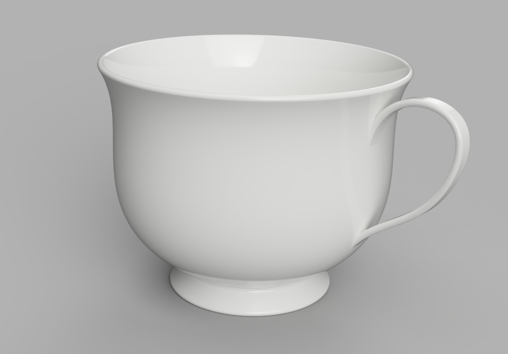

#########
BuildPart
#########

BuildPart is a python context manager that is used to create three dimensional
objects - objects with the property of volume - that are typically
finished parts.

The complete API for BuildPart is located at the end of this section.

*******************
Basic Functionality
*******************

The following is a simple BuildPart example:

.. literalinclude:: general_examples.py
    :start-after: [Ex. 2]
    :end-before: [Ex. 2]

The ``with`` statement creates the ``BuildPart`` context manager with the
identifier ``ex2`` (this code is the second of the introductory examples).
The objects and operations that are within the
scope (i.e. indented) of this context will contribute towards the object
being created by the context manager.  For ``BuildPart``, this object is
``part`` and it's referenced as ``ex2.part``.

The first object in this example is a ``Box`` object which is used to create
a polyhedron with rectangular faces centered on the default ``Plane.XY``.
The second object is a ``Cylinder`` that is subtracted from the box as directed
by the ``mode=Mode.SUBTRACT`` parameter thus creating a hole.

.. image:: assets/general_ex2.svg
    :align: center

*******************
Implicit Parameters
*******************

The BuildPart context keeps track of pending objects such that they can be used
implicitly - there are a couple things to consider when deciding how to proceed:

* For sketches, the planes that they were constructed on is maintained in internal
  data structures such that operations like :func:`~operations_part.extrude` will
  have a good reference for the extrude direction.  One can pass a Face to extrude
  but it will then be forced to use the normal direction at the center of the Face
  as the extrude direction which unfortunately can be reversed in some circumstances.
* Implicit parameters save some typing but hide some functionality - users have
  to decide what works best for them.

This tea cup example uses implicit parameters - note the :func:`~operations_generic.sweep`
operation on the last line:

.. literalinclude:: ../examples/tea_cup.py
    :start-after: [Code]
    :end-before: [End]
    :emphasize-lines: 52

:func:`~operations_generic.sweep` requires a 2D cross section - ``handle_cross_section`` -
and a path - ``handle_path`` - which are both passed implicitly.

*****
Units
*****

Parts created with build123d have no inherent units associated with them. However, when
exporting parts to external formats like ``STL`` or ``STEP`` the units are assumed to
be millimeters (mm).  To be more explicit with units one can use the technique shown
in the above tea cup example where linear dimensions are followed by ``* MM`` which
multiplies the dimension by the ``MM`` scaling factor - in this case ``1``.

The following dimensional constants are pre-defined:

.. code:: python

    MM = 1
    CM = 10 * MM
    M = 1000 * MM
    IN = 25.4 * MM
    FT = 12 * IN
    THOU = IN / 1000

Some export formats like DXF have the ability to explicitly set the units used.

*********
Reference
*********

.. py:module:: build_part

.. autoclass:: BuildPart
    :members:
