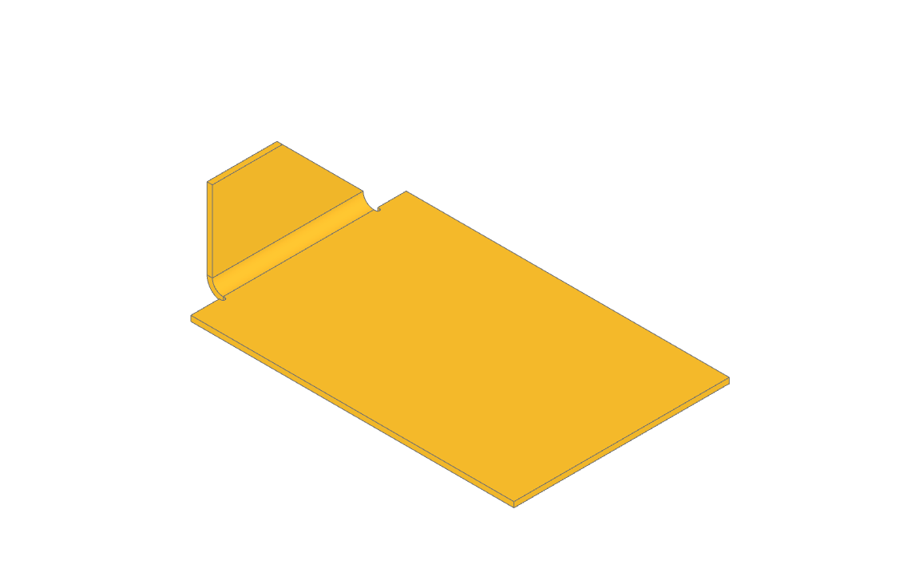

##########
BuildSheet
##########

The ``BuildSheet`` context is used to create sheet metal parts — parts of
constant material thickness formed by folding a flat sheet.

.. image:: assets/sheet_metal_box.png
    :align: center

.. code-block:: python

    with BuildSheet(thickness=1, bend_radius=2) as tray:
        with BuildSketch():
            Rectangle(100, 60)
        bottom_edges = tray.faces().sort_by(Axis.Z)[0].edges().filter_by(GeomType.LINE)
        flange(bottom_edges, length=15, gap1=3.1, gap2=3.1)

*****************
Base sheet
*****************

Closed sketch regions exiting into ``BuildSheet`` are automatically padded
by ``thickness`` — no explicit ``extrude`` is needed. ``Mode.SUBTRACT``
regions cut holes. For open profiles (brake-formed parts) use
:func:`~operations_part.make_brake_formed` with a ``BuildLine`` profile;
note it takes an explicit ``thickness`` and requires bend arcs to be drawn
into the profile (e.g. with ``FilletPolyline``).

*****************
Folding
*****************

:func:`~operations_sheet.flange` folds a wall up from selected sheet
edges; :func:`~operations_sheet.hem` folds an edge back onto itself
(flat, open, teardrop or rolled). Both fold **away from the sheet face**
the selected edge borders: select a bottom-face edge to fold upward.

*******************************
Reliefs, miters and extends
*******************************

Real flanges need corner treatment. ``flange`` provides three tools, all
off by default:

.. code-block:: python

    with BuildSheet(thickness=1, bend_radius=2) as bracket:
        with BuildSketch():
            Rectangle(60, 40)
        edge = bracket.faces().sort_by(Axis.Z)[0].edges().sort_by(Axis.X)[0]
        flange(
            edge,
            length=15,
            gap1=6,
            gap2=6,
            relief=ReliefType.ROUND,     # notch so the fold doesn't tear
            miter_angle2=45,             # angled end-cut on the free end
        )

* ``relief`` / ``relief_size`` cut a bend relief notch into the base sheet
  at each gapped end — ``ReliefType.RECTANGLE`` or ``ReliefType.ROUND``,
  sized ``(width, depth)`` and defaulting to ``0.7 x thickness``.
* ``miter_angle1`` / ``miter_angle2`` cut the wall's free end at an angle
  (positive trims inward, negative widens), for corners where two flanges
  meet.
* ``extend1`` / ``extend2`` widen the flat wall beyond the edge ends; the
  bend itself keeps the gapped width.

``extrude``, ``fillet``, ``chamfer``, ``add`` and ``mirror`` also work
inside ``BuildSheet`` — cuts that cross bends (slots through a folded
leg) are plain ``extrude(..., mode=Mode.SUBTRACT)`` calls. Note that
sketches exiting into ``BuildSheet`` are consumed as base-sheet regions,
so build the profile for an ``extrude`` with ``mode=Mode.PRIVATE`` and
pass it explicitly. For ``add``, solids fuse normally, but Face objects
are rejected — create base-sheet regions with ``BuildSketch`` instead. See
``docs/assets/ttt/ttt-23-02-02-sm_hanger_buildsheet.py`` for a complete
part built this way next to its pre-BuildSheet equivalent.

*****************
Bend topology
*****************

Sheet metal parts keep every bend's cylindrical faces and their flat
"fan" shaped end-caps as separate faces — they are deliberately never
unified. This preserved topology is what future unfolding tools use to
detect bends and compute flat patterns (with the ``k_factor`` stored on
the builder). For this reason **do not call** ``clean()`` on a sheet
metal part.

*****************
Reference
*****************

.. py:module:: build_sheet

.. autoclass:: BuildSheet
    :members:

.. autofunction:: operations_sheet.flange

.. autofunction:: operations_sheet.hem
