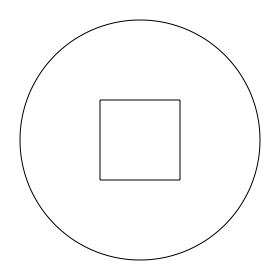
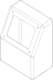

###########
BuildSketch
###########

BuildSketch is a python context manager that is used to create planar two dimensional
objects - objects with the property of area but not volume - that are typically
used as profiles for BuildPart operations like :func:`~operations_part.extrude` or
:func:`~operations_part.revolve`.

The complete API for BuildSketch is located at the end of this section.

*******************
Basic Functionality
*******************

The following is a simple BuildSketch example:

.. literalinclude:: objects_2d.py
    :start-after: [Ex. 13]
    :end-before: [Ex. 13]

The ``with`` statement creates the ``BuildSketch`` context manager with the
identifier ``circle_with_hole``. The objects and operations that are within the
scope (i.e. indented) of this context will contribute towards the object
being created by the context manager.  For ``BuildSketch``, this object is
``sketch`` and it's referenced as ``circle_with_hole.sketch``.

The first object in this example is a ``Circle`` object which is used to create
a filled circular shape on the default XY plane. The second object is a ``Rectangle``
that is subtracted from the circle as directed by the ``mode=Mode.SUBTRACT`` parameter.
A key aspect of sketch objects is that they are all filled shapes and not just
a shape perimeter which enables combining subsequent shapes with different modes
(the valid values of Mode are ``ADD``, ``SUBTRACT``, ``INTERSECT``, ``REPLACE``,
and ``PRIVATE``).

.. _sketching_on_other_planes:

*************************
Sketching on other Planes
*************************

Often when designing parts one needs to build on top of other features.  To facilitate
doing this ``BuildSketch`` allows one to create sketches on any Plane while allowing
the designer to work in a local X, Y coordinate system. It might be helpful to think
of what is happening with this metaphor:

#. When instantiating ``BuildSketch`` one or more workplanes can be passed as parameters.
   These are the placement targets for the completed sketch.
#. The designer draws on a flat "drafting table" which is ``Plane.XY``.
#. Once the sketch is complete, it's applied like a sticker to all of the workplanes
   passed in step 1.

As an example, let's build the following simple control box with a display on an angled plane:

Here is the code:

.. literalinclude:: objects_2d.py
    :start-after: [Ex. 14]
    :end-before: [Ex. 14]
    :emphasize-lines: 14-25

The highlighted part of the code shows how a face is extracted from the design,
a workplane is constructed from this face and finally this workplane is passed
to ``BuildSketch`` as the target for the complete sketch.  Notice how the
``display`` sketch uses local coordinates for its features thus avoiding having
the user to determine how to move and rotate the sketch to get it where it
should go.

Note that ``BuildSketch`` accepts a sequence planes, faces and locations for
workplanes so creation of an explicit workplane is often not required. Being
able to work on multiple workplanes at once allows for features to be created
on multiple side of an object - say both the top and bottom - which is convenient
for symmetric parts.

*************************
Local vs. Global Sketches
*************************

In the above example the target for the sketch was not ``Plane.XY`` but a workplane
passed by the user.  Internally ``BuildSketch`` is always creating the sketch
on ``Plane.XY`` which one can see by looking at the ``sketch_local`` property of your
sketch.  For example, to display the local version of the ``display`` sketch from
above, one would use:

.. code-block:: python

    show_object(display.sketch_local, name="sketch on Plane.XY")

while the sketches as applied to their target workplanes is accessible through
the ``sketch`` property, as follows:

.. code-block:: python

    show_object(display.sketch, name="sketch on target workplane(s)")

When using the :func:`~operations_generic.add` operation to add an external Face
to a sketch the face will automatically be reoriented to ``Plane.XY`` before being
combined with the sketch.  As Faces don't provide an x-direction it's possible
that the new Face may not be oriented as expected. To reorient the Face manually
to ``Plane.XY`` one can use the :meth:`~geometry.to_local_coords` method as
follows:

.. code-block:: python

    reoriented_face = plane.to_local_coords(face)

where ``plane`` is the plane that ``face`` was constructed on.

*****************
Locating Features
*****************

Within a sketch features are positioned with ``Locations`` contexts
(see :ref:`Location Context <location_context_link>`) on the current workplane(s). The following
location contexts are available within a sketch:

* :class:`~build_common.GridLocations` : a X/Y grid of locations
* :class:`~build_common.HexLocations` : a hex grid of locations ideal for nesting circles
* :class:`~build_common.Locations` : a sequence of arbitrary locations
* :class:`~build_common.PolarLocations` : locations defined by radius and angle

Generally one would specify tuples of (X, Y) values when defining locations but
there are many options available to the user.

*********
Reference
*********

.. py:module:: build_sketch

.. autoclass:: BuildSketch
    :members:
