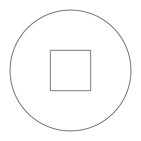
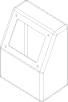

###########
BuildSketch
###########

BuildSketch is a python context manager that is used to create planar two dimensional
objects - objects with the property of area but not volume - that are typically
used as profiles for BuildPart operations like :func:`~operations_part.extrude` or
:func:`~operations_part.revolve`.

The complete API for BuildSketch is located at the end of this section.

*******************
Basic Functionality
*******************

The following is a simple BuildSketch example:

.. literalinclude:: objects_2d.py
    :language: build123d
    :start-after: [Ex. 13]
    :end-before: [Ex. 13]

The ``with`` statement creates the ``BuildSketch`` context manager with the
identifier ``circle_with_hole``. The objects and operations that are within the
scope (i.e. indented) of this context will contribute towards the object
being created by the context manager.  For ``BuildSketch``, this object is
``sketch`` and it's referenced as ``circle_with_hole.sketch``.

The first object in this example is a ``Circle`` object which is used to create
a filled circular shape on the default XY plane. The second object is a ``Rectangle``
that is subtracted from the circle as directed by the ``mode=Mode.SUBTRACT`` parameter.
A key aspect of sketch objects is that they are all filled shapes and not just
a shape perimeter which enables combining subsequent shapes with different modes
(the valid values of Mode are ``ADD``, ``SUBTRACT``, ``INTERSECT``, ``REPLACE``,
and ``PRIVATE``).

.. _sketching_on_other_planes:

*************************
Sketching on other Planes
*************************

Often when designing parts one needs to build on top of other features.  To facilitate
doing this ``BuildSketch`` allows one to publish sketches to any placement while
allowing the designer to work in a local X, Y coordinate system. It might be
helpful to think of what is happening with this metaphor:

#. When instantiating ``BuildSketch`` one or more placements can be passed as parameters.
   These are the placement targets for the completed sketch.
#. The designer draws on a flat "drafting table" which is ``Plane.XY``.
#. Once the sketch is complete, it's applied like a sticker to all of the placements
   passed in step 1.

As an example, let's build the following simple control box with a display on an angled plane:

Here is the code:

.. literalinclude:: objects_2d.py
    :language: build123d
    :start-after: [Ex. 14]
    :end-before: [Ex. 14]
    :emphasize-lines: 14-25

The highlighted part of the code shows how a face is extracted from the design,
a placement is constructed from this face and finally this placement is passed
to ``BuildSketch`` as the target for the complete sketch.  Notice how the
``display`` sketch uses local coordinates for its features thus avoiding having
the user to determine how to move and rotate the sketch to get it where it
should go.

Note that ``BuildSketch`` accepts a sequence of planes, faces, and locations for
placements so creation of an explicit ``Plane`` is often not required. Being
able to publish to multiple placements at once allows for features to be created
on multiple sides of an object - say both the top and bottom - which is convenient
for symmetric parts.

*************************
Local vs. Global Sketches
*************************

In the above example the target for the sketch was not ``Plane.XY`` but a placement
passed by the user.  Internally ``BuildSketch`` is always creating the sketch
on ``Plane.XY`` which one can see by looking at the ``sketch_local`` property of your
sketch.  For example, to display the local version of the ``display`` sketch from
above, one would use:

.. code-block:: build123d

    show_object(display.sketch_local, name="sketch on Plane.XY")

while the sketches as applied to their target placements is accessible through
the ``sketch`` property, as follows:

.. code-block:: build123d

    show_object(display.sketch, name="sketch on target placement(s)")

``Locations`` contexts outside a ``BuildSketch`` apply to the completed sketch
when the builder publishes its output. For example:

.. code-block:: build123d

    with GridLocations(20, 20, 2, 2):
        with BuildSketch() as repeated:
            Rectangle(8, 4)

    show_object(repeated.sketch_local, name="one local rectangle")
    show_object(repeated.sketch, name="four placed rectangles")

The ``repeated.sketch_local`` property contains one rectangle on local
``Plane.XY`` while ``repeated.sketch`` contains the four rectangles placed by
the enclosing ``GridLocations`` context.

When using the :func:`~operations_generic.add` operation to add an external Face
to a sketch the face will automatically be reoriented to ``Plane.XY`` before being
combined with the sketch.  As Faces don't provide an x-direction it's possible
that the new Face may not be oriented as expected. To reorient the Face manually
to ``Plane.XY`` one can use the :meth:`~geometry.to_local_coords` method as
follows:

.. code-block:: build123d

    reoriented_face = plane.to_local_coords(face)

where ``plane`` is the plane that ``face`` was constructed on.

*****************
Locating Features
*****************

Within a sketch features are positioned with ``Locations`` contexts
(see :ref:`Location Context <location_context_link>`) in local sketch coordinates.
The following location contexts are available within a sketch:

* :class:`~build_common.GridLocations` : a X/Y grid of locations
* :class:`~build_common.HexLocations` : a hex grid of locations ideal for nesting circles
* :class:`~build_common.Locations` : a sequence of arbitrary locations
* :class:`~build_common.PolarLocations` : locations defined by radius and angle

Generally one would specify tuples of (X, Y) values when defining locations but
there are many options available to the user.

*********
Reference
*********

.. py:module:: build_sketch

.. autoclass:: BuildSketch
    :members:
