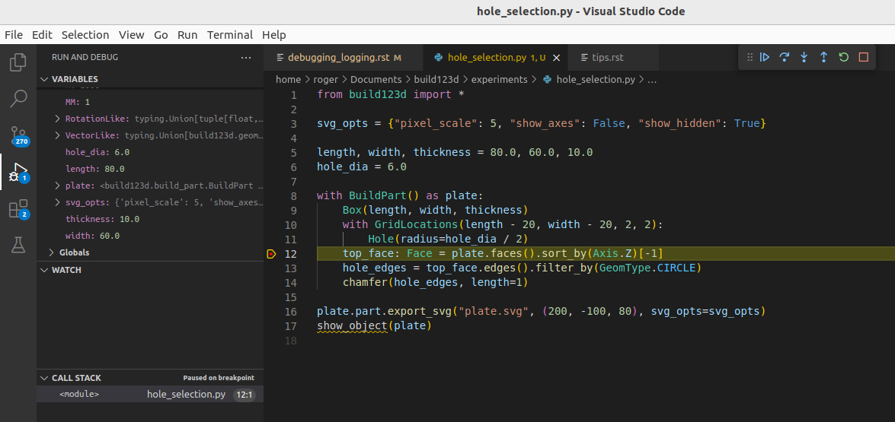

###################
Debugging & Logging
###################

Debugging problems with your build123d design involves the same techniques
one would use to debug any Python source code; however, there are some
specific techniques that might be of assistance.  The following sections
describe these techniques.

***************
Python Debugger
***************

Many Python IDEs have step by step debugging systems that can be used to
walk through your code monitoring its operation with full visibility
of all Python objects.  Here is a screenshot of the Visual Studio Code
debugger in action:

This shows that a break-point has been encountered and the code operation
has been stopped.  From here all of the Python variables are visible and
the system is waiting on input from the user on how to proceed.  One can
enter the code that assigns ``top_face`` by pressing the down arrow button
on the top right. Following code execution like this is a very powerful
debug technique.

*******
Logging
*******

Build123d support standard python logging and generates its own log stream.
If one is using **cq-editor** as a display system there is a built in
``Log viewer`` tab that shows the current log stream - here is an example
of a log stream:

.. code-block:: bash

    [18:43:44.678646] INFO: Entering BuildPart with mode=Mode.ADD which is in different scope as parent
    [18:43:44.679233] INFO: WorkplaneList is pushing 1 workplanes: [Plane(o=(0.00, 0.00, 0.00), x=(1.00, 0.00, 0.00), z=(0.00, 0.00, 1.00))]
    [18:43:44.679888] INFO: LocationList is pushing 1 points: [(p=(0.00, 0.00, 0.00), o=(-0.00, 0.00, -0.00))]
    [18:43:44.681751] INFO: BuildPart context requested by Box
    [18:43:44.685950] INFO: Completed integrating 1 object(s) into part with Mode=Mode.ADD
    [18:43:44.690072] INFO: GridLocations is pushing 4 points: [(p=(-30.00, -20.00, 0.00), o=(-0.00, 0.00, -0.00)), (p=(-30.00, 20.00, 0.00), o=(-0.00, 0.00, -0.00)), (p=(30.00, -20.00, 0.00), o=(-0.00, 0.00, -0.00)), (p=(30.00, 20.00, 0.00), o=(-0.00, 0.00, -0.00))]
    [18:43:44.691604] INFO: BuildPart context requested by Hole
    [18:43:44.724628] INFO: Completed integrating 4 object(s) into part with Mode=Mode.SUBTRACT
    [18:43:44.728681] INFO: GridLocations is popping 4 points
    [18:43:44.747358] INFO: BuildPart context requested by chamfer
    [18:43:44.762429] INFO: Completed integrating 1 object(s) into part with Mode=Mode.REPLACE
    [18:43:44.765380] INFO: LocationList is popping 1 points
    [18:43:44.766106] INFO: WorkplaneList is popping 1 workplanes
    [18:43:44.766729] INFO: Exiting BuildPart

The build123d logger is defined by:

.. code-block:: python

    logging.getLogger("build123d").addHandler(logging.NullHandler())
    logger = logging.getLogger("build123d")

To export logs to a file, the following configuration is recommended:

.. code-block:: python

    logging.basicConfig(
        filename="myapp.log",
        level=logging.INFO,
        format="%(name)s-%(levelname)s %(asctime)s - [%(filename)s:%(lineno)s - \
        %(funcName)20s() ] - %(message)s",
    )

Logs can be easily placed in your code - here is an example:

.. code-block:: python

    logger.info("Exiting %s", type(self).__name__)

********
Printing
********

Sometimes the best debugging aid is just placing a print statement in your code. Many
of the build123d classes are setup to provide useful information beyond their class and
location in memory, as follows:

.. code-block:: python

    plane = Plane.XY.offset(1)
    print(f"{plane=}")

.. code-block:: bash

    plane=Plane(o=(0.00, 0.00, 1.00), x=(1.00, 0.00, 0.00), z=(0.00, 0.00, 1.00))

which shows the origin, x direction, and z direction of the plane.
