#######################
The build123d Examples
#######################
.. |siren| replace:: 🚨 
.. |Builder| replace:: 🔨
.. |Algebra| replace:: ✏️ 

Overview
--------------------------------

In the GitHub repository you will find an `examples folder <https://github.com/42sol-eu/build123d/tree/examples>`_.

Most of the examples show the builder and algebra modes.

.. ----------------------------------------------------------------------------------------------
.. Index Section
.. ----------------------------------------------------------------------------------------------

.. grid:: 3

    .. grid-item-card:: Benchy |Builder|
        :img-top:  assets/examples/thumbnail_benchy_01.png
        :link: examples-benchy
        :link-type: ref

    .. grid-item-card:: Circuit Board With Holes |Builder| |Algebra| 
            :img-top: assets/examples/thumbnail_circuit_board_01.png
            :link: examples-canadian_flag
            :link-type: ref
        
    .. grid-item-card:: Canadian Flag Blowing in The Wind |Builder| |Algebra| 
            :img-top: assets/examples/example_canadian_flag_01.png
            :link: examples-circuit_board
            :link-type: ref

    .. grid-item-card:: Clock Face |Builder| |Algebra| 
            :img-top: assets/examples/clock_face.png
            :link: clock_face
            :link-type: ref

    .. grid-item-card:: Handle |Builder| |Algebra|
            :img-top: assets/examples/handle.png
            :link: handle
            :link-type: ref

    .. grid-item-card:: Heat Exchanger |Builder| |Algebra|
            :img-top: assets/examples/heat_exchanger.png
            :link: heat_exchanger
            :link-type: ref

    .. grid-item-card:: Key Cap |Builder| |Algebra|
            :img-top: assets/examples/key_cap.png
            :link: key_cap
            :link-type: ref

    .. grid-item-card:: (former) build123d Logo |Builder| |Algebra|
            :img-top: assets/examples/thumbnail_build123d_logo_01.png
            :link: examples-build123d_logo
            :link-type: ref
    
    .. grid-item-card:: Maker Coin |Builder| 
            :img-top: assets/examples/maker_coin.png
            :link: maker_coin
            :link-type: ref

    .. grid-item-card:: Mini Nuke |Builder| 
            :img-top: assets/examples/mini_nuke.png
            :link: mini_nuke
            :link-type: ref

    .. grid-item-card:: Multi-Sketch Loft |Builder| |Algebra| 
            :img-top: assets/examples/loft.png
            :link: multi_sketch_loft
            :link-type: ref

    .. grid-item-card:: Peg Board J Hook |Builder|  |Algebra| 
            :img-top: assets/examples/peg_board_hook.png
            :link: peg_board_hook
            :link-type: ref

    .. grid-item-card:: Platonic Solids |Algebra| 
            :img-top: assets/examples/platonic_solids.png
            :link: platonic_solids
            :link-type: ref

    .. grid-item-card:: Playing Cards |Builder| 
            :img-top: assets/examples/playing_cards.png
            :link: playing_cards
            :link-type: ref

    .. grid-item-card:: Stud Wall |Algebra| 
            :img-top: assets/examples/stud_wall.png
            :link: stud_wall
            :link-type: ref

    .. grid-item-card:: Tea Cup |Builder| |Algebra| 
            :img-top: assets/examples/tea_cup.png
            :link: tea_cup
            :link-type: ref

    .. grid-item-card:: Vase |Builder| |Algebra| 
            :img-top: assets/examples/vase.png
            :link: vase
            :link-type: ref

.. NOTE 01: insert new example thumbnails above this line

.. TODO: Copy this block to add the example thumbnails here
    .. grid-item-card:: name-of-your-example-with-spaces |Builder| |Algebra|
            :img-top: assets/examples/thumbnail_{name-of-your-example}_01.{extension}
            :link: examples-{name-of-your-example}
            :link-type: ref
   
.. ----------------------------------------------------------------------------------------------
.. Details Section
.. ----------------------------------------------------------------------------------------------

.. _examples-benchy:

Benchy
------
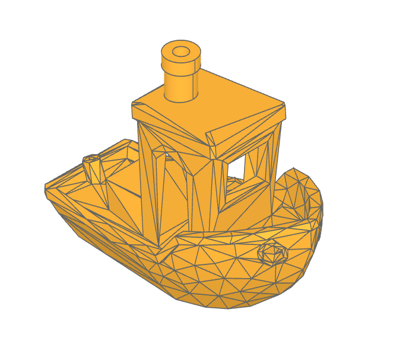

The Benchy examples shows how to import a STL model as a `Solid` object with the class `Mesher` and 
modify it by replacing chimney with a BREP version.

.. note 

     *Attribution:*
     The low-poly-benchy used in this example is by `reddaugherty`, see
     https://www.printables.com/model/151134-low-poly-benchy.

.. dropdown:: Gallery

    .. image:: assets/examples/example_benchy_02.png
        :align: center

    .. image:: assets/examples/example_benchy_03.png
        :align: center

.. dropdown:: |Builder| Reference Implementation (Builder Mode) 

    .. literalinclude:: ../examples/benchy.py
        :start-after: [Code]
        :end-before: [End]

.. ----------------------------------------------------------------------------------------------

.. _examples-build123d_logo:

Former build123d Logo
--------------------------------
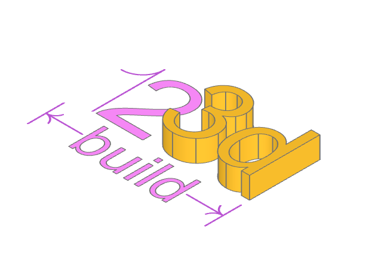

This example creates the former build123d logo (new logo was created in the end of 2023).

Using text and lines to create the first build123d logo. 
The builder mode example also generates the SVG file `logo.svg`.

.. dropdown:: |Builder| Reference Implementation (Builder Mode) 

    .. literalinclude:: ../examples/build123d_logo.py
        :start-after: [Code]
        :end-before: [End]
    
.. dropdown:: |Algebra| Reference Implementation (Algebra Mode) 

    .. literalinclude:: ../examples/build123d_logo_algebra.py
        :start-after: [Code]
        :end-before: [End]

.. _examples-canadian_flag:

Canadian Flag Blowing in The Wind
----------------------------------

A Canadian Flag blowing in the wind created by projecting planar faces onto a non-planar face (the_wind).

This example also demonstrates building complex lines that snap to existing features.

.. dropdown:: More Images

    .. image:: assets/examples/example_canadian_flag_02.png
        :align: center

    .. image:: assets/examples/example_canadian_flag_03.png
        :align: center

.. dropdown:: |Builder| Reference Implementation (Builder Mode) 

    .. literalinclude:: ../examples/canadian_flag.py
        :start-after: [Code]
        :end-before: [End]
    
.. dropdown:: |Algebra| Reference Implementation (Algebra Mode) 

    .. literalinclude:: ../examples/canadian_flag_algebra.py
        :start-after: [Code]
        :end-before: [End]
    

.. _examples-circuit_board:

Circuit Board With Holes
------------------------
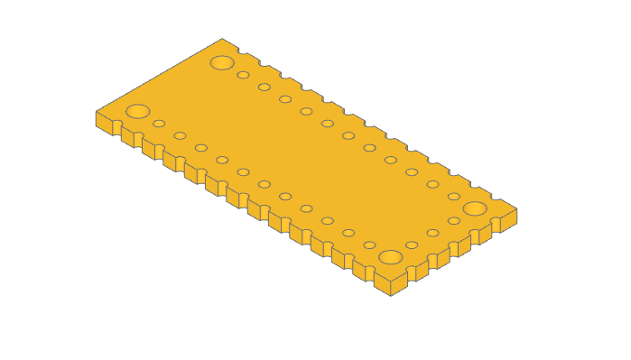

This example demonstrates placing holes around a part.

- Builder mode uses `Locations` context to place the positions.
- Algebra mode uses `product` and `range` to calculate the positions.

.. dropdown:: More Images

    .. image:: assets/examples/example_circuit_board_02.png
        :align: center

.. dropdown:: |Builder| Reference Implementation (Builder Mode) 

    .. literalinclude:: ../examples/circuit_board.py
        :start-after: [Code]
        :end-before: [End]
    
.. dropdown:: |Algebra| Reference Implementation (Algebra Mode) 

    .. literalinclude:: ../examples/circuit_board_algebra.py
        :start-after: [Code]
        :end-before: [End]

.. _clock_face:

Clock Face
----------
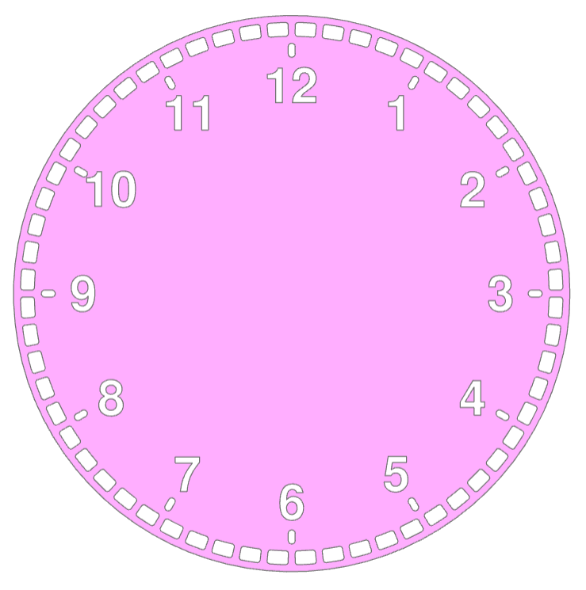

.. dropdown:: |Builder| Reference Implementation (Builder Mode) 

    .. literalinclude:: ../examples/clock.py
        :start-after: [Code]
        :end-before: [End]

.. dropdown:: |Algebra| Reference Implementation (Algebra Mode) 

    .. literalinclude:: ../examples/clock_algebra.py
        :start-after: [Code]
        :end-before: [End]

The Python code utilizes the build123d library to create a 3D model of a clock face. 
It defines a minute indicator with arcs and lines, applying fillets, and then 
integrates it into the clock face sketch. The clock face includes a circular outline, 
hour labels, and slots at specified positions. The resulting 3D model represents 
a detailed and visually appealing clock design.

:class:`~build_common.PolarLocations` are used to position features on the clock face.

.. _handle:

Handle
------
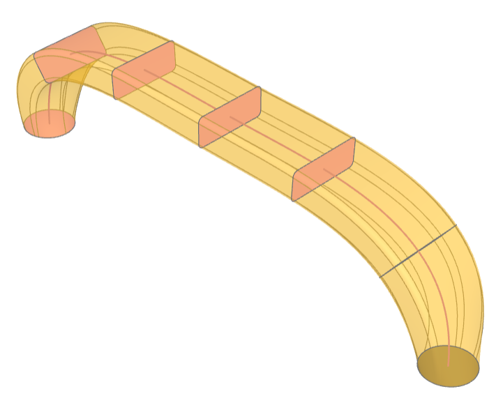

.. dropdown:: |Builder| Reference Implementation (Builder Mode) 

    .. literalinclude:: ../examples/handle.py
        :start-after: [Code]
        :end-before: [End]

.. dropdown:: |Algebra| Reference Implementation (Algebra Mode) 

    .. literalinclude:: ../examples/handle_algebra.py
        :start-after: [Code]
        :end-before: [End]

This example demonstrates multisection sweep creating a drawer handle.

.. _heat_exchanger:

Heat Exchanger
--------------
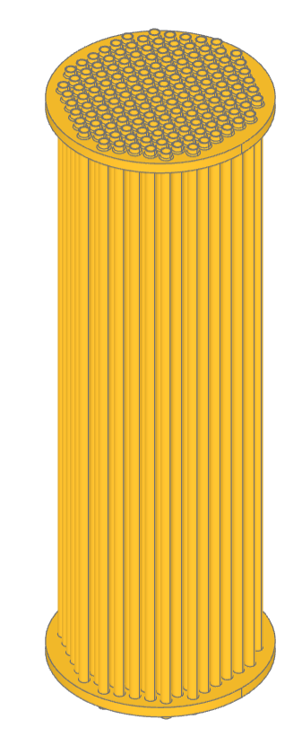

.. dropdown:: |Builder| Reference Implementation (Builder Mode) 

    .. literalinclude:: ../examples/heat_exchanger.py
        :start-after: [Code]
        :end-before: [End]

.. dropdown:: |Algebra| Reference Implementation (Algebra Mode) 

    .. literalinclude:: ../examples/heat_exchanger_algebra.py
        :start-after: [Code]
        :end-before: [End]

This example creates a model of a parametric heat exchanger core. The positions
of the tubes are defined with :class:`~build_common.HexLocations` and further
limited to fit within the circular end caps. The ends of the tubes are filleted
to the end plates to simulate welding.

.. _key_cap:

Key Cap
-------
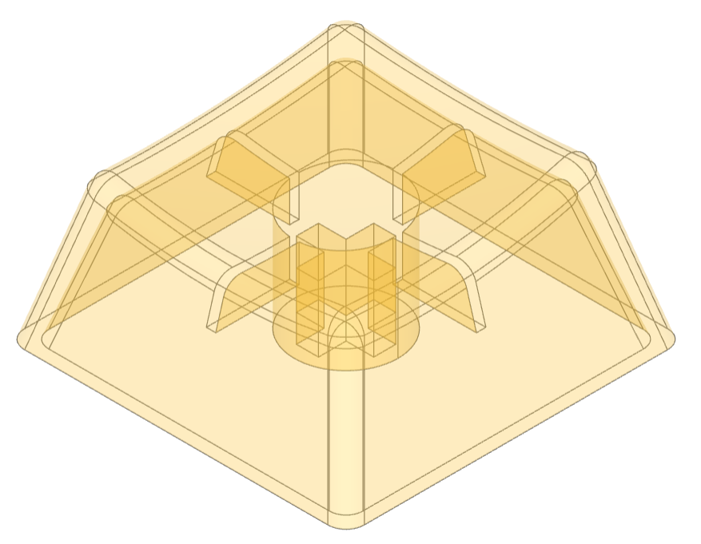

.. dropdown:: |Builder| Reference Implementation (Builder Mode) 

    .. literalinclude:: ../examples/key_cap.py
        :start-after: [Code]
        :end-before: [End]

.. dropdown:: |Algebra| Reference Implementation (Algebra Mode) 

    .. literalinclude:: ../examples/key_cap_algebra.py
        :start-after: [Code]
        :end-before: [End]

This example demonstrates the design of a Cherry MX key cap by using
extrude with a taper and extrude until next.

.. _maker_coin:

Maker Coin
----------
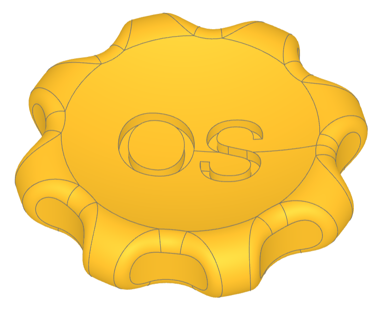

This example creates the maker coin as defined by Angus on the Maker's Muse
YouTube channel. There are two key features:

#. the use of :class:`~objects_curve.DoubleTangentArc` to create a smooth 
   transition from the central dish to the outside arc, and

#. embossing the text into the top of the coin not just as a simple
   extrude but from a projection which results in text with even depth.

.. dropdown:: |Builder| Reference Implementation (Builder Mode) 

    .. literalinclude:: ../examples/maker_coin.py
        :start-after: [Code]
        :end-before: [End]

.. _mini_nuke:

Mini Nuke
---------
.. image:: assets/examples/mini_nuke.png
    :align: center

This example demonstrates the creation of a container featuring a screw top designed 
after the "Mini Nuke" from the Fallout video game series. It showcases the process 
of constructing intricate non-planar objects and leverages the bd_warehouse thread 
and fastener library to create customize threads and Clearance Holes to match a variety
of fasteners. The holes are positioned in locations that do not align with any primary 
axes, illustrating advanced techniques in 3D object design.

.. dropdown:: Gallery

    .. image:: assets/examples/mini_nuke_cutaway.png
        :align: center

.. dropdown:: |Builder| Reference Implementation (Builder Mode) 

    .. literalinclude:: ../examples/mini_nuke.py
        :start-after: [Code]
        :end-before: [End]

.. _multi_sketch_loft:

Multi-Sketch Loft
-----------------

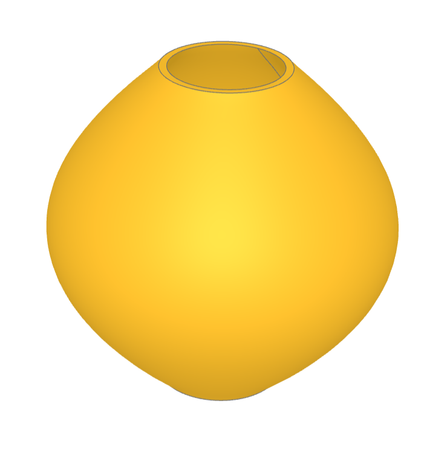

This example demonstrates lofting a set of sketches, selecting
the top and bottom by type, and shelling.

.. dropdown:: |Builder| Reference Implementation (Builder Mode) 

    .. literalinclude:: ../examples/loft.py
        :start-after: [Code]
        :end-before: [End]

.. dropdown:: |Algebra| Reference Implementation (Algebra Mode) 

    .. literalinclude:: ../examples/loft_algebra.py
        :start-after: [Code]
        :end-before: [End]

.. _peg_board_hook:

Peg Board Hook
--------------
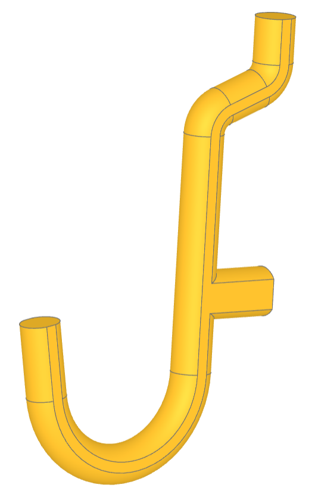

This script creates a a J-shaped pegboard hook. These hooks are commonly used for 
organizing tools in garages, workshops, or other spaces where tools and equipment 
need to be stored neatly and accessibly. The hook is created by defining a complex
path and then sweeping it to define the hook. The sides of the hook are flattened
to aid 3D printing.

.. dropdown:: |Builder| Reference Implementation (Builder Mode) 

    .. literalinclude:: ../examples/pegboard_j_hook.py
        :start-after: [Code]
        :end-before: [End]

.. dropdown:: |Algebra| Reference Implementation (Algebra Mode) 

    .. literalinclude:: ../examples/pegboard_j_hook_algebra.py
        :start-after: [Code]
        :end-before: [End]

.. _platonic_solids:

Platonic Solids
---------------
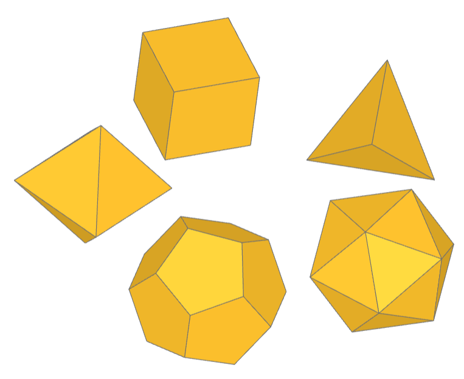

This example creates a custom Part object PlatonicSolid.

Platonic solids are five three-dimensional shapes that are highly symmetrical, 
known since antiquity and named after the ancient Greek philosopher Plato. 
These solids are unique because their faces are congruent regular polygons, 
with the same number of faces meeting at each vertex. The five Platonic solids 
are the tetrahedron (4 triangular faces), cube (6 square faces), octahedron 
(8 triangular faces), dodecahedron (12 pentagonal faces), and icosahedron 
(20 triangular faces). Each solid represents a unique way in which identical 
polygons can be arranged in three dimensions to form a convex polyhedron, 
embodying ideals of symmetry and balance.

.. dropdown:: |Algebra| Reference Implementation (Algebra Mode) 

    .. literalinclude:: ../examples/platonic_solids.py
        :start-after: [Code]
        :end-before: [End]

.. _playing_cards:

Playing Cards
-------------
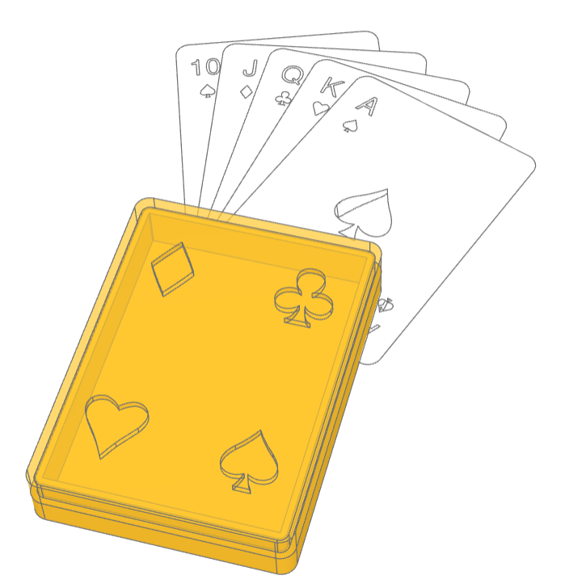

This example creates a customs Sketch objects: Club, Spade, Heart, Diamond, 
and PlayingCard in addition to a two part playing card box which has suit 
cutouts in the lid. The four suits are created with Bézier curves that were 
imported as code from an SVG file and modified to the code found here.  

.. dropdown:: |Builder| Reference Implementation (Builder Mode) 

    .. literalinclude:: ../examples/playing_cards.py
        :start-after: [Code]
        :end-before: [End]

.. _stud_wall:

Stud Wall
---------
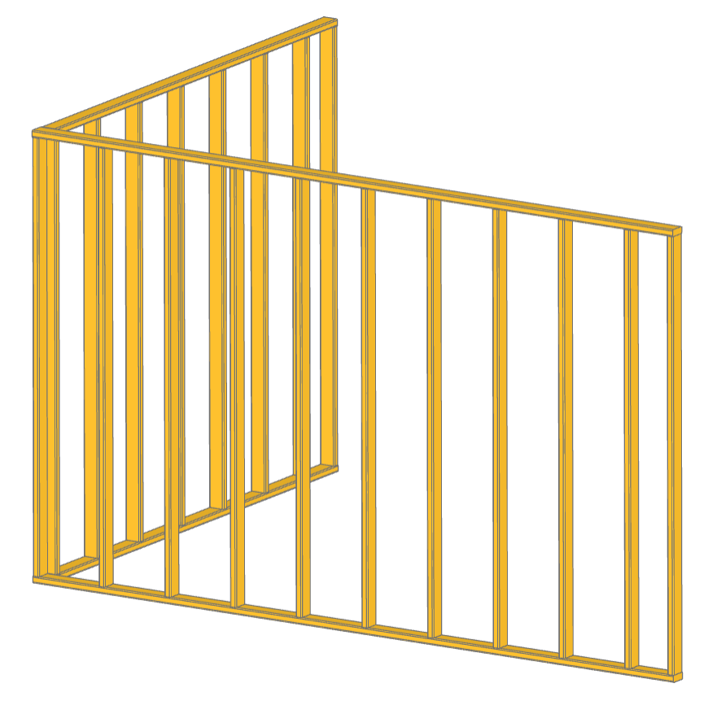

This example demonstrates creatings custom `Part` objects and putting them into
assemblies. The custom object is a `Stud` used in the building industry while
the assembly is a `StudWall` created from copies of `Stud` objects for efficiency.
Both the `Stud` and `StudWall` objects use `RigidJoints` to define snap points which
are used to position all of objects.   

.. dropdown:: |Algebra| Reference Implementation (Algebra Mode) 

    .. literalinclude:: ../examples/stud_wall.py
        :start-after: [Code]
        :end-before: [End]
    
.. _tea_cup:

Tea Cup
-------
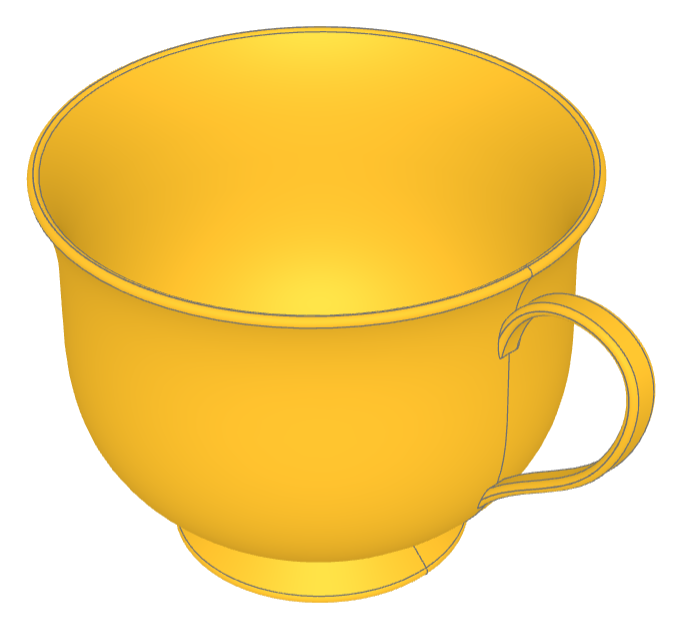

.. dropdown:: |Builder| Reference Implementation (Builder Mode) 

    .. literalinclude:: ../examples/tea_cup.py
        :start-after: [Code]
        :end-before: [End]

.. dropdown:: |Algebra| Reference Implementation (Algebra Mode) 

    .. literalinclude:: ../examples/tea_cup_algebra.py
        :start-after: [Code]
        :end-before: [End]

This example demonstrates the creation a tea cup, which serves as an example of 
constructing complex, non-flat geometrical shapes programmatically.

The tea cup model involves several CAD techniques, such as:

* Revolve Operations: There is 1 occurrence of a revolve operation. This is used 
  to create the main body of the tea cup by revolving a profile around an axis, 
  a common technique for generating symmetrical objects like cups.
* Sweep Operations: There are 2 occurrences of sweep operations. The handle are
  created by sweeping a profile along a path to generate non-planar surfaces.
* Offset/Shell Operations: the bowl of the cup is hollowed out with the offset
  operation leaving the top open. 
* Fillet Operations: There is 1 occurrence of a fillet operation which is used to 
  round the edges for aesthetic improvement and to mimic real-world objects more 
  closely.

.. _vase:

Vase
----
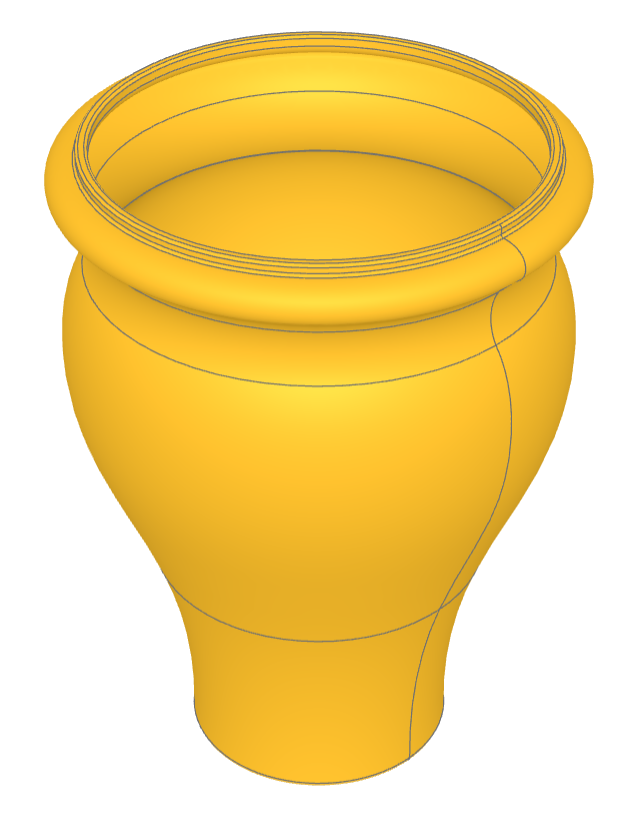

.. dropdown:: |Builder| Reference Implementation (Builder Mode) 

    .. literalinclude:: ../examples/vase.py
        :start-after: [Code]
        :end-before: [End]

.. dropdown:: |Algebra| Reference Implementation (Algebra Mode) 

    .. literalinclude:: ../examples/vase_algebra.py
        :start-after: [Code]
        :end-before: [End]

This example demonstrates the build123d techniques involving the creation of a vase. 
Specifically, it showcases the processes of revolving a sketch, shelling 
(creating a hollow object by removing material from its interior), and 
selecting edges by position range and type for the application of fillets 
(rounding off the edges).

* Sketching: Drawing a 2D profile or outline that represents the side view of 
  the vase.
* Revolving: Rotating the sketch around an axis to create a 3D object. This 
  step transforms the 2D profile into a 3D vase shape.
* Offset/Shelling: Removing material from the interior of the solid vase to 
  create a hollow space, making it resemble a real vase more closely.
* Edge Filleting: Selecting specific edges of the vase for filleting, which 
  involves rounding those edges. The edges are selected based on their position
  and type.

.. NOTE 02: insert new example thumbnails above this line
    

.. TODO: Copy this block to add your example details here
    .. _examples-{name-of-your-example}:

    {name-of-your-example-with-spaces}
    --------------------------------
    .. image:: assets/examples/example_{name-of-your-example}_01.{extension}
    :align: center

    .. image:: assets/examples/example_{name-of-your-example}_02.{extension}
    :align: center

    .. dropdown:: info

        TODO: add more information about your example 

    .. dropdown:: |Builder| Reference Implementation (Builder Mode) 

        .. literalinclude:: ../examples/boxes_on_faces.py
            :start-after: [Code]
            :end-before: [End]

    .. dropdown:: |Algebra| Reference Implementation (Algebra Mode)  

        .. literalinclude:: ../examples/boxes_on_faces_algebra.py
            :start-after: [Code]
            :end-before: [End]
