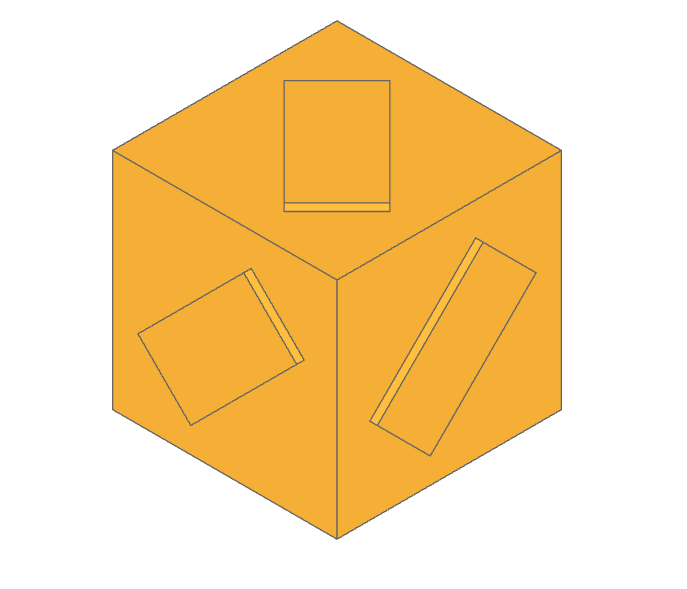
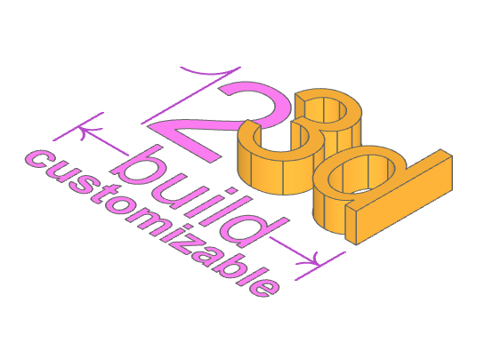

#######################
The build123d Examples
#######################
.. |siren| replace:: 🚨 
.. |Builder| replace:: 🔨
.. |Algebra| replace:: ✏️ 

Overview
--------------------------------

In the GitHub repository you will find an `examples folder <https://github.com/42sol-eu/build123d/tree/examples>`_ 

Most of the examples show the builder and algebra modes.

.. ----------------------------------------------------------------------------------------------
.. Index Section
.. ----------------------------------------------------------------------------------------------

.. grid:: 3

    .. grid-item-card:: Low Poly Benchy |Builder|
        :img-top:  assets/examples/thumbnail_benchy_01.png
        :link: examples-benchy
        :link-type: ref

    .. grid-item-card:: Boxes on Faces |Builder| |Algebra|
        :img-top: assets/examples/thumbnail_boxes_on_faces_01.png
        :link: examples-boxes_on_faces
        :link-type: ref

    .. grid-item-card:: build123d customizable logo |Builder| |Algebra|
        :img-top: assets/examples/thumbnail_build123d_customizable_logo_01.png
        :link: examples-build123d_customizable_logo
        :link-type: ref

    .. grid-item-card:: Former build123d Logo |Builder| |Algebra|
            :img-top: assets/examples/thumbnail_build123d_logo_01.png
            :link: examples-build123d_logo
            :link-type: ref
    
    
.. NOTE 01: insert new example thumbnails above this line

.. TODO: Copy this block to add the example thumbnails here
    .. grid-item-card:: name-of-your-example-with-spaces |Builder| |Algebra|
            :img-top: assets/examples/thumbnail_{name-of-your-example}_01.{extension}
            :link: examples-{name-of-your-example}
            :link-type: ref
   
.. ----------------------------------------------------------------------------------------------
.. Details Section
.. ----------------------------------------------------------------------------------------------

.. _examples-benchy:

Low Poly Benchy
--------------------------------
.. image:: assets/examples/example_benchy_01.png
    :align: center

The Benchy examples shows hot to import a STL model as a `Solid` object with the class `Mesher` and change it to low poly.

.. note 

     *Attribution:*
     The low-poly-benchy used in this example is by `reddaugherty`, see
     https://www.printables.com/model/151134-low-poly-benchy.

.. dropdown:: Gallery

    .. image:: assets/examples/example_benchy_02.png
        :align: center

    .. image:: assets/examples/example_benchy_03.png
        :align: center

.. dropdown:: |Builder| Reference Implementation (Builder Mode) 

    .. literalinclude:: ../examples/benchy.py
        :start-after: [Code]
        :end-before: [End]

.. ----------------------------------------------------------------------------------------------

.. _examples-boxes_on_faces:

Boxes on Faces
--------------------------------

Create elements on every face of a box.

.. dropdown:: |Builder| Reference Implementation (Builder Mode) 

    .. literalinclude:: ../examples/boxes_on_faces.py
        :start-after: [Code]
        :end-before: [End]

.. dropdown:: |Algebra| Reference Implementation (Algebra Mode)  

    .. literalinclude:: ../examples/boxes_on_faces_algebra.py
        :start-after: [Code]
        :end-before: [End]

.. _examples-build123d_customizable_logo:

The build123d customizable logo
--------------------------------

This example creates the build123d customizable logo.
It shows how text is created, placed and sizes of text is calulated to define sizes of other elements.

.. dropdown:: |Builder| Reference Implementation (Builder Mode) 

    .. literalinclude:: ../examples/build123d_customizable_logo.py
        :start-after: [Code]
        :end-before: [End]

.. dropdown:: |Algebra| Reference Implementation (Algebra Mode)  

    .. literalinclude:: ../examples/build123d_customizable_logo_algebra.py
        :start-after: [Code]
        :end-before: [End]

.. _examples-build123d_logo:

Former build123d Logo
--------------------------------
.. image:: assets/examples/example_build123d_logo_01.png
    :align: center

This example creates the former build123d logo (new logo was created in the end of 2023).

Using text and lines to create the first build123d logo. 
The builder mode example also generates the SVG file `logo.svg`.

.. dropdown:: |Builder| Reference Implementation (Builder Mode) 

    .. literalinclude:: ../examples/build123d_logo.py
        :start-after: [Code]
        :end-before: [End]
    
.. dropdown:: |Algebra| Reference Implementation (Algebra Mode) 

    .. literalinclude:: ../examples/build123d_logo_algebra.py
        :start-after: [Code]
        :end-before: [End]

.. NOTE 02: insert new example thumbnails above this line
    

.. TODO: Copy this block to add your example details here
    .. _examples-{name-of-your-example}:

    {name-of-your-example-with-spaces}
    --------------------------------
    .. image:: assets/examples/example_{name-of-your-example}_01.{extension}
    :align: center

    .. image:: assets/examples/example_{name-of-your-example}_02.{extension}
    :align: center

    .. dropdown:: info

        TODO: add more information about your example 

    .. dropdown:: |Builder| Reference Implementation (Builder Mode) 

        .. literalinclude:: ../examples/boxes_on_faces.py
            :start-after: [Code]
            :end-before: [End]

    .. dropdown:: |Algebra| Reference Implementation (Algebra Mode)  

        .. literalinclude:: ../examples/boxes_on_faces_algebra.py
            :start-after: [Code]
            :end-before: [End]