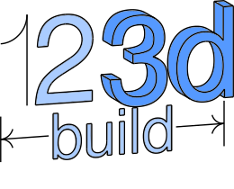

..
    build123d readthedocs documentation

    by:   Gumyr
    date: July 13th 2022

    desc: This is the documentation for build123d on readthedocs

    license:

        Copyright 2022 Gumyr

        Licensed under the Apache License, Version 2.0 (the "License");
        you may not use this file except in compliance with the License.
        You may obtain a copy of the License at

            http://www.apache.org/licenses/LICENSE-2.0

        Unless required by applicable law or agreed to in writing, software
        distributed under the License is distributed on an "AS IS" BASIS,
        WITHOUT WARRANTIES OR CONDITIONS OF ANY KIND, either express or implied.
        See the License for the specific language governing permissions and
        limitations under the License.

.. highlight:: python

Build123d is a python-based, parametric, boundary representation (BREP) modeling
framework for 2D and 3D CAD. It's built on the Open Cascade geometric kernel and
allows for the creation of complex models using a simple and intuitive python
syntax. Build123d can be used to create models for 3D printing, CNC machining,
laser cutting, and other manufacturing processes.  Models can be exported to a
wide variety of popular CAD tools such as FreeCAD and SolidWorks.

Build123d could be considered as an evolution of
`CadQuery <https://cadquery.readthedocs.io/en/latest/index.html>`_ where the
somewhat restrictive Fluent API (method chaining) is replaced with stateful
context managers - e.g. `with` blocks - thus enabling the full python toolbox:
for loops, references to objects, object sorting and filtering, etc.

########
Overview
########

build123d uses the standard python context manager - e.g. the ``with`` statement often used when
working with files - as a builder of the object under construction. Once the object is complete
it can be extracted from the builders and used in other ways: for example exported as a STEP
file or used in an Assembly.  There are three builders available:

* **BuildLine**: a builder of one dimensional objects - those with the property
  of length but not of area or volume - typically used
  to create complex lines used in sketches or paths.
* **BuildSketch**: a builder of planar two dimensional objects - those with the property
  of area but not of volume - typically used to create 2D drawings that are extruded into 3D parts.
* **BuildPart**: a builder of three dimensional objects - those with the property of volume -
  used to create individual parts.

The three builders work together in a hierarchy as follows:

.. code-block:: python

    with BuildPart() as my_part:
        ...
        with BuildSketch() as my_sketch:
            ...
            with BuildLine() as my_line:
                ...
            ...
        ...

where ``my_line`` will be added to ``my_sketch`` once the line is complete and ``my_sketch`` will be
added to ``my_part`` once the sketch is complete.

As an example, consider the design of a simple bearing pillow block:

.. literalinclude:: ../examples/pillow_block.py
    :lines: 28-47

.. note::

  There is a `Discord <https://discord.com/invite/Bj9AQPsCfx>`_ server (shared with CadQuery) where
  you can ask for help in the build123d channel.

#################
Table Of Contents
#################

.. toctree::
    :maxdepth: 2

    introduction.rst
    installation.rst
    introductory_examples.rst
    tutorials.rst
    builders.rst
    advanced.rst
    cheat_sheet.rst
    external.rst
    builder_api_reference.rst
    direct_api_reference.rst

==================
Indices and tables
==================

* :ref:`genindex`
* :ref:`modindex`
* :ref:`search`
