#########################
Introductory Examples
#########################

The examples on this page can help you learn how to build objects with build123d, and are intended as a general overview of build123d.

They are organized from simple to complex, so working through them in order is the best way to absorb them.

.. note::

    Some important lines are omitted below to save space, so you will most likely need to add 1 & 2 to the provided code below for them to work:

       1. ``from build123d import *``
       2. If you are using build123d *builder mode* or *algebra mode*,

            - in *ocp_vscode* simply use e.g. ``show(ex15)`` to the end of your design to view parts, sketches and curves. ``show_all()`` can be used to automatically show all objects with their variable names as labels.
            - in *CQ-editor* add e.g. ``show_object(ex15.part)``, ``show_object(ex15.sketch)`` or ``show_object(ex15.line)`` to the end of your design to view parts, sketches or lines.

       3. If you want to save your resulting object as an STL from *builder mode*, you can use e.g. ``export_stl(ex15.part, "file.stl")``.
       4. If you want to save your resulting object as an STL from *algebra mode*, you can use e.g. ``export_stl(ex15, "file.stl")``
       5. build123d also supports exporting to multiple other file formats including STEP, see here for further information: `Import/Export Formats <https://build123d.readthedocs.io/en/latest/import_export.html>`_

.. contents:: List of Examples
    :backlinks: entry

.. _ex 1:

1. Simple Rectangular Plate
---------------------------------------------------

Just about the simplest possible example, a rectangular :class:`~objects_part.Box`.

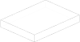

* **Builder mode**

    .. literalinclude:: general_examples.py
        :start-after: [Ex. 1]
        :end-before: [Ex. 1]

* **Algebra mode**

    .. literalinclude:: general_examples_algebra.py
        :start-after: [Ex. 1]
        :end-before: [Ex. 1]

.. _ex 2:

2. Plate with Hole
---------------------------------------------------

A rectangular box, but with a hole added.

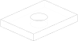

* **Builder mode**

    In this case we are using
    :class:`~build_enums.Mode` ``.SUBTRACT`` to cut the :class:`~objects_part.Cylinder`
    from the :class:`~objects_part.Box`.

    .. literalinclude:: general_examples.py
        :start-after: [Ex. 2]
        :end-before: [Ex. 2]

* **Algebra mode**

    In this case we are using
    the subtract operator ``-`` to cut the :class:`~objects_part.Cylinder`
    from the :class:`~objects_part.Box`.

    .. literalinclude:: general_examples_algebra.py
        :start-after: [Ex. 2]
        :end-before: [Ex. 2]

.. _ex 3:

3. An extruded prismatic solid
---------------------------------------------------

Build a prismatic solid using extrusion.

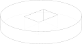

* **Builder mode**

    This time we can first create a 2D :class:`~build_sketch.BuildSketch` adding a
    :class:`~objects_sketch.Circle` and a subtracted :class:`~objects_sketch.Rectangle``
    and then use :class:`~build_part.BuildPart`'s :meth:`~operations_part.extrude` feature.

    .. literalinclude:: general_examples.py
        :start-after: [Ex. 3]
        :end-before: [Ex. 3]

* **Algebra mode**

    This time we can first create a 2D :class:`~objects_sketch.Circle` with a subtracted
    :class:`~objects_sketch.Rectangle`` and then use the :meth:`~operations_part.extrude` operation for parts.

    .. literalinclude:: general_examples_algebra.py
        :start-after: [Ex. 3]
        :end-before: [Ex. 3]

.. _ex 4:

4. Building Profiles using lines and arcs
---------------------------------------------------

Sometimes you need to build complex profiles using lines and arcs. This example
builds a prismatic solid from 2D operations. It is not necessary to create
variables for the line segments, but it will be useful in a later example.

* **Builder mode**

    :class:`~build_sketch.BuildSketch` operates on closed Faces, and the operation
    :meth:`~operations_sketch.make_face` is used to convert the pending line segments
    from :class:`~build_line.BuildLine` into a closed Face.

    .. literalinclude:: general_examples.py
        :start-after: [Ex. 4]
        :end-before: [Ex. 4]

* **Algebra mode**

    We start with an empty :class:`~topology.Curve` and add lines to it (note that
    ``Curve() + [line1, line2, line3]`` is much more efficient than ``line1 + line2 + line3``,
    see :ref:`algebra_performance`).
    The operation :meth:`~operations_sketch.make_face` is used to convert the line
    segments into a Face.

    .. literalinclude:: general_examples_algebra.py
        :start-after: [Ex. 4]
        :end-before: [Ex. 4]

Note that to build a closed face it requires line segments that form a closed shape.

.. _ex 5:

5. Moving the current working point
---------------------------------------------------

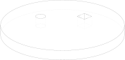

* **Builder mode**

    Using :class:`~build_common.Locations` we can place one (or multiple) objects
    at one (or multiple) places.

    .. literalinclude:: general_examples.py
        :start-after: [Ex. 5]
        :end-before: [Ex. 5]

* **Algebra mode**

    Using the pattern ``Pos(x, y, z=0) * obj`` (with :class:`geometry.Pos`) we can move an
    object to the provided position. Using ``Rot(x_angle, y_angle, z_angle) * obj``
    (with :class:`geometry.Rot`)  would rotate the object.

    .. literalinclude:: general_examples_algebra.py
        :start-after: [Ex. 5]
        :end-before: [Ex. 5]

.. _ex 6:

6. Using Point Lists
---------------------------------------------------

Sometimes you need to create a number of features at various
:class:`~build_common.Locations`.

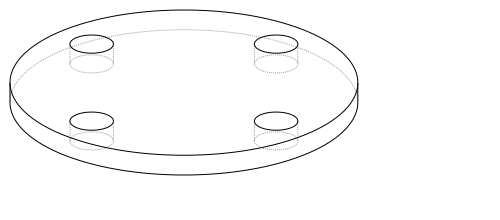

* **Builder mode**

    You can use a list of points to construct multiple objects at once.

    .. literalinclude:: general_examples.py
        :start-after: [Ex. 6]
        :end-before: [Ex. 6]

* **Algebra mode**

    You can use loops to iterate over these Locations
    or list comprehensions as in the example.

    The algebra operations are vectorized, which means ``obj - [obj1, obj2, obj3]``
    is short for ``obj - obj1 - obj2 - ob3`` (and more efficient, see :ref:`algebra_performance`).

    .. literalinclude:: general_examples_algebra.py
        :start-after: [Ex. 6]
        :end-before: [Ex. 6]

.. _ex 7:

7. Polygons
---------------------------------------------------

* **Builder mode**

    You can create :class:`~objects_sketch.RegularPolygon` for each stack point if
    you would like.

    .. literalinclude:: general_examples.py
        :start-after: [Ex. 7]
        :end-before: [Ex. 7]

* **Algebra mode**

    You can apply locations to :class:`~objects_sketch.RegularPolygon` instances
    for each location  via loops or list comprehensions.

    .. literalinclude:: general_examples_algebra.py
        :start-after: [Ex. 7]
        :end-before: [Ex. 7]

.. _ex 8:

8. Polylines
---------------------------------------------------

:class:`~objects_curve.Polyline` allows creating a shape from a large number
of chained points connected by lines. This example uses a polyline to create
one half of an i-beam shape, which is :meth:`~operations_generic.mirror` ed to
create the final profile.

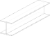

* **Builder mode**

    .. literalinclude:: general_examples.py
        :start-after: [Ex. 8]
        :end-before: [Ex. 8]

* **Algebra mode**

    .. literalinclude:: general_examples_algebra.py
        :start-after: [Ex. 8]
        :end-before: [Ex. 8]

.. _ex 9:

9. Selectors, Fillets, and Chamfers
---------------------------------------------------

This example introduces multiple useful and important concepts. Firstly :meth:`~operations_generic.chamfer`
and :meth:`~operations_generic.fillet` can be used to "bevel" and "round" edges respectively. Secondly,
these two methods require an edge or a list of edges to operate on. To select all
edges, you could simply pass in ``ex9.edges()``.

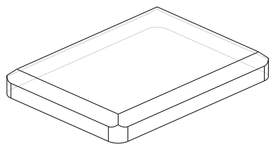

* **Builder mode**

    .. literalinclude:: general_examples.py
        :start-after: [Ex. 9]
        :end-before: [Ex. 9]

* **Algebra mode**

    .. literalinclude:: general_examples_algebra.py
        :start-after: [Ex. 9]
        :end-before: [Ex. 9]

Note that :meth:`~topology.ShapeList.group_by` ``(Axis.Z)`` returns a list of lists of edges that is grouped by
their z-position. In this case we want to use the ``[-1]`` group which, by convention, will
be the highest z-dimension group.

.. _ex 10:

10. Select Last and Hole
---------------------------------------------------

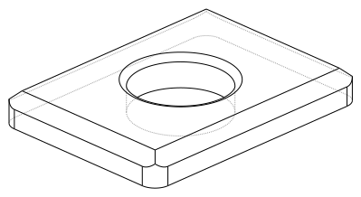

* **Builder mode**

    Using :class:`~build_enums.Select` ``.LAST`` you can select the most recently modified edges.
    It is used to perform a :meth:`~operations_generic.fillet` in this example. This example also
    makes use of :class:`~objects_part.Hole` which automatically cuts through the entire part.

    .. literalinclude:: general_examples.py
        :start-after: [Ex. 10]
        :end-before: [Ex. 10]

* **Algebra mode**

    Using the pattern ``snapshot = obj.edges()`` before and ``last_edges = obj.edges() - snapshot`` after an
    operation allows to select the most recently modified edges (same for ``faces``, ``vertices``, ...).
    It is used to perform a :meth:`~operations_generic.fillet` in this example. This example also makes use
    of :class:`~objects_part.Hole`. Different to the *context mode*, you have to add the ``depth`` of the whole.

    .. literalinclude:: general_examples_algebra.py
        :start-after: [Ex. 10]
        :end-before: [Ex. 10]

.. _ex 11:

11. Use a face as a plane for BuildSketch and introduce GridLocations
----------------------------------------------------------------------------

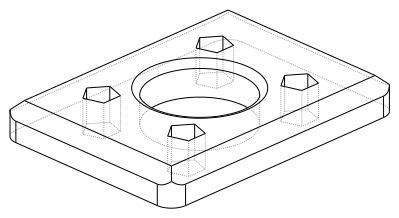

* **Builder mode**

    :class:`~build_sketch.BuildSketch` accepts a Plane or a Face, so in this case we locate the Sketch
    on the top of the part. Note that the face used as input to BuildSketch needs
    to be Planar or unpredictable behavior can result. Additionally :class:`~build_common.GridLocations`
    can be used to create a grid of points that are simultaneously used to place 4
    pentagons.

    Lastly, :meth:`~operations_part.extrude` can be used with a negative amount and ``Mode.SUBTRACT`` to
    cut these from the parent.

    .. literalinclude:: general_examples.py
        :start-after: [Ex. 11]
        :end-before: [Ex. 11]

* **Algebra mode**

    The pattern ``plane * obj`` can be used to locate an object on a plane. Furthermore, the pattern
    ``plane * location * obj`` first places the object on a plane and then moves it relative to plane
    according to ``location``.

    :class:`~build_common.GridLocations` creates a grid of points that can be used in loops or list
    comprehensions as described earlier.

    Lastly, :meth:`~operations_part.extrude` can be used with a negative amount and cut (``-``) from the
    parent.

    .. literalinclude:: general_examples_algebra.py
        :start-after: [Ex. 11]
        :end-before: [Ex. 11]

Note that the direction implied by positive or negative inputs to amount is relative to the
normal direction of the face or plane. As a result of this, unexpected behavior can occur
if the extrude direction and mode/operation (ADD / ``+`` or SUBTRACT / ``-``) are not correctly set.

.. _ex 12:

12. Defining an Edge with a Spline
---------------------------------------------------

This example defines a side using a spline curve through a collection of points. Useful when you have an
edge that needs a complex profile.

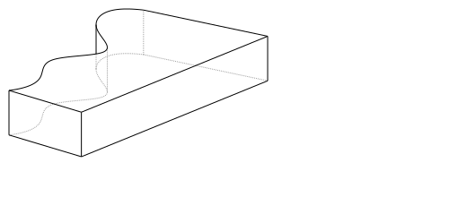

* **Builder mode**

    .. literalinclude:: general_examples.py
        :start-after: [Ex. 12]
        :end-before: [Ex. 12]

* **Algebra mode**

    .. literalinclude:: general_examples_algebra.py
        :start-after: [Ex. 12]
        :end-before: [Ex. 12]

.. _ex 13:

13. CounterBoreHoles, CounterSinkHoles and PolarLocations
-------------------------------------------------------------

Counter-sink and counter-bore holes are useful for creating recessed areas for fasteners.

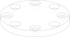

* **Builder mode**

    We use a face to establish a location for :class:`~build_common.Locations`.

    .. literalinclude:: general_examples.py
        :start-after: [Ex. 13]
        :end-before: [Ex. 13]

* **Algebra mode**

    We use a face to establish a plane that is used later in the code for locating objects
    onto this plane.

    .. literalinclude:: general_examples_algebra.py
        :start-after: [Ex. 13]
        :end-before: [Ex. 13]

:class:`~build_common.PolarLocations` creates a list of points that are radially distributed.

.. _ex 14:

14. Position on a line with '\@', '\%' and introduce Sweep
------------------------------------------------------------

build123d includes a feature for finding the position along a line segment. This
is normalized between 0 and 1 and can be accessed using the :meth:`~topology.Mixin1D.position_at` (`@`) operator.
Similarly the :meth:`~topology.Mixin1D.tangent_at` (`%`) operator returns the line direction at a given point.

These two features are very powerful for chaining line segments together without
having to repeat dimensions again and again, which is error prone, time
consuming, and more difficult to maintain. The pending faces must lie on the
path, please see example 37 for a way to make this placement easier.

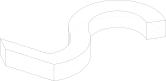

* **Builder mode**

    The :meth:`~operations_generic.sweep` method takes any pending faces and sweeps them through the provided
    path (in this case the path is taken from the pending edges from ``ex14_ln``).
    :meth:`~operations_part.revolve` requires a single connected wire. 

    .. literalinclude:: general_examples.py
        :start-after: [Ex. 14]
        :end-before: [Ex. 14]

* **Algebra mode**

    The :meth:`~operations_generic.sweep` method takes any faces and sweeps them through the provided
    path (in this case the path is taken from ``ex14_ln``).

    .. literalinclude:: general_examples_algebra.py
        :start-after: [Ex. 14]
        :end-before: [Ex. 14]

It is also possible to use tuple or :class:`~geometry.Vector` addition (and other vector math operations)
as seen in the ``l3`` variable.

.. _ex 15:

15. Mirroring Symmetric Geometry
---------------------------------------------------

Here mirror is used on the BuildLine to create a symmetric shape with fewer line segment commands.
Additionally the '@' operator is used to simplify the line segment commands.

``(l4 @ 1).Y`` is used to extract the y-component of the ``l4 @ 1`` vector.

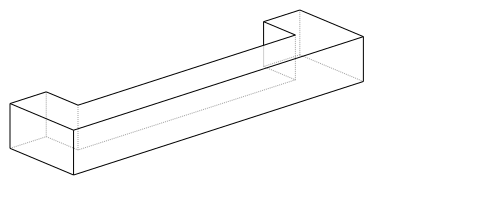

* **Builder mode**

    .. literalinclude:: general_examples.py
        :start-after: [Ex. 15]
        :end-before: [Ex. 15]

* **Algebra mode**

    Combine lines via the pattern ``Curve() + [l1, l2, l3, l4, l5]``

    .. literalinclude:: general_examples_algebra.py
        :start-after: [Ex. 15]
        :end-before: [Ex. 15]

.. _ex 16:

16. Mirroring 3D Objects
---------------------------------------------------

Mirror can also be used with BuildPart (and BuildSketch) to mirror 3D objects.
The ``Plane.offset()`` method shifts the plane in the normal direction (positive or negative).

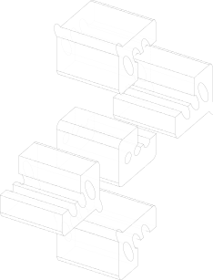

* **Builder mode**

    .. literalinclude:: general_examples.py
        :start-after: [Ex. 16]
        :end-before: [Ex. 16]

* **Algebra mode**

    .. literalinclude:: general_examples_algebra.py
        :start-after: [Ex. 16]
        :end-before: [Ex. 16]

.. _ex 17:

17. Mirroring From Faces
---------------------------------------------------

Here we select the farthest face in the Y-direction and turn it into a :class:`~geometry.Plane` using the
``Plane()`` class.

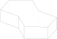

* **Builder mode**

    .. literalinclude:: general_examples.py
        :start-after: [Ex. 17]
        :end-before: [Ex. 17]

* **Algebra mode**

    .. literalinclude:: general_examples_algebra.py
        :start-after: [Ex. 17]
        :end-before: [Ex. 17]

.. _ex 18:

18. Creating Workplanes on Faces
---------------------------------------------------

Here we start with an earlier example, select the top face, draw a rectangle and then use Extrude
with a negative distance.

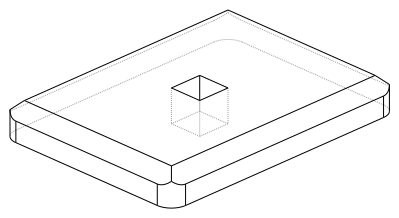

* **Builder mode**

    We then use ``Mode.SUBTRACT`` to cut it out from the main body.

    .. literalinclude:: general_examples.py
        :start-after: [Ex. 18]
        :end-before: [Ex. 18]

* **Algebra mode**

    We then use ``-=`` to cut it out from the main body.

    .. literalinclude:: general_examples_algebra.py
        :start-after: [Ex. 18]
        :end-before: [Ex. 18]

.. _ex 19:

19. Locating a workplane on a vertex
---------------------------------------------------

Here a face is selected and two different strategies are used to select vertices.
Firstly ``vtx`` uses :meth:`~topology.ShapeList.group_by` and ``Axis.X`` to select a particular vertex. The second strategy uses a custom
defined Axis ``vtx2Axis`` that is pointing roughly in the direction of a vertex to select, and then :meth:`~topology.ShapeList.sort_by`
this custom Axis.

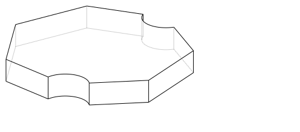

* **Builder mode**

    Then the X and Y positions of these vertices are selected and passed to :class:`~build_common.Locations`
    as center points for two circles that cut through the main part. Note that if you passed the variable ``vtx`` directly to
    :class:`~build_common.Locations` then the part would be offset from the workplane by the vertex z-position.

    .. literalinclude:: general_examples.py
        :start-after: [Ex. 19]
        :end-before: [Ex. 19]

* **Algebra mode**

    Then the X and Y positions of these vertices are selected and used to move two circles
    that cut through the main part. Note that if you passed the variable ``vtx`` directly to
    :class:`~geometry.Pos` then the part would be offset from the workplane by the vertex z-position.

    .. literalinclude:: general_examples_algebra.py
        :start-after: [Ex. 19]
        :end-before: [Ex. 19]

.. _ex 20:

20. Offset Sketch Workplane
---------------------------------------------------

The ``plane`` variable is set to be coincident with the farthest face in the
negative x-direction. The resulting Plane is offset from the original position.

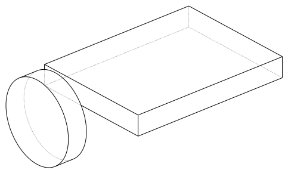

* **Builder mode**

    .. literalinclude:: general_examples.py
        :start-after: [Ex. 20]
        :end-before: [Ex. 20]

* **Algebra mode**

    .. literalinclude:: general_examples_algebra.py
        :start-after: [Ex. 20]
        :end-before: [Ex. 20]

.. _ex 21:

21. Create a Workplanes in the center of another shape
-------------------------------------------------------

One cylinder is created, and then the origin and z_dir of that part are used to create a new Plane for
positioning another cylinder perpendicular and halfway along the first.

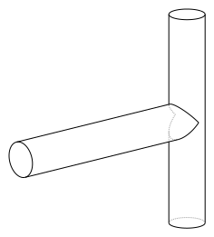

* **Builder mode**

    .. literalinclude:: general_examples.py
        :start-after: [Ex. 21]
        :end-before: [Ex. 21]

* **Algebra mode**

    .. literalinclude:: general_examples_algebra.py
        :start-after: [Ex. 21]
        :end-before: [Ex. 21]

.. _ex 22:

22. Rotated Workplanes
---------------------------------------------------

It is also possible to create a rotated workplane, building upon some of the concepts in an earlier
example.

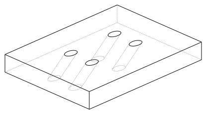

* **Builder mode**

    Use the :meth:`~geometry.Plane.rotated` method to rotate the workplane.

    .. literalinclude:: general_examples.py
        :start-after: [Ex. 22]
        :end-before: [Ex. 22]

* **Algebra mode**

    Use the operator ``*`` to relocate the plane (post-multiplication!).

    .. literalinclude:: general_examples_algebra.py
        :start-after: [Ex. 22]
        :end-before: [Ex. 22]

:class:`~build_common.GridLocations` places 4 Circles on 4 points on this rotated workplane, and then the Circles are
extruded in the "both" (positive and negative) normal direction.

.. _ex 23:

23. Revolve
---------------------------------------------------

Here we build a sketch with a :class:`~objects_curve.Polyline`,
:class:`~objects_curve.Line`, and a :class:`~objects_sketch.Circle`. It is
absolutely critical that the sketch is only on one side of the axis of rotation
before Revolve is called. To that end, ``split`` is used with ``Plane.ZY`` to keep
only one side of the Sketch.

It is highly recommended to view your sketch before you attempt to call revolve.

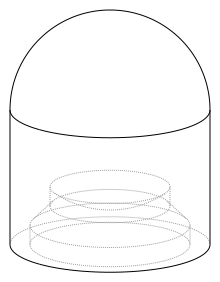

* **Builder mode**

    .. literalinclude:: general_examples.py
        :start-after: [Ex. 23]
        :end-before: [Ex. 23]

* **Algebra mode**

    .. literalinclude:: general_examples_algebra.py
        :start-after: [Ex. 23]
        :end-before: [Ex. 23]

.. _ex 24:

24. Loft
---------------------------------------------------

Loft is a very powerful tool that can be used to join dissimilar shapes. In this case we make a
conical-like shape from a circle and a rectangle that is offset vertically. In this case
:meth:`~operations_part.loft` automatically takes the pending faces that were added by the two BuildSketches.
Loft can behave unexpectedly when the input faces are not parallel to each other.

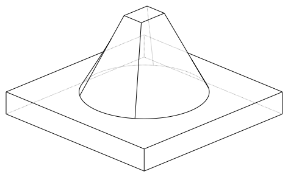

* **Builder mode**

    .. literalinclude:: general_examples.py
        :start-after: [Ex. 24]
        :end-before: [Ex. 24]

* **Algebra mode**

    .. literalinclude:: general_examples_algebra.py
        :start-after: [Ex. 24]
        :end-before: [Ex. 24]

.. _ex 25:

25. Offset Sketch
---------------------------------------------------

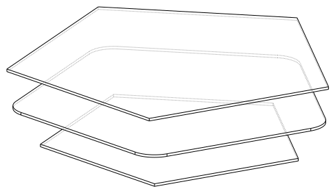

* **Builder mode**

    BuildSketch faces can be transformed with a 2D :meth:`~operations_generic.offset`.

    .. literalinclude:: general_examples.py
        :start-after: [Ex. 25]
        :end-before: [Ex. 25]

* **Algebra mode**

    Sketch faces can be transformed with a 2D :meth:`~operations_generic.offset`.

    .. literalinclude:: general_examples_algebra.py
        :start-after: [Ex. 25]
        :end-before: [Ex. 25]

They can be offset inwards or outwards, and with different techniques for extending the
corners (see :class:`~build_enums.Kind` in the Offset docs).

.. _ex 26:

26. Offset Part To Create Thin features
---------------------------------------------------

Parts can also be transformed using an offset, but in this case with
a 3D :meth:`~operations_generic.offset`. Also commonly known as a shell, this allows creating thin walls
using very few operations. This can also be offset inwards or outwards. Faces can be selected to be
"deleted" using the ``openings`` parameter of :meth:`~operations_generic.offset`.

Note that self intersecting edges and/or faces can break both 2D and 3D offsets.

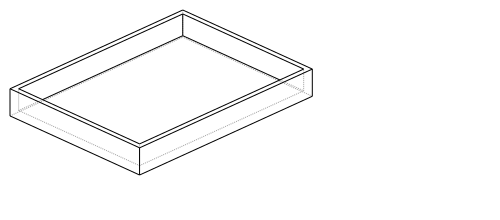

* **Builder mode**

    .. literalinclude:: general_examples.py
        :start-after: [Ex. 26]
        :end-before: [Ex. 26]

* **Algebra mode**

    .. literalinclude:: general_examples_algebra.py
        :start-after: [Ex. 26]
        :end-before: [Ex. 26]

.. _ex 27:

27. Splitting an Object
---------------------------------------------------

You can split an object using a plane, and retain either or both halves. In this case we select
a face and offset half the width of the box.

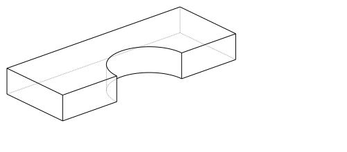

* **Builder mode**

    .. literalinclude:: general_examples.py
        :start-after: [Ex. 27]
        :end-before: [Ex. 27]

* **Algebra mode**

    .. literalinclude:: general_examples_algebra.py
        :start-after: [Ex. 27]
        :end-before: [Ex. 27]

.. _ex 28:

28. Locating features based on Faces
---------------------------------------------------

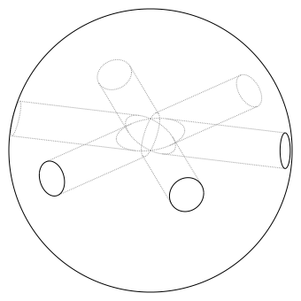

* **Builder mode**

    We create a triangular prism with :class:`~build_enums.Mode` ``.PRIVATE`` and then later
    use the faces of this object to cut holes in a sphere.

    .. literalinclude:: general_examples.py
        :start-after: [Ex. 28]
        :end-before: [Ex. 28]

* **Algebra mode**

    We create a triangular prism and then later  use the faces of this object to cut holes in a sphere.

    .. literalinclude:: general_examples_algebra.py
        :start-after: [Ex. 28]
        :end-before: [Ex. 28]

We are able to create multiple workplanes by looping over the list of faces.

.. _ex 29:

29. The Classic OCC Bottle
---------------------------------------------------

build123d is based on the OpenCascade.org (OCC) modeling Kernel. Those who are familiar with OCC
know about the famous ‘bottle’ example. We use a 3D Offset and the openings parameter to create
the bottle opening.

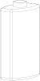

* **Builder mode**

    .. literalinclude:: general_examples.py
        :start-after: [Ex. 29]
        :end-before: [Ex. 29]

* **Algebra mode**

    .. literalinclude:: general_examples_algebra.py
        :start-after: [Ex. 29]
        :end-before: [Ex. 29]

.. _ex 30:

30. Bezier Curve
---------------------------------------------------

Here ``pts`` is used as an input to both :class:`~objects_curve.Polyline` and
:class:`~objects_curve.Bezier` and ``wts`` to Bezier alone. These two together
create a closed line that is made into a face and extruded.

* **Builder mode**

    .. literalinclude:: general_examples.py
        :start-after: [Ex. 30]
        :end-before: [Ex. 30]

* **Algebra mode**

    .. literalinclude:: general_examples_algebra.py
        :start-after: [Ex. 30]
        :end-before: [Ex. 30]

.. _ex 31:

31. Nesting Locations
---------------------------------------------------

Locations contexts can be nested to create groups of shapes. Here 24 triangles, 6 squares, and
1 hexagon are created and then extruded. Notably :class:`~build_common.PolarLocations`
rotates any "children" groups by default.

* **Builder mode**

    .. literalinclude:: general_examples.py
        :start-after: [Ex. 31]
        :end-before: [Ex. 31]

* **Algebra mode**

    .. literalinclude:: general_examples_algebra.py
        :start-after: [Ex. 31]
        :end-before: [Ex. 31]

.. _ex 32:

32. Python For-Loop
---------------------------------------------------

In this example, a standard python for-loop is used along with a list of faces extracted from a sketch
to progressively modify the extrusion amount. There are 7 faces in the sketch, so this results in 7
separate calls to :meth:`~operations_part.extrude`.

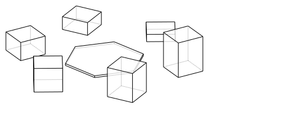

* **Builder mode**

    :class:`~build_enums.Mode` ``.PRIVATE`` is used in :class:`~build_sketch.BuildSketch` to avoid
    adding these faces until the for-loop.

    .. literalinclude:: general_examples.py
        :start-after: [Ex. 32]
        :end-before: [Ex. 32]

* **Algebra mode**

    .. literalinclude:: general_examples_algebra.py
        :start-after: [Ex. 32]
        :end-before: [Ex. 32]

.. _ex 33:

33. Python Function and For-Loop
---------------------------------------------------

Building on the previous example, a standard python function is used to return
a sketch as a function of several inputs to
progressively modify the size of each square.

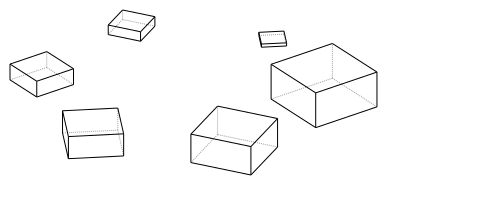

* **Builder mode**

    The function returns a :class:`~build_sketch.BuildSketch`.

    .. literalinclude:: general_examples.py
        :start-after: [Ex. 33]
        :end-before: [Ex. 33]

* **Algebra mode**

    The function returns a ``Sketch`` object.

    .. literalinclude:: general_examples_algebra.py
        :start-after: [Ex. 33]
        :end-before: [Ex. 33]

.. _ex 34:

34. Embossed and Debossed Text
---------------------------------------------------

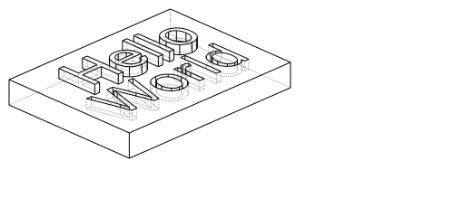

* **Builder mode**

    The text "Hello" is placed on top of a rectangle and embossed (raised) by placing a BuildSketch on the
    top face (``topf``). Note that :class:`~build_enums.Align` is used to control the text placement. We re-use
    the ``topf`` variable to select the same face and deboss (indented) the text "World". Note that if we simply
    ran ``BuildSketch(ex34.faces().sort_by(Axis.Z)[-1])`` for both ``ex34_sk1 & 2`` it would incorrectly locate
    the 2nd "World" text on the top of the "Hello" text.

    .. literalinclude:: general_examples.py
        :start-after: [Ex. 34]
        :end-before: [Ex. 34]

* **Algebra mode**

    The text "Hello" is placed on top of a rectangle and embossed (raised) by placing a sketch on the
    top face (``topf``). Note that :class:`~build_enums.Align` is used to control the text placement. We re-use
    the ``topf`` variable to select the same face and deboss (indented) the text "World".

    .. literalinclude:: general_examples_algebra.py
        :start-after: [Ex. 34]
        :end-before: [Ex. 34]

.. _ex 35:

35. Slots
---------------------------------------------------

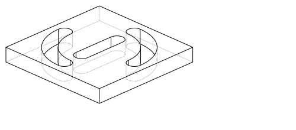

* **Builder mode**

    Here we create a :class:`~objects_sketch.SlotCenterToCenter` and then use a
    :class:`~build_line.BuildLine` and :class:`~objects_curve.RadiusArc` to create an
    arc for two instances of :class:`~objects_sketch.SlotArc`.

    .. literalinclude:: general_examples.py
        :start-after: [Ex. 35]
        :end-before: [Ex. 35]

* **Algebra mode**

    Here we create a :class:`~objects_sketch.SlotCenterToCenter` and then use
    a :class:`~objects_curve.RadiusArc` to create an arc for two instances of :class:`~operations_sketch.SlotArc`.

    .. literalinclude:: general_examples_algebra.py
        :start-after: [Ex. 35]
        :end-before: [Ex. 35]

.. _ex 36:

36. Extrude Until
---------------------------------------------------

Sometimes you will want to extrude until a given face that could be non planar or
where you might not know easily the distance you have to extrude to. In such
cases you can use :meth:`~operations_part.extrude` :class:`~build_enums.Until`
with ``Until.NEXT`` or ``Until.LAST``.

.. image:: assets/general_ex36.svg
    :align: center

* **Builder mode**

    .. literalinclude:: general_examples.py
        :start-after: [Ex. 36]
        :end-before: [Ex. 36]

* **Algebra mode**

    .. literalinclude:: general_examples_algebra.py
        :start-after: [Ex. 36]
        :end-before: [Ex. 36]
