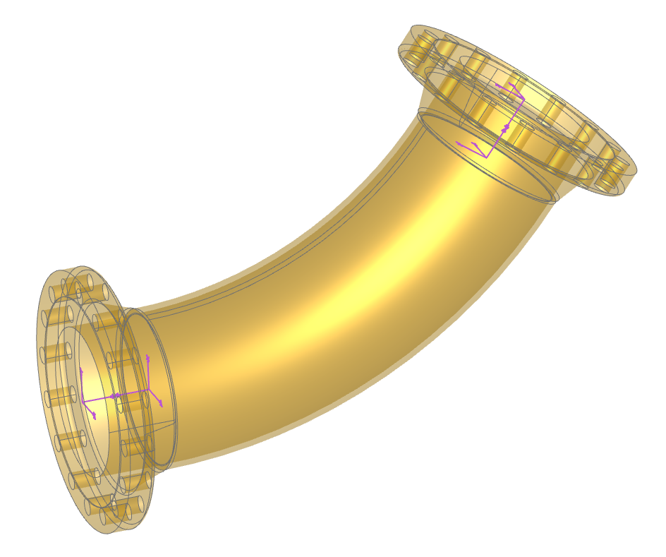
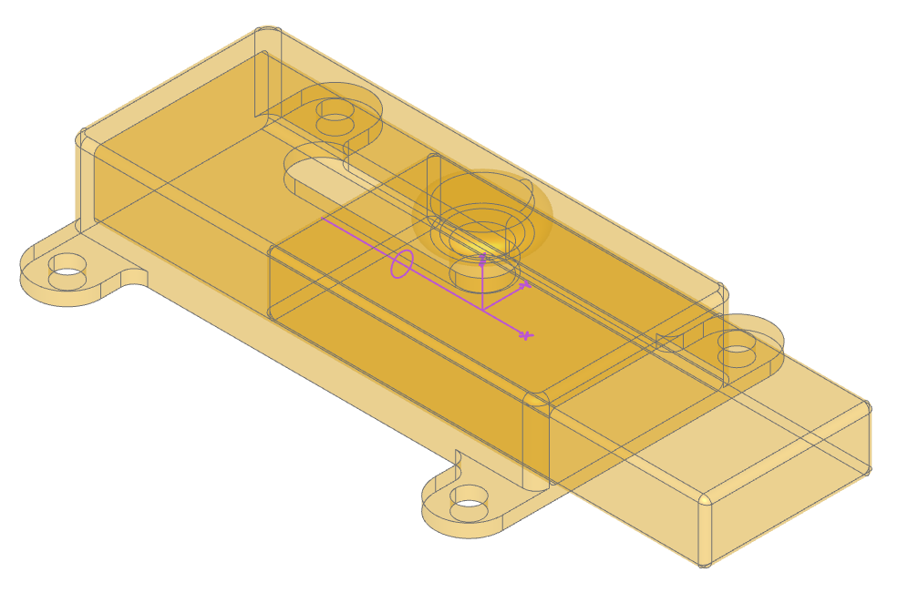
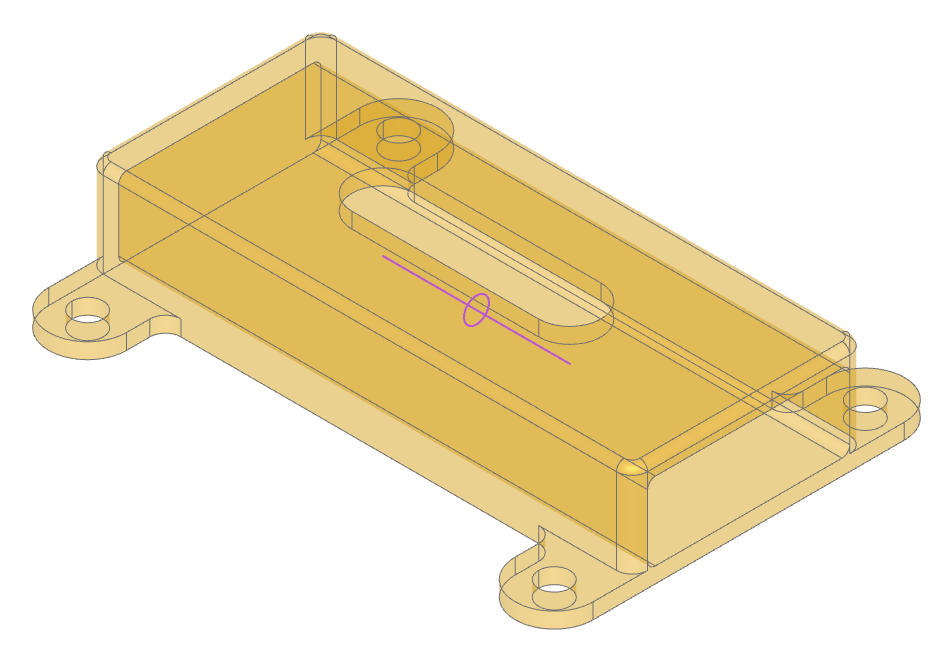
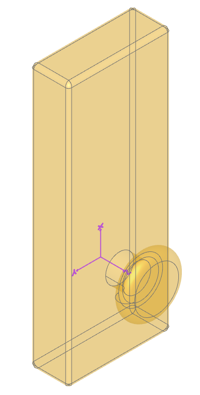
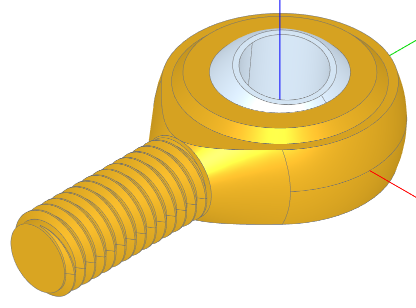

######
Joints
######

:class:`~topology.Joint`'s enable Solid and Compound objects to be arranged
relative to each other in an intuitive manner - with the same degree of motion
that is found with the equivalent physical joints.  :class:`~topology.Joint`'s always work
in pairs - a :class:`~topology.Joint` can only be connected to another :class:`~topology.Joint` as follows:

+---------------------------------------+---------------------------------------------------------------------+--------------------+
| :class:`~topology.Joint`              | connect_to                                                          | Example            |
+=======================================+=====================================================================+====================+
| :class:`~topology.BallJoint`          |  :class:`~topology.RigidJoint`                                      | Gimbal             |
+---------------------------------------+---------------------------------------------------------------------+--------------------+
| :class:`~topology.CylindricalJoint`   |  :class:`~topology.RigidJoint`                                      | Screw              |
+---------------------------------------+---------------------------------------------------------------------+--------------------+
| :class:`~topology.LinearJoint`        | :class:`~topology.RigidJoint`, :class:`~topology.RevoluteJoint`     | Slider or Pin Slot |
+---------------------------------------+---------------------------------------------------------------------+--------------------+
| :class:`~topology.RevoluteJoint`      | :class:`~topology.RigidJoint`                                       | Hinge              |
+---------------------------------------+---------------------------------------------------------------------+--------------------+
| :class:`~topology.RigidJoint`         | :class:`~topology.RigidJoint`                                       | Fixed              |
+---------------------------------------+---------------------------------------------------------------------+--------------------+

Objects may have many joints bound to them each with an identifying label. All :class:`~topology.Joint`
objects have a ``symbol`` property that can be displayed to help visualize
their position and orientation (the `ocp-vscode <https://github.com/bernhard-42/vscode-ocp-cad-viewer>`_ viewer 
has built-in support for displaying joints).

.. note::
    The :class:`~build_part.BuildPart` builder will currently over-write joints unless they appear at
    the end of the part definition.

The following sections provide more detail on the available joints and describes how they are used.

***********
Rigid Joint
***********

A rigid joint positions two components relative to each another with no freedom of movement. When a 
:class:`~topology.RigidJoint` is instantiated it's assigned a ``label``, a part to bind to (``to_part``),
and a ``joint_location`` which defines both the position and orientation of the joint (see 
:class:`~geometry.Location`) - as follows:

.. code-block:: python

    RigidJoint(label="outlet", to_part=pipe, joint_location=path.location_at(1))

Once a joint is bound to a part this way, the :meth:`~topology.Joint.connect_to` method can be used to 
repositioning another part relative to ``self`` which stay fixed - as follows:

.. code-block:: python

    pipe.joints["outlet"].connect_to(flange_outlet.joints["pipe"])

.. note::
    Within a part all of the joint labels must be unique.

The :meth:`~topology.Joint.connect_to` method only does a one time re-position of a part and does not
bind them in any way; however, putting them into an :ref:`assembly` will maintain there relative locations
as will combining parts with boolean operations or within a :class:`~build_part.BuildPart` context.

As a example of creating parts with joints and connecting them together, consider the following code where
flanges are attached to the ends of a curved pipe:

.. literalinclude:: rigid_joints_pipe.py

Note how the locations of the joints are determined by the :meth:`~topology.Mixin1D.location_at` method
and how the ``-`` negate operator is used to reverse the direction of the location without changing its
poosition.  Also note that the ``WeldNeckFlange`` class predefines two joints, one at the pipe end and
one at the face end - both of which are shown in the above image (generated by ocp-vscode with the
``render_joints=True`` flag set in the ``show`` function).

**************
Revolute Joint
**************

Component rotates around axis like a hinge. The :ref:`joint_tutorial` covers Revolute Joints in detail.

During instantiation of a :class:`~topology.RevoluteJoint` there are three parameters not present with 
Rigid Joints: ``axis``, ``angle_reference``, and ``range`` that allow the circular motion to be fully
defined.

When :meth:`~topology.Joint.connect_to` with a Revolute Joint, an extra ``angle`` parameter is present
which allows one to change the relative position of joined parts by changing a single value.

************
Linear Joint
************

Component moves along a single axis as with a sliding latch shown here:

The code to generate these components follows:

.. literalinclude:: slide_latch.py
    :emphasize-lines: 30, 52, 55

Note how the slide is constructed in a different orientation than the direction of motion. The
three highlighted lines of code show how the joints are created and connected together:

* The :class:`~topology.LinearJoint` has an axis and limits of movement
* The :class:`~topology.RigidJoint` has a single location, orientated such that the knob will ultimately be "up"
* The ``connect_to`` specifies a position that must be within the predefined limits.

The slider can be moved back and forth by just changing the ``position`` value.  Values outside
of the limits will raise an exception.

*****************
Cylindrical Joint
*****************

A :class:`~topology.CylindricalJoint` allows a component to rotate around and moves along a single axis 
like a screw combining the functionality of a :class:`~topology.LinearJoint` and a 
:class:`~topology.RevoluteJoint` joint.  The ``connect_to`` for these joints have both ``position`` and 
``angle`` parameters as shown below extracted from the joint tutorial. 

.. code-block::python

    hinge_outer.joints["hole2"].connect_to(m6_joint, position=5 * MM, angle=30)

**********
Ball Joint
**********

A component rotates around all 3 axes using a gimbal system (3 nested rotations). A :class:`~topology.BallJoint`
is found within a rod end as shown here:

.. literalinclude:: rod_end.py
    :emphasize-lines: 37-42,49,51

Note how limits are defined during the instantiation of the ball joint when ensures that the pin or bolt 
within the rod end does not interfer with the rod end itself. The ``connect_to`` sets the three angles
(only two are significant in this example).

