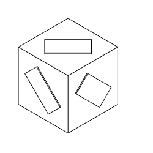

###########################
Key Concepts (builder mode)
###########################

There are two primary APIs provided by build123d: builder and algebra. The builder
API may be easier for new users as it provides some assistance and shortcuts; however,
if you know what a Quaternion is you might prefer the algebra API which allows
CAD objects to be created in the style of mathematical equations. Both API can
be mixed in the same model with the exception that the algebra API can't be used
from within a builder context. As with music, there is no "best" genre or API,
use the one you prefer or both if you like.

The following key concepts will help new users understand build123d quickly.

.. _topology:

Topology
========

Topology, in the context of 3D modeling and computational geometry, is the
branch of mathematics that deals with the properties and relationships of
geometric objects that are preserved under continuous deformations. In the
context of CAD and modeling software like build123d, topology refers to the
hierarchical structure of geometric elements (vertices, edges, faces, etc.) and
their relationships in a 3D model. This structure defines how the components of
a model are connected, enabling operations like Boolean operations,
transformations, and analysis of complex shapes. Topology provides a formal
framework for understanding and manipulating geometric data in a consistent and
reliable manner.

The following are the topological objects that compose build123d objects:

:class:`~topology.Vertex`
    A Vertex is a data structure representing a 0D topological element. It
    defines a precise point in 3D space, often at the endpoints or intersections of
    edges in a 3D model. These vertices are part of the topological structure used
    to represent complex shapes in build123d.

:class:`~topology.Edge`
	An Edge in build123d is a fundamental geometric entity representing a 1D
	element in a 3D model. It defines the shape and position of a 1D curve within
	the model. Edges play a crucial role in defining the boundaries of faces and in
	constructing complex 3D shapes.

:class:`~topology.Wire`
	A Wire in build123d is a topological construct that represents a connected
	sequence of Edges, forming a 1D closed or open loop within a 3D model. Wires
	define the boundaries of faces and can be used to create complex shapes, making
	them essential for modeling in build123d.

:class:`~topology.Face`
	A Face in build123d represents a 2D surface in a 3D model. It defines the
	boundary of a region and can have associated geometric and topological data.
	Faces are vital for shaping solids, providing surfaces where other elements like
	edges and wires are connected to form complex structures.

:class:`~topology.Shell`
	A Shell in build123d represents a collection of Faces, defining a closed,
	connected volume in 3D space. It acts as a container for organizing and grouping
	faces into a single shell, essential for defining complex 3D shapes like solids
	or assemblies within the build123d modeling framework.

:class:`~topology.Solid`
	A Solid in build123d is a 3D geometric entity that represents a bounded
	volume with well-defined interior and exterior surfaces. It encapsulates a
	closed and watertight shape, making it suitable for modeling solid objects and
	enabling various Boolean operations such as union, intersection, and
	subtraction.

:class:`~topology.Compound`
	A Compound in build123d is a container for grouping multiple geometric
	shapes. It can hold various types of entities, such as vertices, edges, wires,
	faces, shells, or solids, into a single structure. This makes it a versatile
	tool for managing and organizing complex assemblies or collections of shapes
	within a single container.

:class:`~topology.Shape`
	A Shape in build123d represents a fundamental building block in 3D
	modeling. It encompasses various topological elements like vertices, edges,
	wires, faces, shells, solids, and compounds. The Shape class is the base class
	for all of the above topological classes.

One can use the :meth:`~topology.Shape.show_topology` method to display the
topology of a shape as shown here for a unit cube:

.. code::
	
	Solid                      at 0x7f94c55430f0, Center(0.5, 0.5, 0.5)
	└── Shell                  at 0x7f94b95835f0, Center(0.5, 0.5, 0.5)
	    ├── Face               at 0x7f94b95836b0, Center(0.0, 0.5, 0.5)
	    │   └── Wire           at 0x7f94b9583730, Center(0.0, 0.5, 0.5)
	    │       ├── Edge       at 0x7f94b95838b0, Center(0.0, 0.0, 0.5)
	    │       │   ├── Vertex at 0x7f94b9583470, Center(0.0, 0.0, 1.0)
	    │       │   └── Vertex at 0x7f94b9583bb0, Center(0.0, 0.0, 0.0)
	    │       ├── Edge       at 0x7f94b9583a30, Center(0.0, 0.5, 1.0)
	    │       │   ├── Vertex at 0x7f94b9583030, Center(0.0, 1.0, 1.0)
	    │       │   └── Vertex at 0x7f94b9583e70, Center(0.0, 0.0, 1.0)
	    │       ├── Edge       at 0x7f94b9583770, Center(0.0, 1.0, 0.5)
	    │       │   ├── Vertex at 0x7f94b9583bb0, Center(0.0, 1.0, 1.0)
	    │       │   └── Vertex at 0x7f94b9583e70, Center(0.0, 1.0, 0.0)
	    │       └── Edge       at 0x7f94b9583db0, Center(0.0, 0.5, 0.0)
	    │           ├── Vertex at 0x7f94b9583e70, Center(0.0, 1.0, 0.0)
	    │           └── Vertex at 0x7f94b95862f0, Center(0.0, 0.0, 0.0)
	...
	    └── Face               at 0x7f94b958d3b0, Center(0.5, 0.5, 1.0)
	        └── Wire           at 0x7f94b958d670, Center(0.5, 0.5, 1.0)
	            ├── Edge       at 0x7f94b958e130, Center(0.0, 0.5, 1.0)
	            │   ├── Vertex at 0x7f94b958e330, Center(0.0, 1.0, 1.0)
	            │   └── Vertex at 0x7f94b958e770, Center(0.0, 0.0, 1.0)
	            ├── Edge       at 0x7f94b958e630, Center(0.5, 1.0, 1.0)
	            │   ├── Vertex at 0x7f94b958e8b0, Center(1.0, 1.0, 1.0)
	            │   └── Vertex at 0x7f94b958ea70, Center(0.0, 1.0, 1.0)
	            ├── Edge       at 0x7f94b958e7b0, Center(1.0, 0.5, 1.0)
	            │   ├── Vertex at 0x7f94b958ebb0, Center(1.0, 1.0, 1.0)
	            │   └── Vertex at 0x7f94b958ed70, Center(1.0, 0.0, 1.0)
	            └── Edge       at 0x7f94b958eab0, Center(0.5, 0.0, 1.0)
	                ├── Vertex at 0x7f94b958eeb0, Center(1.0, 0.0, 1.0)
	                └── Vertex at 0x7f94b9592170, Center(0.0, 0.0, 1.0)
	
Users of build123d will often reference topological objects as part of the
process of creating the object as described below.

Builders
========

The three builders, ``BuildLine``, ``BuildSketch``, and ``BuildPart`` are tools to create
new objects - not the objects themselves. Each of the objects and operations applicable
to these builders create objects of the standard CadQuery Direct API, most commonly
``Compound`` objects.  This is opposed to CadQuery's Fluent API which creates objects
of the ``Workplane`` class which frequently needed to be converted back to base
class for further processing.

One can access the objects created by these builders by referencing the appropriate
instance variable. For example:

.. code-block:: python

    with BuildPart() as my_part:
        ...

    show_object(my_part.part)

.. code-block:: python

    with BuildSketch() as my_sketch:
        ...

    show_object(my_sketch.sketch)

.. code-block:: python

    with BuildLine() as my_line:
        ...

    show_object(my_line.line)

Implicit Builder Instance Variables
===================================

One might expect to have to reference a builder's instance variable when using
objects or operations that impact that builder like this:

.. code-block:: python

    with BuildPart() as part_builder:
        Box(part_builder, 10,10,10)

Instead, build123d determines from the scope of the object or operation which
builder it applies to thus eliminating the need for the user to provide this
information - as follows:

.. code-block:: python

    with BuildPart() as part_builder:
        Box(10,10,10)
        with BuildSketch() as sketch_builder:
            Circle(2)

In this example, ``Box`` is in the scope of ``part_builder`` while ``Circle``
is in the scope of ``sketch_builder``.

Workplanes
==========

As build123d is a 3D CAD package one must be able to position objects anywhere. As one
frequently will work in the same plane for a sequence of operations, the first parameter(s)
of the builders is a (sequence of) workplane(s) which is (are) used
to aid in the location of features. The default workplane in most cases is the ``Plane.XY``
where a tuple of numbers represent positions on the x and y axes. However workplanes can
be generated on any plane which allows users to put a workplane where they are working
and then work in local 2D coordinate space.


.. code-block:: python

    with BuildPart(Plane.XY) as example:
        ... # a 3D-part
        with BuildSketch(example.faces().sort_by(sort_by=Axis.Z)[0]) as bottom:
            ...
        with BuildSketch(Plane.XZ) as vertical:
            ...
        with BuildSketch(example.faces().sort_by(sort_by=Axis.Z)[-1]) as top:
            ...

When ``BuildPart`` is invoked it creates the workplane provided as a parameter (which has a
default of the ``Plane.XY``). The ``bottom`` sketch is therefore created on the ``Plane.XY`` but with the
normal reversed to point down. Subsequently the user has created the ``vertical`` (``Plane.XZ``) sketch.
All objects or operations within the scope of a workplane will automatically be orientated with
respect to this plane so the user only has to work with local coordinates.

As shown above, workplanes can be created from faces as well. The ``top`` sketch is
positioned on top of ``example`` by selecting its faces and finding the one with the greatest z value.

One is not limited to a single workplane at a time. In the following example all six
faces of the first box are used to define workplanes which are then used to position
rotated boxes.

.. code-block:: python

    import build123d as bd

    with bd.BuildPart() as bp:
        bd.Box(3, 3, 3)
        with bd.BuildSketch(*bp.faces()):
            bd.Rectangle(1, 2, rotation=45)
        bd.extrude(amount=0.1)

This is the result:



.. _location_context_link:

Location
========

A :class:`~geometry.Location` represents a combination of translation and rotation
applied to a topological or geometric object. It encapsulates information
about the spatial orientation and position of a shape within its reference
coordinate system. This allows for efficient manipulation of shapes within
complex assemblies or transformations. The location is typically used to
position shapes accurately within a 3D scene, enabling operations like
assembly, and boolean operations. It's an essential component in build123d
for managing the spatial relationships of geometric entities, providing a
foundation for precise 3D modeling and engineering applications.

The topological classes (sub-classes of :class:`~topology.Shape`) and the geometric classes 
:class:`~geometry.Axis` and :class:`~geometry.Plane` all have a ``location`` property.
The :class:`~geometry.Location` class itself has ``position`` and ``orientation`` properties
that have setters and getters as shown below:


.. doctest::

    >>> from build123d import *
    >>> # Create an object and extract its location
    >>> b = Box(1, 1, 1)
    >>> box_location = b.location
    >>> box_location
    (p=(0.00, 0.00, 0.00), o=(-0.00, 0.00, -0.00))
    >>> # Set position and orientation independently
    >>> box_location.position = (1, 2, 3)
    >>> box_location.orientation = (30, 40, 50)
    >>> box_location.position
    Vector: (1.0, 2.0, 3.0)
    >>> box_location.orientation
    Vector: (29.999999999999993, 40.00000000000002, 50.000000000000036)

Combining the getter and setter enables relative changes as follows:

.. doctest::

    >>> # Relative change
    >>> box_location.position += (3, 2, 1)
    >>> box_location.position
    Vector: (4.0, 4.0, 4.0)

There are also four methods that are used to change the location of objects:

* :meth:`~topology.Shape.locate` - absolute change of this object
* :meth:`~topology.Shape.located` - absolute change of copy of this object
* :meth:`~topology.Shape.move` - relative change of this object
* :meth:`~topology.Shape.moved` - relative change of copy of this object

Locations can be combined with the ``*`` operator and have their direction flipped with
the ``-`` operator.

Locations Context
=================

When positioning objects or operations within a builder Location Contexts are used.  These
function in a very similar was to the builders in that they create a context where one or
more locations are active within a scope.  For example:

.. code-block:: python

    with BuildPart():
        with Locations((0,10),(0,-10)):
            Box(1,1,1)
            with GridLocations(x_spacing=5, y_spacing=5, x_count=2, y_count=2):
                Sphere(1)
            Cylinder(1,1)

In this example ``Locations`` creates two positions on the current workplane at (0,10) and (0,-10).
Since ``Box`` is within the scope of ``Locations``, two boxes are created at these locations. The
``GridLocations`` context creates four positions which apply to the ``Sphere``. The ``Cylinder`` is
out of the scope of ``GridLocations`` but in the scope of ``Locations`` so two cylinders are created.

Note that these contexts are creating Location objects not just simple points. The difference
isn't obvious until the ``PolarLocations`` context is used which can also rotate objects within
its scope - much as the hour and minute indicator on an analogue clock.

Also note that the locations are local to the current location(s) - i.e. ``Locations`` can be
nested. It's easy for a user to retrieve the global locations:

.. code-block:: python

    with Locations(Plane.XY, Plane.XZ):
        locs = GridLocations(1, 1, 2, 2)
        for l in locs:
            print(l)

.. code-block::

    Location(p=(-0.50,-0.50,0.00), o=(0.00,-0.00,0.00))
    Location(p=(-0.50,0.50,0.00), o=(0.00,-0.00,0.00))
    Location(p=(0.50,-0.50,0.00), o=(0.00,-0.00,0.00))
    Location(p=(0.50,0.50,0.00), o=(0.00,-0.00,0.00))
    Location(p=(-0.50,-0.00,-0.50), o=(90.00,-0.00,0.00))
    Location(p=(-0.50,0.00,0.50), o=(90.00,-0.00,0.00))
    Location(p=(0.50,0.00,-0.50), o=(90.00,-0.00,0.00))
    Location(p=(0.50,0.00,0.50), o=(90.00,-0.00,0.00))


Operation Inputs
================

When one is operating on an existing object, e.g. adding a fillet to a part,
an iterable of objects is often required (often a ShapeList).

Here is the definition of :meth:`~operations_generic.fillet` to help illustrate:

.. code-block:: python

    def fillet(
        objects: Union[Union[Edge, Vertex], Iterable[Union[Edge, Vertex]]],
        radius: float,
    ):

To use this fillet operation, an edge or vertex or iterable of edges or 
vertices must be provided followed by a fillet radius with or without the keyword as follows:

.. code-block:: python

    with BuildPart() as pipes:
        Box(10, 10, 10, rotation=(10, 20, 30))
        ...
        fillet(pipes.edges(Select.LAST), radius=0.2)

Here the fillet accepts the iterable ShapeList of edges from the last operation of
the ``pipes`` builder and a radius is provided as a keyword argument.

Combination Modes
=================

Almost all objects or operations have a ``mode`` parameter which is defined by the
``Mode`` Enum class as follows:

.. code-block:: python

    class Mode(Enum):
        ADD = auto()
        SUBTRACT = auto()
        INTERSECT = auto()
        REPLACE = auto()
        PRIVATE = auto()

The ``mode`` parameter describes how the user would like the object or operation to
interact with the object within the builder. For example, ``Mode.ADD`` will
integrate a new object(s) in with an existing ``part``.  Note that a part doesn't
necessarily have to be a single object so multiple distinct objects could be added
resulting is multiple objects stored as a ``Compound`` object. As one might expect
``Mode.SUBTRACT``, ``Mode.INTERSECT``, and ``Mode.REPLACE`` subtract, intersect, or replace
(from) the builder's object. ``Mode.PRIVATE`` instructs the builder that this object
should not be combined with the builder's object in any way.

Most commonly, the default ``mode`` is ``Mode.ADD`` but this isn't always true.
For example, the ``Hole`` classes use a default ``Mode.SUBTRACT`` as they remove
a volume from the part under normal circumstances. However, the ``mode`` used in
the ``Hole`` classes can be specified as ``Mode.ADD`` or ``Mode.INTERSECT`` to
help in inspection or debugging.

Selectors
=========

.. include:: selectors.rst

Using Locations & Rotating Objects
==================================

build123d stores points (to be specific ``Location`` (s)) internally to be used as
positions for the placement of new objects.  By default, a single location
will be created at the origin of the given workplane such that:

.. code-block:: python

    with BuildPart() as pipes:
        Box(10, 10, 10, rotation=(10, 20, 30))

will create a single 10x10x10 box centered at (0,0,0) - by default objects are
centered. One can create multiple objects by pushing points prior to creating
objects as follows:

.. code-block:: python

    with BuildPart() as pipes:
        with Locations((-10, -10, -10), (10, 10, 10)):
            Box(10, 10, 10, rotation=(10, 20, 30))

which will create two boxes.

To orient a part, a ``rotation`` parameter is available on ``BuildSketch``` and
``BuildPart`` APIs. When working in a sketch, the rotation is a single angle in
degrees so the parameter is a float. When working on a part, the rotation is
a three dimensional ``Rotation`` object of the form
``Rotation(<about x>, <about y>, <about z>)`` although a simple three tuple of
floats can be used as input.  As 3D rotations are not cumulative, one can
combine rotations with the `*` operator like this:
``Rotation(10, 20, 30) * Rotation(0, 90, 0)`` to generate any desired rotation.

.. hint::
    Experts Only

    ``Locations`` will accept ``Location`` objects for input which allows one
    to specify both the position and orientation.  However, the orientation
    is often determined by the ``Plane`` that an object was created on.
    ``Rotation`` is a subclass of ``Location`` and therefore will also accept
    a position component.

Builder's Pending Objects
=========================

When a builder exits, it will push the object created back to its parent if
there was one.  Here is an example:

.. code-block:: python

    height, width, thickness, f_rad = 60, 80, 20, 10

    with BuildPart() as pillow_block:
        with BuildSketch() as plan:
            Rectangle(width, height)
            fillet(plan.vertices(), radius=f_rad)
        extrude(amount=thickness)

``BuildSketch`` exits after the ``fillet`` operation and when doing so it transfers
the sketch to the ``pillow_block`` instance of ``BuildPart`` as the internal instance variable
``pending_faces``. This allows the ``extrude`` operation to be immediately invoked as it
extrudes these pending faces into ``Solid`` objects. Likewise, ``loft`` would take all of the
``pending_faces`` and attempt to create a single ``Solid`` object from them.

Normally the user will not need to interact directly with pending objects; however,
one can see pending Edges and Faces with ``<builder_instance>.pending_edges`` and 
``<builder_instance>.pending_faces`` attributes.  In the above example, by adding a 
``print(pillow_block.pending_faces)`` prior to the ``extrude(amount=thickness)`` the
pending ``Face`` from the ``BuildSketch`` will be displayed.
