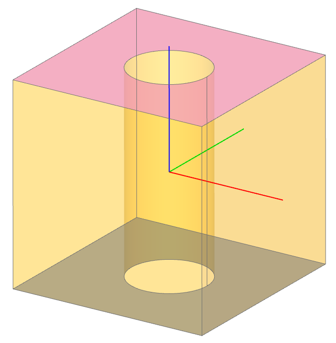

When using a GUI based CAD system the user will often click on a feature to select
it for some operation. How does a user "click" when CAD is done entirely in code?
Selectors are recipes for how to isolate a feature from a design using python
filter and sorting methods typically implemented as a set of custom python
operations.

Quick Reference
---------------

The following tables describes the build123d selectors:

+-------------+-----------------------------------+-------------------+-------------------+
| Selector    | Applicability                     | Description       | Example           |
+=============+===================================+===================+===================+
| vertices()  | BuildLine, BuildSketch, BuildPart | Vertex extraction | `part.vertices()` |
+-------------+-----------------------------------+-------------------+-------------------+
| edges()     | BuildLine, BuildSketch, BuildPart | Edge extraction   | `part.edges()`    |
+-------------+-----------------------------------+-------------------+-------------------+
| wires()     | BuildLine, BuildSketch, BuildPart | Wire extraction   | `part.wires()`    |
+-------------+-----------------------------------+-------------------+-------------------+
| faces()     | BuildSketch, BuildPart            | Face extraction   | `part.faces()`    |
+-------------+-----------------------------------+-------------------+-------------------+
| solids()    | BuildPart                         | Solid extraction  | `part.solids()`   |
+-------------+-----------------------------------+-------------------+-------------------+

.. _selector_operators:

+----------+-----------------------+--------------------+-------------------------------------------------------+---------------------------------------------------------------------------+
| Operator | Operand               | Method             | Description                                           | Example                                                                   |
+==========+=======================+====================+=======================================================+===========================================================================+
| >        | SortBy, Axis          | sort_by            | Sort ShapeList by operand                             | `part.vertices() > Axis.Z`                                                |
+----------+-----------------------+--------------------+-------------------------------------------------------+---------------------------------------------------------------------------+
| <        | SortBy, Axis          | sort_by            | Reverse sort ShapeList by operand                     | `part.faces() < Axis.Z`                                                   |
+----------+-----------------------+--------------------+-------------------------------------------------------+---------------------------------------------------------------------------+
| >>       | SortBy, Axis          | group_by           | Group ShapeList by operand and return last value      | `part.solids() >> Axis.X`                                                 |
+----------+-----------------------+--------------------+-------------------------------------------------------+---------------------------------------------------------------------------+
| <<       | SortBy, Axis          | group_by           | Group ShapeList by operand and return first value     | `part.faces() << Axis.Y`                                                  |
+----------+-----------------------+--------------------+-------------------------------------------------------+---------------------------------------------------------------------------+
| \|       | Axis, Plane, GeomType | filter_by          | Filter and sort ShapeList by Axis, Plane, or GeomType | `part.faces() \| Axis.Z`                                                  |
+----------+-----------------------+--------------------+-------------------------------------------------------+---------------------------------------------------------------------------+
| []       |                       |                    | Standard python list indexing and slicing             | `part.faces()[-2:]`                                                       |
+----------+-----------------------+--------------------+-------------------------------------------------------+---------------------------------------------------------------------------+
|          | Axis                  | filter_by_position | Filter ShapeList by Axis & mix / max values           | `part.faces()..filter_by_position(Axis.Z, 1, 2, inclusive=(False, True))` |
+----------+-----------------------+--------------------+-------------------------------------------------------+---------------------------------------------------------------------------+

The operand types are: Axis, Plane, SortBy, and GeomType. An Axis is a base object with an origin and a
direction with several predefined values such as ``Axis.X``, ``Axis.Y``, and ``Axis.Z``; however,
any Axis could be used as an operand (e.g. ``Axis((1,2,3),(0.5,0,-0.5))`` is valid) - see
:class:`~geometry.Axis` for a complete description.
A Plane is a coordinate system defined by an origin, x_dir (X direction), y_dir (Y direction), and
z_dir (Z direction). See :class:`~geometry.Plane` for a complete description.
Filtering by a Plane will return faces/edges parallel to it.
SortBy and GeomType are python
Enum class described here:

:class:`~build_enums.GeomType`
    BEZIER, BSPLINE, CIRCLE, CONE, CYLINDER, ELLIPSE, EXTRUSION, HYPERBOLA, LINE, OFFSET, OTHER,
    PARABOLA, PLANE, REVOLUTION, SPHERE, TORUS
:class:`~build_enums.SortBy`
    LENGTH, RADIUS, AREA, VOLUME, DISTANCE

ShapeList Class
---------------

The builders include methods to extract Edges, Faces, Solids, Vertices, or Wires from the objects
they are building. All of these methods return objects of a subclass of `list`, a :class:`~topology.ShapeList` with
custom filtering and sorting methods and operations as follows.

Custom Sorting and Filtering
----------------------------

It is important to note that standard list methods such as `sorted` or `filtered` can
be used to easily build complex selectors beyond what is available with the predefined
sorts and filters. Here is an example of a custom filters:

.. code-block:: python

    with BuildSketch() as din:
        ...
        outside_vertices = filter(
            lambda v: (v.Y == 0.0 or v.Y == height)
            and -overall_width / 2 < v.X < overall_width / 2,
            din.vertices(),
        )

The :meth:`~topology.ShapeList.filter_by` method can take lambda expressions as part of a
fluent chain of operations which enables integration of custom filters into a larger change of
selectors as shown in this example:

.. code-block:: python

    obj = Box(1, 1, 1) - Cylinder(0.2, 1)
    faces_with_holes = obj.faces().filter_by(lambda f: f.inner_wires())

Here the two faces with "inner_wires" (i.e. holes) have been selected independent of orientation.