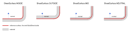

.. _sheet_metal_concepts:

########
Concepts
########

A sheet metal part is modelled as a *surface* rather than a solid: a
``Shell`` of flat faces and cylindrical bends sewn into one connected sheet.
That surface is the **reference surface**, and every size in the model is
measured on it. Where the material sits relative to it, against one face of it
or straddling it, is a parameter described below. The surface is given its
thickness only at the end by :ref:`thicken <sheet_metal_thicken>`, and the
same surface is what :ref:`unfold <sheet_metal_unfold>` develops into the flat
pattern.

This page explains the handful of ideas the operations share. Read it once;
the operation pages assume it.

.. _sheet_metal_parameters:

****************
Sheet parameters
****************

Four numbers relate the reference surface to the physical material. In Builder
mode they are the arguments of ``BuildSheet``; in Algebra mode they are
bundled as a ``SheetMetalParameters`` and passed to every operation.

=================  =============================================================
Parameter          Meaning
=================  =============================================================
``thickness``      The sheet's material thickness.
``bend_radius``    The default *inside* radius of a bend, the physical radius
                   on the concave side. Any bending operation can override it.
                   Defaults to the thickness.
``k_factor``       Where the neutral axis lies through the thickness, as a
                   fraction from the inside of the bend. Defaults to 0.5.
``sheet_surface``  Which face of the material the reference surface is:
                   ``INSIDE``, ``OUTSIDE``, ``MID`` or ``NEUTRAL``. Defaults to
                   ``INSIDE``.
=================  =============================================================

.. tab-set::

    .. tab-item:: Builder

        .. code-block:: build123d

            with BuildSheet(thickness=1, bend_radius=2, k_factor=0.4) as sheet:
                with BuildSketch():
                    Rectangle(100, 60)
                flange(sheet.rims(), length=20)

    .. tab-item:: Algebra

        .. code-block:: build123d

            parameters = SheetMetalParameters(thickness=1, bend_radius=2, k_factor=0.4)
            blank = Rectangle(100, 60)
            sheet = flange(blank.edges(), length=20, sheet_parameters=parameters)

Inside a ``BuildSheet`` the operations take the parameters from the builder
and the ``sheet_parameters`` argument must be left out. In Algebra mode it is
required.

*********************
The reference surface
*********************

When metal bends, the outside of the bend stretches and the inside compresses.
Somewhere between them is a layer whose length does not change, the **neutral
axis**, and the K-factor says where: a fraction of the thickness measured from
the inside of the bend. The length of flat a bend consumes, its **bend
allowance**, is the arc length of that layer.

``sheet_surface`` chooses which surface of the material the model draws. The
drawn face has a normal, and positive bend angles fold toward it. In section,
with the drawn face as the horizontal line and a bend folded toward its
normal, the four choices put the material here:

=============  ==================  ====================================
Surface        Material lies       Where the surface sits
=============  ==================  ====================================
``INSIDE``     against the normal  the inside face of the sheet
``OUTSIDE``    along the normal    the outside face of the sheet
``MID``        half each way       the middle of the sheet
``NEUTRAL``    ``k`` toward,       the neutral axis of a bend toward
               ``1 - k`` against   the normal
=============  ==================  ====================================

The default, ``INSIDE``, means a sheet drawn on ``Plane.XY`` has its material
below the plane, from ``z = 0`` down to ``-thickness``, and a positive angle
folds the wall up toward ``+Z`` with the drawn face on the inside of the fold.
That is the natural choice when the drawing dimensions the inside of a box or
tray. ``OUTSIDE`` suits a part dimensioned to its outer faces, and ``MID`` and
``NEUTRAL`` are for workflows that measure on the centre or on the neutral
axis.

The bend radius you give is always the physical inside radius. The model
converts it to the radius the reference surface is drawn at, using the
thickness, the direction of the fold and the K-factor, so the bend allowance
comes out the same whichever surface is drawn.

.. _sheet_metal_dimensioning:

************************************
From drawing dimensions to the model
************************************

A drawing dimensions a folded part to its **virtual sharps**, the corners it
would have if it were folded sharp, where the extended faces of two legs meet,
and gives the bend radius separately. The model is built from flat faces and
the bends between them, so the question is how a drawing's numbers become the
sizes the faces are drawn with.

Four lengths describe a bend of angle *θ* in a sheet of thickness *t* with
inside radius *r*, all measured along the sheet from the bend's **tangent
line**, where the flat stops and the arc begins:

===================================  ====================================
Quantity                             Value
===================================  ====================================
Inside setback, to the inner sharp   ``r · tan(θ / 2)``
Outside setback, to the outer sharp  ``(r + t) · tan(θ / 2)``
Bend allowance, flat the arc takes   ``θ · (r + k · t)`` with *θ* in radians
Bend deduction                       ``2 · outside setback - bend allowance``
===================================  ====================================

The setbacks say how far a corner of the part lies beyond the tangent line, so
a leg dimensioned to a sharp is longer than its flat by one setback, and a face
between two bends is longer by two. The bend allowance is what a bend consumes
of the blank, and the flat pattern's length is the sum of the drawing's outside
dimensions less one bend deduction per bend.

You rarely need to do this arithmetic. :ref:`flange <sheet_metal_flange>`
takes a drawing's numbers directly: ``position`` puts the corner of the formed
part on the edge the face was drawn to, and ``length_mode`` measures the wall
from the corner at its other end. A U channel dimensioned to its outside
faces, 60 wide, 40 high and 100 long in 2 mm sheet bent to an inside radius of
3, is drawn with exactly those numbers:

.. code-block:: build123d

    with BuildSheet(thickness=2, bend_radius=3) as channel:
        with BuildSketch():
            Rectangle(60, 100)  # the drawing's outside width and length
        flange(
            channel.rims().filter_by(Axis.Y),
            length=40,  # the drawing's outside height
            position=BendPosition.MATERIAL_OUTSIDE,
            length_mode=FlangeLength.OUTER_SHARP,
        )

Thickened, the part measures 60 × 100 × 40 outside. With the default
``BendPosition.BEND_OUTSIDE`` and ``FlangeLength.TANGENT`` the bend starts at
the edge and the wall is the flat beyond it, so the same channel would be
drawn to its tangent lines: a base of ``60 - 2 × 5`` and walls of ``40 - 5``.
Both give the same part. The default is the natural form when the flat sizes
are what is known, as for a blank that already exists; the drawing form when
the sharps are.

.. _sheet_metal_topology:

******************************
Flats, bends, rims, fold lines
******************************

A sheet reads as flats joined by bends, and the selectors say so directly.
``BuildSheet`` has them as methods and so does every ``Shell``, for Algebra
mode:

=================  ============================================================
Selector           What it returns
=================  ============================================================
``flats()``        The planar faces.
``bends()``        The cylindrical faces. A bend's ``length`` runs along its
                   axis, so bends sort by the size they look like they are.
``rims()``         The free edges of the flats: the edges a flange, hem or
                   jog can be folded from.
``fold_lines()``   The straight edges shared by two coplanar flats: the lines
                   a bend or jog can fold along.
=================  ============================================================

All four take the same ``Select`` argument as the other builder selectors, so
``tray.bends(Select.LAST)`` narrows to the last operation. A flat has
``fold_lines()`` and ``rims()`` of its own, selected through it, which matters
for :ref:`bend <sheet_metal_bend>`: a fold line lies between two flats, and
selecting it through one of them is how you say which side stays put.

.. code-block:: build123d

    long_bends = tray.bends().sort_by(SortBy.LENGTH)[-2:]
    top_rims = tray.rims().group_by(Axis.Z)[-1]
    line = tray.flats().sort_by(Axis.X)[0].fold_lines()[0]

.. _sheet_selection_lifetime:

******************
Selection lifetime
******************

Every operation replaces the whole shell: the faces it touched are rebuilt and
the rest are sewn in again. A selection made *before* an operation therefore
names shapes the sheet no longer contains. Hand such a stale selection to the
next operation and it is refused with a message that says so, rather than
failing later as a geometry problem. Select again from the sheet as it is now;
it is no more work than reaching for the selection the first time.

``Select.LAST`` is what the last operation brought in, made, or moved: a
flange's bend and wall, a bend's cylinder together with everything that swung
with it. A face the operation only trimmed keeps its identity and is not
*last*, though the edges the cut made are, so after a hole
``tray.edges(Select.LAST)`` is the hole's edge and ``tray.faces(Select.LAST)``
is empty. ``Select.NEW`` narrows further to what no input had in any form. The
general rules are under :ref:`when a feature came to be <when>`.

Fold lines survive all of this: material arriving with a later flange or hem
merges into the face it touches, but a seam already in the sheet stays a seam,
so a face can be split, flanged elsewhere, and folded along the split
afterwards.

*******************
Builder and Algebra
*******************

``BuildSheet`` is a builder like ``BuildPart``: it holds the sheet in progress,
takes the regions of a nested ``BuildSketch`` in as flat faces, gives the
operations their parameters, and offers the selectors above. Sketch objects
written directly inside ``BuildSheet`` are not material: a sheet is never
assembled from 2D pieces the way a sketch is, so ``Rectangle(100, 60)`` on its
own in the sheet context is refused with ``Mode.ADD``, and with
``Mode.SUBTRACT`` it is a cutter for the face it lies on. Nested inside ``BuildPart`` it publishes the
finished shell so that a bare :func:`~operations_part.thicken` consumes it.
The builder's own page, :ref:`BuildSheet <build_sheet>`, covers what it
accepts as material and what it does with sketch objects and solids drawn
inside it.

In Algebra mode there is no context. A blank is a ``Face`` or a sketch object,
a sheet is a ``Shell``, each operation returns the new ``Shell``, and the
parameters travel with every call:

.. code-block:: build123d

    parameters = SheetMetalParameters(thickness=1, bend_radius=2)
    blank = Rectangle(100, 60)
    sheet = flange(blank.edges(), length=15, gaps=3.1, sheet_parameters=parameters)
    sheet = corner_relief(
        sheet.flats().sort_by(Axis.Z)[0].vertices().filter_by(Convexity.CONVEX),
        ReliefType.ROUND,
        radius=3,
        sheet_parameters=parameters,
    )
    part = thicken(sheet, sheet_parameters=parameters)

What makes a shell a sheet, flats and bends sewn into one connected manifold
shell, is enforced by :meth:`~topology.Shell.make_sheet`, which is what
``BuildSheet`` calls to take faces in and the way to assemble a sheet from
faces by hand. ``+`` on a ``Shell`` sews rather than fuses, as described under
:ref:`sewing sheet surfaces <algebra_sewing>`.
