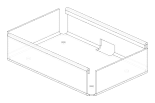

.. _sheet_metal:

###########
Sheet Metal
###########

A sheet metal part is a flat blank of constant thickness, cut to an outline and
folded into shape. build123d models one the way a fabricator thinks about it:
draw the blank, fold walls and flanges out of it, relieve the corners so the
folds can be made, hem the raw edges, and finally either give the surface its
thickness for a solid or unfold it back into the flat pattern the blank is cut
from.

Everything here works in both of build123d's styles. In Builder mode the
``BuildSheet`` context collects the work and supplies the material parameters;
in Algebra mode each operation takes a ``Shell`` and a
``SheetMetalParameters`` and returns the updated ``Shell``.

.. code-block:: build123d

    with BuildPart() as tray_part:
        with BuildSheet(thickness=1, bend_radius=2) as tray:
            with BuildSketch():
                Rectangle(100, 60)
            flange(tray.rims(), length=15, gaps=3.1)
            corners = tray.flats().sort_by(Axis.Z)[0].vertices()
            corner_relief(corners.filter_by(Convexity.CONVEX), ReliefType.ROUND, radius=3)
        thicken()

**********
Start here
**********

.. grid:: 1 2 2 2
    :gutter: 3

    .. grid-item-card:: Tutorial
        :link: sheet_metal_tutorial
        :link-type: ref

        Build an enclosure from a blank to a thickened part and its flat
        pattern, one step at a time.

    .. grid-item-card:: Concepts
        :link: sheet_metal_concepts
        :link-type: ref

        The reference surface, bend radius and K-factor, how a drawing's
        dimensions become face sizes, and how a sheet is selected from.

**********
Operations
**********

Each operation has its own page: what it is in the shop and why it is needed,
the shapes it comes in with a picture of each, the code, the rules it enforces
and what it refuses.

.. grid:: 1 2 3 3
    :gutter: 3

    .. grid-item-card:: Flange
        :link: sheet_metal_flange
        :link-type: ref

        Fold a new wall up from a free edge.

    .. grid-item-card:: Bend
        :link: sheet_metal_bend
        :link-type: ref

        Fold material the blank already has along a line.

    .. grid-item-card:: Jog
        :link: sheet_metal_jog
        :link-type: ref

        Step the sheet sideways through two opposite bends.

    .. grid-item-card:: Hem
        :link: sheet_metal_hem
        :link-type: ref

        Fold a raw edge back on itself for a safe, stiff rim.

    .. grid-item-card:: Miter
        :link: sheet_metal_miter
        :link-type: ref

        Angle the sides of a flange so neighbours meet at a corner.

    .. grid-item-card:: Corner relief
        :link: sheet_metal_corner_relief
        :link-type: ref

        Open the corner where two bends meet.

    .. grid-item-card:: Bend relief
        :link: sheet_metal_bend_relief
        :link-type: ref

        Notch the end of a bend that stops inside the sheet.

    .. grid-item-card:: Holes and cutouts
        :link: sheet_metal_cutouts
        :link-type: ref

        Cut holes in a face, or a cutout straight through a bend.

    .. grid-item-card:: Unfold
        :link: sheet_metal_unfold
        :link-type: ref

        Develop the part into the flat pattern the blank is cut from.

    .. grid-item-card:: Thicken
        :link: sheet_metal_thicken
        :link-type: ref

        Turn the reference surface into a solid part.

*********************
Recipes and reference
*********************

.. grid:: 1 2 2 2
    :gutter: 3

    .. grid-item-card:: Recipes
        :link: sheet_metal_recipes
        :link-type: ref

        Short worked answers to the things a part usually needs: a tab out of
        a slot, a flared leg, a cut across a bend.

    .. grid-item-card:: Reference
        :link: sheet_metal_reference
        :link-type: ref

        ``BuildSheet``, ``SheetMetalParameters``, the enums and every
        operation's full signature.

.. toctree::
    :hidden:

    tutorial
    concepts
    flange
    bend
    jog
    hem
    miter
    corner_relief
    bend_relief
    cutouts
    unfold
    thicken
    recipes
    reference
