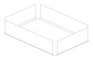
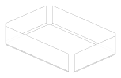
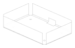
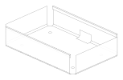

.. _sheet_metal_tutorial:

########
Tutorial
########

This tutorial builds an open enclosure base from a flat blank to a thickened
part and its flat pattern. Each step introduces one operation and shows the
sheet as it stands afterwards. The whole program is in
``docs/sheet_metal_examples.py``, which also draws the pictures.

The enclosure is 120 by 80 with 25 high walls, in 1.5 mm sheet bent to an
inside radius of 2. It gets relieved corners, mounting holes, a slot through
one wall, and hemmed rims on the long sides.

*****************
Step 1: The blank
*****************

A sheet metal part starts as a flat blank, and in build123d that is a closed
sketch region drawn inside ``BuildSheet``. The context takes the material
parameters once, up front, and every operation inside it uses them. Nesting
the sheet inside a ``BuildPart`` is what lets the last step thicken it with a
bare ``thicken()``:

.. code-block:: build123d

    from build123d import *

    with BuildPart() as enclosure_part:
        with BuildSheet(thickness=1.5, bend_radius=2) as enclosure:
            with BuildSketch():
                Rectangle(120, 80)

The rectangle becomes the base of the enclosure, drawn on ``Plane.XY`` with
its normal pointing up. With the default reference surface the material lies
below the plane, so the drawn face is the inside of the finished part.

The blank is drawn in a nested ``BuildSketch`` rather than written straight
into the ``BuildSheet``. A sheet is never assembled from 2D pieces the way a
sketch is, so a sketch object placed directly inside ``BuildSheet`` with the
default ``Mode.ADD`` is refused. Inside the sheet context a sketch object is a
*cutter*, which step 4 uses to punch holes.

**********************
Step 2: Fold the walls
**********************

:ref:`flange <sheet_metal_flange>` folds a wall up from each free edge. The
blank's four edges are its ``rims()``, and a positive angle, the default 90,
folds toward the face normal. The ``gaps`` trim each wall back from the ends
of its edge so the neighbouring walls clear each other at the corners:

.. literalinclude:: ../sheet_metal_examples.py
    :language: build123d
    :start-after: [tutorial_2]
    :end-before: [tutorial_2]
    :dedent:

The wall ``length`` is the flat past the bend. A drawing would more likely
give the overall height to the outside corner; the flange page explains how
``position`` and ``length_mode`` take a drawing's numbers directly.

***************************
Step 3: Relieve the corners
***************************

The gaps keep the walls apart, but each bend now stops inside the blank and
the corner between two bends would tear as the part is formed.
:ref:`corner_relief <sheet_metal_corner_relief>` cuts a round hole centred on
each corner so the two bends can fold independently. The corners are the
convex vertices of the base, the lowest flat; the vertices where each bend
starts lie on a straight run of the outline and are not corners:

.. literalinclude:: ../sheet_metal_examples.py
    :language: build123d
    :start-after: [tutorial_3]
    :end-before: [tutorial_3]
    :dedent:

The relief is laid out on the flat pattern, so it is a true circle on the
blank and hides under the folded corner on the part.

**************************
Step 4: Holes and a cutout
**************************

Mounting holes are cut in the base with sketch objects in ``Mode.SUBTRACT``: a
2D shape inside ``BuildSheet`` is a cutter for the face it lies on. The slot
in the long wall is different, because it has to run through the bend into
the base. That takes a solid cutter, which cuts every face it passes through:

.. literalinclude:: ../sheet_metal_examples.py
    :language: build123d
    :start-after: [tutorial_4]
    :end-before: [tutorial_4]
    :dedent:

Both kinds of cut are covered under :ref:`holes and cutouts
<sheet_metal_cutouts>`.

********************
Step 5: Hem the rims
********************

The top edges of the walls are raw sheared edges. A :ref:`hem
<sheet_metal_hem>` folds them back for a safe, stiff rim. The rims of the two
long walls are the free edges that run along ``Axis.X`` at the top of the
part. The steps from here on are still inside the ``BuildSheet`` context:

.. literalinclude:: ../sheet_metal_examples.py
    :language: build123d
    :start-after: [tutorial_5]
    :end-before: [tutorial_5]
    :dedent:

An open hem leaves a gap between the folded leg and the wall, which is easier
to form than a flat hem and leaves room for a lid to locate in.

***************
Step 6: Thicken
***************

Everything so far has been a surface, the reference shell. Leaving the
``BuildSheet`` context publishes that shell and its parameters to the
enclosing ``BuildPart``, and :ref:`thicken <sheet_metal_thicken>` gives it
its material:

.. literalinclude:: ../sheet_metal_examples.py
    :language: build123d
    :start-after: [tutorial_6]
    :end-before: [tutorial_6]
    :dedent:

.. image:: ../assets/sheet_metal/tutorial_6.svg
    :align: center

``enclosure_part.part`` is now a solid to export or assemble like any other.

************************
Step 7: The flat pattern
************************

The same reference shell :ref:`unfolds <sheet_metal_unfold>` into the blank
the part is cut from. Outside the context the operation takes the shell and
its parameters explicitly, and ``Align.MIN`` corners the pattern on the
origin for the cutter:

.. literalinclude:: ../sheet_metal_examples.py
    :language: build123d
    :start-after: [tutorial_7]
    :end-before: [tutorial_7]
    :dedent:

Each bend has become the length of flat it consumes, worked out on the
neutral axis, so this blank folds back to the enclosure. The corner reliefs
are circles here, and the slot's developed outline shows where it crossed the
bend.

**********
Next steps
**********

* The :ref:`concepts <sheet_metal_concepts>` page explains the reference
  surface, the K-factor, and how to take sizes from a drawing.
* Each operation's page lists the shapes and options the tutorial did not use:
  bend positions, hem profiles, the relief shapes, miters.
* The :ref:`recipes <sheet_metal_recipes>` show the same tools applied to a
  tab out of a slot, a flared leg, and walls mitered to meet at the corners.
