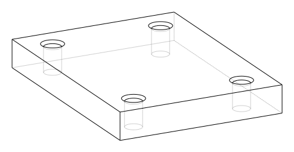
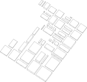
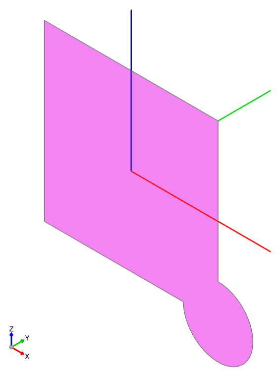

############################
Tips, Best Practices and FAQ
############################

Although there are countless ways to create objects with build123d, experience
has proven that certain techniques can assist designers in achieving their goals
with the greatest efficiency. The following is a description of these techniques.

*************************
Can't Get There from Here
*************************

Unfortunately, it's a reality that not all parts described using build123d can be
successfully constructed by the underlying CAD core. Designers may have to
explore different design approaches to get the OpenCascade CAD core to successfully
build the target object. For instance, if a multi-section :func:`~operations_generic.sweep`
operation fails, a :func:`~operations_part.loft` operation may be a viable alternative
in certain situations. It's crucial to remember that CAD is a complex field and
patience may be required to achieve the desired results.

************
2D before 3D
************

When creating complex 3D objects, it is generally best to start with 2D work before
moving on to 3D. This is because 3D structures are much more intricate, and 3D operations
can be slower and more prone to failure. For designers who come from a Constructive Solid
Geometry (CSG) background, such as OpenSCAD, this approach may seem counterintuitive. On
the other hand, designers from a GUI BREP CAD background, like Fusion 360 or SolidWorks,
may find this approach more natural.

In practice, this means that 3D objects are often created by applying operations like
:func:`~operations_part.extrude` or :func:`~operations_part.revolve` to 2D sketches, as shown below:

.. code:: python

    with BuildPart() as my_part:
        with BuildSketch() as part_profile:
            ...
        extrude(amount=some_distance)
        ...

With this structure ``part_profile`` may have many objects that are combined and
modified by operations like :func:`~operations_generic.fillet` before being extruded
to a 3D shape.

**************************
Delay Chamfers and Fillets
**************************

Chamfers and fillets can add complexity to a design by transforming simple vertices
or edges into arcs or non-planar faces. This can significantly increase the complexity
of the design. To avoid unnecessary processing costs and potential errors caused by a
needlessly complicated design, it's recommended to perform these operations towards
the end of the object's design. This is especially true for 3D shapes, as it is
sometimes necessary to fillet or chamfer in the 2D design phase. Luckily, these
2D fillets and chamfers are less likely to fail than their 3D counterparts.

************
Parameterize
************

One of the most powerful features of build123d is the ability to design fully
parameterized parts. While it may be faster to use a GUI CAD package for the
initial iteration of a part, subsequent iterations can prove frustratingly
difficult. By using variables for critical dimensions and deriving other dimensions
from these key variables, not only can a single part be created, but a whole set
of parts can be readily available. When inevitable change requests arise, a simple
parameter adjustment may be all that's required to make necessary modifications.

******************
Use Shallow Copies
******************

As discussed in the Assembly section, a :ref:`shallow copy <shallow_copy>` of parts that
are repeated in your design can make a huge difference in performance and usability of
your end design.  Objects like fasteners, bearings, chain links, etc. could be duplicated
tens or even hundreds of times otherwise. Use shallow copies where possible but keep in
mind that if one instance of the object changes all will change.

****************
Object Selection
****************

When selecting features in a design it's sometimes easier to select an object from
higher up in the topology first, then select the object from there.  For example let's
consider a plate with four chamfered holes like this:

When selecting edges to be chamfered one might first select the face that these edges
belong to then select the edges as shown here:

.. code-block:: python

    from build123d import *

    svg_opts = {"pixel_scale": 5, "show_axes": False, "show_hidden": True}

    length, width, thickness = 80.0, 60.0, 10.0
    hole_dia = 6.0

    with BuildPart() as plate:
        Box(length, width, thickness)
        with GridLocations(length - 20, width - 20, 2, 2):
            Hole(radius=hole_dia / 2)
        top_face: Face = plate.faces().sort_by(Axis.Z)[-1]
        hole_edges = top_face.edges().filter_by(GeomType.CIRCLE)
        chamfer(hole_edges, length=1)

********************************
Build123d - CadQuery Integration
********************************

As both `CadQuery <https://cadquery.readthedocs.io/en/latest/index.html>`_ and **build123d** use
a common OpenCascade Python wrapper (`OCP <https://github.com/CadQuery/OCP>`_) it's possible to
interchange objects both from CadQuery to build123d and vice-versa by transferring the ``wrapped`` 
objects as follows (first from CadQuery to build123d):

.. code-block:: python

    import build123d as b3d
    b3d_solid = b3d.Solid.make_box(1,1,1)

    ... some cadquery stuff ...

    b3d_solid.wrapped = cq_solid.wrapped

Secondly, from build123d to CadQuery as follows:

.. code-block:: python

    import build123d as b3d
    import cadquery as cq

    with b3d.BuildPart() as b123d_box:
        b3d.Box(1,2,3)

    cq_solid = cq.Solid.makeBox(1,1,1)
    cq_solid.wrapped = b123d_box.part.solid().wrapped

*****************
Self Intersection
*****************

Avoid creating objects that intersect themselves - even if at a single vertex - as these topologies
will almost certainly be invalid (even if :meth:`~topology.Shape.is_valid` reports a ``True`` value).
An example of where this may arise is with the thread of a screw (or any helical shape) where after
one complete revolution the part may contact itself. One is likely be more successful if the part
is split into multiple sections - say 180° of a helix - which are then stored in an assembly.

.. rst-class:: clearfix

**************************
Packing Objects on a Plane
**************************

When designing independent shapes it's common to place each at or near
the global origin, which can make it tricky to visualize many shapes at
once. :meth:`pack.pack` will translate the :class:`~topology.Shape`'s passed to it so
that they don't overlap, with an optional padding/spacing.  Here's the
result of packing a bunch of overlapping boxes (left) using some
padding (right):

By default, the original Z value of all objects packed using the :meth:`pack.pack` function is preserved. 
If you want to align all objects so that they are "placed" on the zero Z coordinate, the :meth:`pack` 
function has an `align_z` argument. When set to `True`, this will align all objects. 

This can be useful, for example, when preparing print setups for 3D printing, giving you full control 
over this alignment so you don't have to leave it to the slicer.

.. _are_glob_imports_bad_practice:

***********************************************
Isn’t ``from build123d import *`` bad practice?
***********************************************

Glob imports like ``from build123d import *`` are generally frowned upon when writing software, and for
good reason. They pollute the global namespace, cause confusing collisions, and are not future-proof, as
future changes to the library being imported could collide with other names. It would be much safer to do 
something like ``import build123d as bd`` and then reference every item with, for example, ``bd.BuildPart()``.
If your goal is to integrate build123d into a larger piece of software, which many people work on, or where
long-term maintainability is a priority, using this approach is definitely a good idea! Why then, are
glob imports so often used in build123d code and official examples?

build123d is most commonly used not as a library within a larger application, but as a `Domain-Specific Language <https://en.wikipedia.org/wiki/Domain-specific_language>`__
which, together with something like the OCP CAD Viewer, acts as the user interface for a CAD application.
Writing build123d often involves live coding in a REPL or typing in editors with limited space due to
the rest of the CAD GUI taking up screen space. Scripts are usually centred around build123d usage, with
usage of other libraries being limited enough that naming conflicts are easily avoided. In this context,
it’s entirely reasonable to prioritise developer ergonomics over “correctness” by making build123d’s primitives
available in the global namespace.

***************************************
Why doesn't BuildSketch(Plane.XZ) work?
***************************************

When creating a sketch not on the default ``Plane.XY`` users may expect that they are drawing directly
on the workplane / coordinate system provided.  For example:

.. code-block:: python

    with BuildSketch(Plane.XZ) as vertical_sketch:
        Rectangle(1, 1)
        with Locations(vertices().group_by(Axis.X)[-1].sort_by(Axis.Z)[-1]):
            Circle(0.2)

In this case the circle is not positioned in the top right as one would expect; in-fact, the position
of the circle randomly switches between the bottom and top corner.

This is because all sketches are created on a local ``Plane.XY`` independent of where they will be
ultimately placed; therefore, the ``sort_by(Axis.Z)`` is sorting two points that have a Z value of
zero as they are located on ``Plane.XY`` and effectively return a random point.

Why does ``BuildSketch`` work this way? Consider an example where the user wants to work on a
plane not aligned with any Axis, as follows (this is often done when creating a sketch on a ``Face``
of a 3D part but is simulated here by rotating a ``Plane``):

.. code-block:: python

    with BuildSketch(Plane.YZ.rotated((123, 45, 6))) as custom_plane:
        Rectangle(1, 1, align=Align.MIN)
        with Locations(vertices().group_by(Axis.X)[-1].sort_by(Axis.Y)[-1]):
            Circle(0.2)

.. image:: assets/sketch_on_custom_plane.png

Here one can see both ``sketch_local`` (with the light fill on ``Plane.XY``) and the ``sketch``
(with the darker fill) placed on the user provided workplane. As the selectors work off global 
coordinates, selection of the "top right" of this sketch would be quite challenging and would 
likely change if the sketch was ever moved as could happen if the 3D part changed.  For an 
example of sketching on a 3D part, see :ref:`sketching_on_other_planes`.

*************************************************************************
Why is BuildLine not working as expected within the scope of BuildSketch?
*************************************************************************

As described above, all sketching is done on a local ``Plane.XY``; however, the following
is a common issue:

.. code-block:: python

    with BuildSketch() as sketch:
        with BuildLine(Plane.XZ):
            Polyline(...)
        make_face()

Here ``BuildLine`` is within the scope of ``BuildSketch``; therefore, all of the
drawing should be done on ``Plane.XY``; however, the user has specified ``Plane.XZ``
when creating the ``BuildLine`` instance. Although this isn't absolutely incorrect
it's almost certainly not what the user intended.  Here the face created by ``make_face`` will
be reoriented to ``Plane.XY`` as all sketching must be done on that plane. This reorienting
of objects to ``Plane.XY`` allows a user to ``add`` content from other sources to the
sketch without having to manually re-orient the object. 

Unless there is a good reason and the user understands how the ``BuildLine`` object will be
reoriented, all ``BuildLine`` instances within the scope of ``BuildSketch`` should be done
on the default ``Plane.XY``.

***************************************************************
Don't Builders inherit workplane/coordinate sytems when nested
***************************************************************

Some users expect that nested Builders will inherit the workplane or coordinate system from
their parent Builder - this is not true.  When a Builder is instantiated, a workplane is either
provided by the user or it defaults to ``Plane.XY``. Having Builders inherent coordinate systems
from their parents could result in confusion when they are nested as well as change their
behaviour depending on which scope they are in. Inheriting coordinate systems isn't necessarily 
incorrect, it was considered for build123d but ultimately the simple static approach was taken. 
