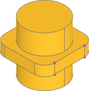
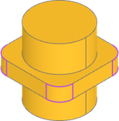
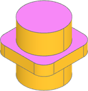
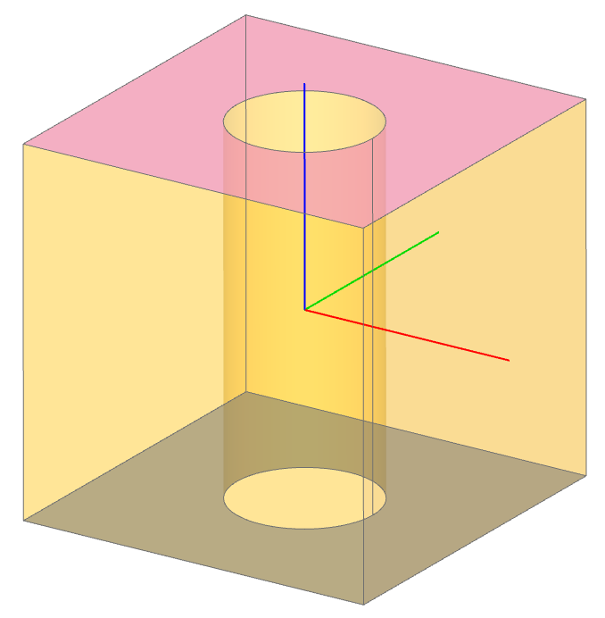
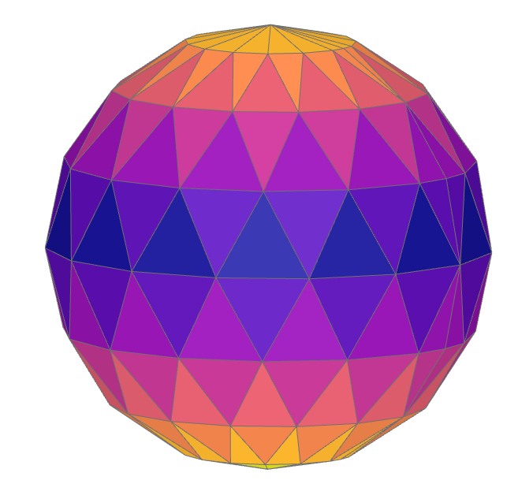
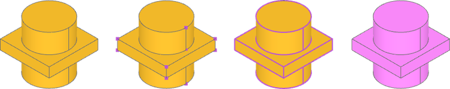
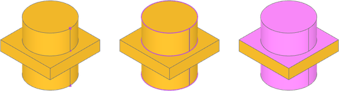
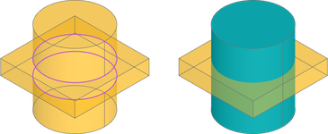
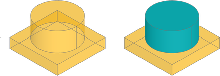

#####################################
Topology Selection and Exploration
#####################################

:ref:`topology` is the structure of build123d geometric features, and traversing the
topology of a part is often required to specify objects for an operation or to locate a
CAD feature. In a GUI you would click on a feature; in code you describe it. That
description has three parts:

- a :ref:`selector <selectors>` names the *kind* of feature - vertices, edges, wires,
  faces or solids - and returns them all in a |ShapeList|;
- :ref:`operators <operators>` sort, group and filter that list, or slice it like any
  Python list, until what remains is the feature you meant;
- :ref:`criteria <criteria>` are what the operators sort, group and filter *by*.

Criteria come in three kinds, and keeping them apart makes selectors easier to write:

1. **What a feature is.** Its own geometry: the type of curve or surface, its length,
   area, radius or volume, which way it points, where it lies. These are properties of
   the feature alone and can be measured with nothing else in hand.
2. **How a feature sits in its shape.** Whether an edge is a convex or concave corner of
   the solid, which faces are its neighbours, which face a vertex was picked off. These
   are relations, not properties: the same straight edge is convex on a box and concave
   at the inner corner of an L, and nothing about the edge itself says which.
3. **When a feature came to be.** Whether the last operation created it, brought it in,
   or only rebuilt it. This is the feature's history, and it is what makes "fillet the
   edges I just made" possible.

.. _selectors:

*********
Selectors
*********

Selectors extract all of a feature type from the referenced object, or the subset the
last operation is responsible for. They are available on every ``Shape`` and on every
builder, and return a |ShapeList|, a subclass of ``list`` that the :ref:`operators`
refine.

+--------------+---------------------------------------------------+-----------------------+
| Selector     | Applicability                                     | Description           |
+==============+===================================================+=======================+
| |vertices|   | any ``Shape``; ``BuildLine``, ``BuildSketch``,    | ``Vertex`` extraction |
|              | ``BuildPart``                                     |                       |
+--------------+---------------------------------------------------+-----------------------+
| |edges|      | any ``Shape``; ``BuildLine``, ``BuildSketch``,    | ``Edge`` extraction   |
|              | ``BuildPart``                                     |                       |
+--------------+---------------------------------------------------+-----------------------+
| |wires|      | any ``Shape``; ``BuildLine``, ``BuildSketch``,    | ``Wire`` extraction   |
|              | ``BuildPart``                                     |                       |
+--------------+---------------------------------------------------+-----------------------+
| |faces|      | any ``Shape``; ``BuildSketch``, ``BuildPart``     | ``Face`` extraction   |
+--------------+---------------------------------------------------+-----------------------+
| |solids|     | any ``Shape``; ``BuildPart``                      | ``Solid`` extraction  |
+--------------+---------------------------------------------------+-----------------------+

Every selector takes a :class:`~build_enums.Select` argument, ``Select.ALL`` by
default. ``Select.LAST`` and ``Select.NEW`` narrow the result to what the last
operation did, and are described under :ref:`when a feature came to be <when>`.

.. code-block:: build123d

    # In context
    with BuildSketch() as context:
        Rectangle(1, 1)
        context.edges()

        # Build context implicitly has access to the selector
        edges()

    # Taking the sketch out of context
    context.sketch.edges()

    # Create sketch out of context
    Rectangle(1, 1).edges()

A |ShapeList| has the same selectors, so a selection can be narrowed in steps: the
edges of the smallest faces are ``part.faces().group_by(SortBy.AREA)[0].edges()``.

.. _operators:

*********
Operators
*********

Operators refine a |ShapeList| of features isolated by a selector. They sort, group or
filter and return a modified |ShapeList|, or in the case of |group_by| a ``GroupBy``, a
list of |ShapeList| objects accessible by index or key.

+----------------------+---------------------------------------------------------------------------+-------------------------------------------------------+
| Method               | Criteria                                                                  | Description                                           |
+======================+===========================================================================+=======================================================+
| |sort_by|            | ``Axis``, ``Edge``, ``Wire``, ``SortBy``, callable, property              | Sort ``ShapeList`` by criteria                        |
+----------------------+---------------------------------------------------------------------------+-------------------------------------------------------+
| |sort_by_distance|   | ``Shape``, ``VectorLike``                                                 | Sort ``ShapeList`` by distance from criteria          |
+----------------------+---------------------------------------------------------------------------+-------------------------------------------------------+
| |group_by|           | ``Axis``, ``Edge``, ``Wire``, ``SortBy``, ``Convexity``, callable,        | Group ``ShapeList`` by criteria                       |
|                      | property                                                                  |                                                       |
+----------------------+---------------------------------------------------------------------------+-------------------------------------------------------+
| |filter_by|          | ``Axis``, ``Plane``, ``GeomType``, ``Convexity``, callable, property      | Filter ``ShapeList`` by criteria                      |
+----------------------+---------------------------------------------------------------------------+-------------------------------------------------------+
| |filter_by_position| | ``Axis``                                                                  | Filter ``ShapeList`` by ``Axis`` & min / max values   |
+----------------------+---------------------------------------------------------------------------+-------------------------------------------------------+

The most common operators also have a shorthand, so a selection can read as a chain:

+----------+---------------------------+--------------------------------------------------------+------------------------------------+
| Operator | Operand                   | Meaning                                                | Example                            |
+==========+===========================+========================================================+====================================+
| ``>``    | ``SortBy``, ``Axis``      | |sort_by|                                              | ``part.vertices() > Axis.Z``       |
+----------+---------------------------+--------------------------------------------------------+------------------------------------+
| ``<``    | ``SortBy``, ``Axis``      | |sort_by| reversed                                     | ``part.faces() < Axis.Z``          |
+----------+---------------------------+--------------------------------------------------------+------------------------------------+
| ``>>``   | ``SortBy``, ``Axis``      | |group_by|, last group                                 | ``part.solids() >> Axis.X``        |
+----------+---------------------------+--------------------------------------------------------+------------------------------------+
| ``<<``   | ``SortBy``, ``Axis``      | |group_by|, first group                                | ``part.faces() << Axis.Y``         |
+----------+---------------------------+--------------------------------------------------------+------------------------------------+
| ``|``    | ``Axis``, ``Plane``,      | |filter_by|                                            | ``part.faces() | Axis.Z``          |
|          | ``GeomType``,             |                                                        |                                    |
|          | ``Convexity``             |                                                        |                                    |
+----------+---------------------------+--------------------------------------------------------+------------------------------------+
| ``[]``   |                           | Python indexing and slicing                            | ``part.faces()[-2:]``              |
+----------+---------------------------+--------------------------------------------------------+------------------------------------+

Sort
====

A |ShapeList| can be sorted with the |sort_by| and |sort_by_distance| methods. Sorting
is a critical step when isolating individual features, as a |ShapeList| from a selector
is unordered.

Here we want to capture some vertices from the object furthest along ``X``: all the
vertices are first captured with the |vertices| selector, then sorted by ``Axis.X``.
Finally, the vertices can be captured with a list slice for the last 4 list items, as the
items are sorted from least to greatest ``X`` position. Remember, |ShapeList| is a
subclass of ``list``, so any list slice can be used.

.. code-block:: build123d

    part.vertices().sort_by(Axis.X)[-4:]

|

Examples
--------

.. toctree::
    :maxdepth: 2
    :hidden:

    topology_selection/sort_examples

.. grid:: 3
    :gutter: 3

    .. grid-item-card:: SortBy
        :img-top: assets/topology_selection/thumb_sort_sortby.png
        :link: sort_sortby
        :link-type: ref

    .. grid-item-card:: Along Wire
        :img-top: assets/topology_selection/thumb_sort_along_wire.png
        :link: sort_along_wire
        :link-type: ref

    .. grid-item-card:: Axis
        :img-top: assets/topology_selection/thumb_sort_axis.png
        :link: sort_axis
        :link-type: ref

    .. grid-item-card:: Distance From
        :img-top: assets/topology_selection/thumb_sort_distance.png
        :link: sort_distance_from
        :link-type: ref

Group
=====

A |ShapeList| can be grouped and sorted with the |group_by| method. Grouping is a great
way to organize features without knowing the values of specific feature properties.
Rather than returning a |ShapeList|, |group_by| returns a ``GroupBy``, a list of
|ShapeList| objects sorted by the grouping criteria. ``GroupBy`` can be printed to view
the members of each group, indexed like a list to retrieve a |ShapeList|, and accessed
by key with the ``group`` method. If the group keys are unknown they can be discovered
with ``key_to_group_index``. The ``first`` and ``last`` properties return the first
and last |ShapeList| groups, respectively, so selectors can be chained directly::

    part.faces().group_by(SortBy.AREA).first.edges()

These properties follow the group order, including when ``reverse=True`` is passed
to |group_by|, and raise ``IndexError`` if there are no groups.

If we want only the edges from the smallest faces by area we can get the faces, then
group by ``SortBy.AREA``. The |ShapeList| of smallest faces is available from the first
list index. Finally, a |ShapeList| has access to selectors, so calling |edges| will
return a new list of all edges in the previous list.

.. code-block:: build123d

    part.faces().group_by(SortBy.AREA)[0].edges()

|

Examples
--------

.. toctree::
    :maxdepth: 2
    :hidden:

    topology_selection/group_examples

.. grid:: 3
    :gutter: 3

    .. grid-item-card:: Axis and Length
        :img-top: assets/topology_selection/thumb_group_axis.png
        :link: group_axis
        :link-type: ref

    .. grid-item-card:: Hole Area
        :img-top: assets/topology_selection/thumb_group_hole_area.png
        :link: group_hole_area
        :link-type: ref

    .. grid-item-card:: Properties with Keys
        :img-top: assets/topology_selection/thumb_group_properties_with_keys.png
        :link: group_properties_with_keys
        :link-type: ref

Filter
======

A |ShapeList| can be filtered with the |filter_by| and |filter_by_position| methods.
Filters are a flexible way to isolate (or exclude) features based on known criteria.

Let's say we need all the faces with a normal in the ``+Z`` direction. One way to do this
might be with a list comprehension, however |filter_by| can take a lambda function as a
filter condition on the entire list. In this case, the normal of each face can be checked
against a vector direction and filtered accordingly.

.. code-block:: build123d

    part.faces().filter_by(lambda f: f.normal_at() == Vector(0, 0, 1))

|

Because |filter_by| accepts any callable, a filter on any combination of properties
fits into a fluent chain. Here the two faces with inner wires, that is with holes, are
selected regardless of their orientation:

.. code-block:: build123d

    obj = Box(1, 1, 1) - Cylinder(0.2, 1)
    faces_with_holes = obj.faces().filter_by(lambda f: f.inner_wires())

Standard Python tools work too. ``sorted``, ``filter`` and comprehensions all accept a
|ShapeList|, which is useful when a selection needs several properties at once:

.. code-block:: build123d

    outside_vertices = filter(
        lambda v: (v.Y == 0.0 or v.Y == height)
        and -overall_width / 2 < v.X < overall_width / 2,
        din.vertices(),
    )

Examples
--------

.. toctree::
    :maxdepth: 2
    :hidden:

    topology_selection/filter_examples

.. grid:: 3
    :gutter: 3

    .. grid-item-card:: GeomType
        :img-top: assets/topology_selection/thumb_filter_geomtype.png
        :link: filter_geomtype
        :link-type: ref

    .. grid-item-card:: All Edges Circle
        :img-top: assets/topology_selection/thumb_filter_all_edges_circle.png
        :link: filter_all_edges_circle
        :link-type: ref

    .. grid-item-card:: Axis and Plane
        :img-top: assets/topology_selection/thumb_filter_axisplane.png
        :link: filter_axis_plane
        :link-type: ref

    .. grid-item-card:: Inner Wire Count
        :img-top: assets/topology_selection/thumb_filter_inner_wire_count.png
        :link: filter_inner_wire_count
        :link-type: ref

    .. grid-item-card:: Nested Filters
        :img-top: assets/topology_selection/thumb_filter_nested.png
        :link: filter_nested
        :link-type: ref

    .. grid-item-card:: Shape Properties
        :img-top: assets/topology_selection/thumb_filter_shape_properties.png
        :link: filter_shape_properties
        :link-type: ref

.. _criteria:

********
Criteria
********

The operators above take criteria of three kinds. Any operator can take any kind; the
kinds differ in what they need to answer.

What a feature is
=================

The first kind describes the feature alone. Nothing but the feature is needed to
evaluate them, and they are the criteria most selectors start with.

- **Type**: :class:`~build_enums.GeomType` names the curve or surface - ``LINE``,
  ``CIRCLE``, ``PLANE``, ``CYLINDER`` and so on. ``part.edges().filter_by(GeomType.CIRCLE)``
  keeps the circular edges; ``geom_type`` is the property behind it.
- **Size**: :class:`~build_enums.SortBy` orders by ``LENGTH``, ``RADIUS``, ``AREA``,
  ``VOLUME`` or ``DISTANCE``; the properties ``length``, ``radius``, ``area`` and
  ``volume`` can be passed to |sort_by|, |group_by| and |filter_by| directly.
- **Direction**: an ``Axis`` passed to |filter_by| keeps the planar faces whose normal,
  or the linear edges whose direction, is parallel to it; a ``Plane`` keeps those
  parallel to the plane. Passed to |sort_by| or |group_by|, an ``Axis`` orders by
  position along it.
- **Position**: |filter_by_position| keeps features within a range along an axis, and
  |sort_by_distance| orders by distance from a point or another shape.
- **Anything else** the feature can say about itself, through a property or a callable:
  ``Face.is_planar``, ``Edge.is_closed``, ``lambda f: len(f.inner_wires()) == 1``.

.. _relations:

How a feature sits in its shape
===============================

The second kind describes the feature's relationship to the shape it was selected from:
which face a vertex is a corner of, whether an edge is a crease that turns inward or
outward, which faces neighbour which. None of these can be read from the feature alone,
so all of them depend on the *route* the feature was selected by.

Selection route
---------------

A shape pulled out of another remembers where it came from. Every selector step
is recorded on the result as ``topo_path``, a tuple running from the outermost
shape to the one it was taken directly out of:

.. code-block:: python

    face = box.faces().sort_by(Axis.X)[-1]
    edge = face.edges().sort_by(Axis.Y)[0]

    edge.topo_path      # (box, face)
    edge.topo_parent    # box - where the selection started
    edge.topo_owner     # face - what the edge was picked off

``topo_parent`` is the first step and ``topo_owner`` the last, so on a single
selection they are the same shape. The distinction matters when a selector
narrows twice: an edge belongs to two faces of a solid, and only the route it
was selected by says which one was meant. Selecting the edge straight off the
solid records no face, so an operation that needs one has to say so rather than
guess.

Provenance is metadata rather than geometry. It is carried by reference through
copies, since it names shapes outside the copy, and it is not part of shape
equality.

Convexity
---------

A vertex, edge or face can be classified by how the material of the shape it was
selected from sits around it, with :class:`~build_enums.Convexity`:

- ``CONVEX`` - the material closes around the element by less than half a turn:
  the outer edge of a box, the corner of a plate, a boss
- ``CONCAVE`` - by more than half a turn: the inner corner of a pocket, a hole
- ``SMOOTH`` - the boundary passes through without bending: a fillet seam, a
  planar face, a vertex where two edges meet in line
- ``SADDLE`` - both senses are present: an edge whose dihedral angle crosses half a
  turn along its length, a vertex where convex and concave edges meet, a face with
  principal curvatures of opposite sign

This is a relationship, not a property. The same straight edge is convex on a box and
concave at the inner corner of an L, and nothing about the edge itself distinguishes
them. Every shape has a ``convexity`` property, |filter_by| takes a member of the enum,
and |group_by| takes the enum itself:

.. code-block:: build123d

    with BuildPart() as tray:
        Box(20, 20, 5)
        offset(amount=-2, openings=tray.faces().sort_by(Axis.Z)[-1])
        fillet(tray.edges().filter_by(Convexity.CONCAVE), 1.5)
        fillet(tray.edges().filter_by(Convexity.CONVEX), 0.5)

    inside_fillets = tray.faces().filter_by(Convexity.CONCAVE)
    by_kind = tray.edges().group_by(Convexity)

Because the classification is relative to the shape the element came from, the
selection route decides the question being asked. A vertex taken through a face,
as ``face.vertices()`` does, is a corner of that face and is classified by the
turn of the face's boundary there; the same vertex taken straight off the solid is
classified by the creases meeting at it. The inner corner of a cross is concave on
the top face but a saddle on the solid, where two convex edges meet a concave one.
An edge is classified between the two faces of the shape it was selected from, so
an edge of a lone face, or of an open shell's rim, has no crease to classify and
raises rather than guessing.

``Edge.is_interior``, ``Face.is_circular_convex`` and ``Face.is_circular_concave``
are shorthand for the concave and convex cases.

Topological distance
--------------------

|topo_distance_to| creates a callable key that measures graph distance through
topology rather than geometric distance through space. It is useful when selecting
features by adjacency, for example faces connected to a reference face, or the next
ring of faces after that.

Distances are measured within the shared ``topo_parent`` of the reference shape. The
reference shape has distance ``0``, directly adjacent shapes have distance ``1``, and
unreachable shapes have distance ``inf``.

.. code-block:: build123d

    box = Box(1, 1, 1)
    faces = box.faces()
    top_face = faces.sort_by(Axis.Z)[-1]

    face_rings = faces.group_by(topo_distance_to(top_face))

    top = face_rings[0]
    sides = face_rings[1]
    bottom = face_rings[2]

Multiple reference shapes can be provided. This is useful for selecting all features
within a topological distance from any reference. In this example, a sphere is converted
to a triangular mesh, faces near the middle of the mesh are used as references, and all
mesh faces are grouped into topological rings expanding away from that starting band.

.. code-block:: build123d

    from build123d import *
    from pathlib import Path
    from tempfile import TemporaryDirectory

    from ocp_vscode import ColorMap, show

    mesher = Mesher()
    mesher.add_shape(Sphere(1), linear_deflection=0.05, angular_deflection=1)

    with TemporaryDirectory() as tmp_dir:
        mesh_path = Path(tmp_dir) / "sphere.stl"
        mesher.write(mesh_path)
        mesh_sphere = Mesher().read(mesh_path)[0]

    sphere_faces = mesh_sphere.faces()

    vertical_groups = sphere_faces.group_by(Axis.Z)
    starting_ring = vertical_groups[len(vertical_groups) // 2]
    face_rings = sphere_faces.group_by(topo_distance_to(starting_ring))

    show(*face_rings, colors=ColorMap.listed(len(face_rings)))

The same approach can be used with edges or vertices. For example, a single edge on the
mesh can be used as the starting point for edge-distance rings.

.. code-block:: build123d

    sphere_edges = mesh_sphere.edges()
    reference_edge = choice(sphere_edges)
    edge_rings = sphere_edges.group_by(topo_distance_to(reference_edge))

.. _when:

When a feature came to be
=========================

The third kind is history. Every operation - a boolean, a fillet, a chamfer, a 2D
fillet, a join of connected edges - keeps a record of what it did to the sub-shapes of
its inputs: which it left alone, which it rebuilt, which it created and which it
removed. The record travels with the shape the operation returns, and the selectors
read it through :class:`~build_enums.Select`:

- ``Select.ALL`` - every feature of the kind, the default;
- ``Select.LAST`` - the features the last operation brought in or created. A feature
  the operation merely rebuilt is not included: when a cylinder is fused onto a box the
  box's top face gains a circular edge, but it is still the box's top face, so
  ``Select.LAST`` returns the cylinder's faces and not the top;
- ``Select.NEW`` - only the features that existed in no input in any form: the edges
  where two objects intersect, the faces of a fillet, the solid two solids merge into.

All three are available for every shape type, in builders and on shapes alike.

In a builder, the operations are the objects and operations run in the context, and the
selectors are the builder's own:

.. code-block:: build123d

    with BuildPart() as part:
        Box(5, 5, 1)
        Cylinder(1, 5)

        part.vertices()             # every vertex, the same as part.vertices(Select.ALL)
        part.faces(Select.LAST)     # the cylinder's faces
        part.edges(Select.NEW)      # the two circles where the cylinder meets the box

    The default ``Select.ALL`` features

    ``Select.LAST`` features

    ``Select.NEW`` edges where box and cylinder intersect

``Select.NEW`` returns nothing when every edge of the result already existed in an
input. Here the cylinder stands on the box rather than passing through it, so the
circle where they meet is the cylinder's own bottom edge, brought in rather than made:

.. code-block:: build123d

    with BuildPart() as part:
        Box(5, 5, 1, align=(Align.CENTER, Align.CENTER, Align.MAX))
        Cylinder(2, 2, align=(Align.CENTER, Align.CENTER, Align.MIN))

        part.edges(Select.NEW)      # none
        part.edges(Select.LAST)     # the cylinder's three edges, that circle among them

    ``Select.NEW`` edges when box and cylinder don't intersect

Operations that rebuild the object rather than adding to it follow the same rule. After
a fillet, the fillet faces and their seam and arc edges are new and last, the faces they
blend into were rebuilt and are neither, and the edges that were filleted are gone:

.. code-block:: build123d

    with BuildPart() as part:
        Box(5, 5, 1)
        Cylinder(1, 5)
        fillet(part.edges().filter_by(lambda e: e.length == 1), 1)

        part.faces(Select.LAST)     # the fillet faces
        part.edges(Select.NEW)      # their seams and arcs

In Algebra mode the record rides on the result, so the same selectors work on it. The
left operand is what was there before and the right operand is what was brought in:

.. code-block:: build123d

    cross = Rectangle(8, 2)
    cross += Rectangle(2, 8)
    inner_corners = cross.vertices(Select.NEW)      # the four points where the arms cross
    second_arm = cross.edges(Select.LAST)           # the surviving edges of the second rectangle

    tray = Box(20, 20, 5) - Pos(Z=1.5) * Box(16, 16, 5)
    tray.faces(Select.LAST)                         # the five faces of the pocket

Two limits follow from where the record comes from. A shape that is not the result of
an operation, such as a freshly made ``Rectangle``, has no record and raises if asked
for ``Select.LAST`` or ``Select.NEW``. And an operation that keeps no record hands its
result on with an empty one, under which every feature that is not identical to one
from before counts as new; the kernel algorithms behind build123d's operations all
report, so this is rare.

The standalone :func:`~topology.new_edges` function predates the record. It compares
shapes geometrically and still works, but ``edges(Select.NEW)`` answers the same
question from the record, for every shape type.

.. |vertices| replace:: :meth:`~topology.Shape.vertices`
.. |edges| replace:: :meth:`~topology.Shape.edges`
.. |wires| replace:: :meth:`~topology.Shape.wires`
.. |faces| replace:: :meth:`~topology.Shape.faces`
.. |solids| replace:: :meth:`~topology.Shape.solids`
.. |sort_by| replace:: :meth:`~topology.ShapeList.sort_by`
.. |sort_by_distance| replace:: :meth:`~topology.ShapeList.sort_by_distance`
.. |group_by| replace:: :meth:`~topology.ShapeList.group_by`
.. |topo_distance_to| replace:: :func:`~topology.topo_distance_to`
.. |filter_by| replace:: :meth:`~topology.ShapeList.filter_by`
.. |filter_by_position| replace:: :meth:`~topology.ShapeList.filter_by_position`
.. |ShapeList| replace:: :class:`~topology.ShapeList`
