#############################
Too Tall Toby (TTT) Tutorials
#############################

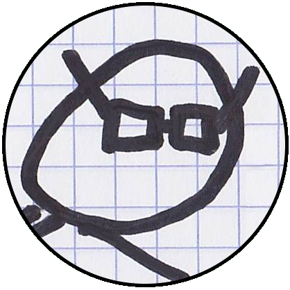

To enhance users' proficiency with Build123D, this section offers a series of challenges. 
In these challenges, users are presented with a CAD drawing and tasked with designing the 
part. Their goal is to match the part's mass to a specified target.

These drawings were skillfully crafted and generously provided to Build123D by Too Tall Toby, 
a renowned figure in the realm of 3D CAD. Too Tall Toby is the host of the World Championship 
of 3D CAD Speedmodeling. For additional 3D CAD challenges and content, be sure to 
visit `Toby's youtube channel <https://www.Youtube.com/TooTallToby>`_.

Feel free to click on the parts below to embark on these engaging challenges.

.. grid:: 3

    .. grid-item-card:: Party Pack 01-01 Bearing Bracket
        :img-top: assets/ttt/ttt-ppp0101_object.png
        :link: ttt-ppp0101
        :link-type: ref

    .. grid-item-card:: Party Pack 01-02 Post Cap
        :img-top: assets/ttt/ttt-ppp0102_object.png
        :link: ttt-ppp0102
        :link-type: ref

    .. grid-item-card:: Party Pack 01-03 C Clamp Base
        :img-top: assets/ttt/ttt-ppp0103_object.png
        :link: ttt-ppp0103
        :link-type: ref

    .. grid-item-card:: Party Pack 01-04 Angle Bracket
        :img-top: assets/ttt/ttt-ppp0104_object.png
        :link: ttt-ppp0104
        :link-type: ref

    .. grid-item-card:: Party Pack 01-05 Paste Sleeve
        :img-top: assets/ttt/ttt-ppp0105_object.png
        :link: ttt-ppp0105
        :link-type: ref

    .. grid-item-card:: Party Pack 01-06 Bearing Jig
        :img-top: assets/ttt/ttt-ppp0106_object.png
        :link: ttt-ppp0106
        :link-type: ref

    .. grid-item-card:: Party Pack 01-07 Flanged Hub
        :img-top: assets/ttt/ttt-ppp0107_object.png
        :link: ttt-ppp0107
        :link-type: ref

    .. grid-item-card:: Party Pack 01-08 Tie Plate
        :img-top: assets/ttt/ttt-ppp0108_object.png
        :link: ttt-ppp0108
        :link-type: ref

    .. grid-item-card:: Party Pack 01-09 Corner Tie
        :img-top: assets/ttt/ttt-ppp0109_object.png
        :link: ttt-ppp0109
        :link-type: ref

    .. grid-item-card:: Party Pack 01-10 Light Cap
        :img-top: assets/ttt/ttt-ppp0110_object.png
        :link: ttt-ppp0110
        :link-type: ref

    .. grid-item-card:: 23-02-02 SM Hanger
        :img-top: assets/ttt/ttt-23-02-02-sm_hanger_object.png
        :link: ttt-23-02-02-sm_hanger
        :link-type: ref

    .. grid-item-card:: 23-T-24 Curved Support
        :img-top: assets/ttt/ttt-23-t-24-curved_support_object.png
        :link: ttt-23-t-24
        :link-type: ref

    .. grid-item-card:: 24-SPO-06 Buffer Stand
        :img-top: assets/ttt/ttt-24-SPO-06-Buffer_Stand_object.png
        :link: ttt-24-spo-06
        :link-type: ref

.. _ttt-ppp0101:

Party Pack 01-01 Bearing Bracket
--------------------------------
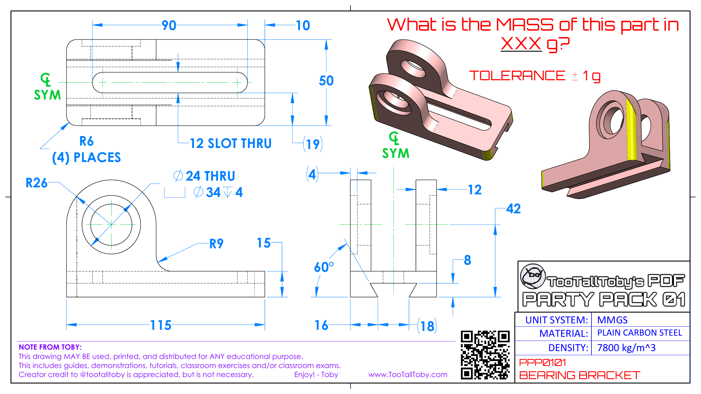

.. dropdown:: Object Mass

    797.15 g

.. dropdown:: Reference Implementation

    .. literalinclude:: assets/ttt/ttt-ppp0101.py

.. _ttt-ppp0102:

Party Pack 01-02 Post Cap
--------------------------------
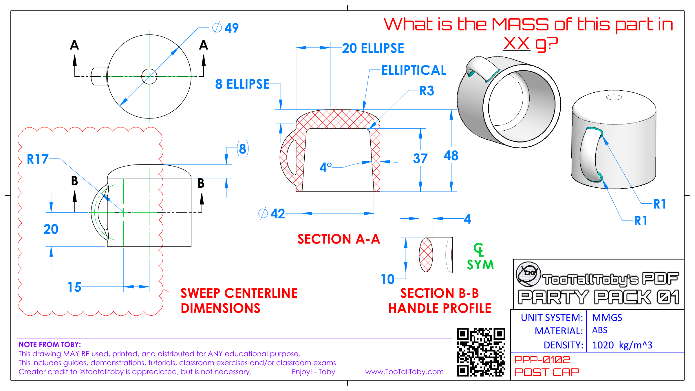

.. dropdown:: Object Mass

    43.09 g

.. dropdown:: Reference Implementation

    .. literalinclude:: assets/ttt/ttt-ppp0102.py

.. _ttt-ppp0103:

Party Pack 01-03 C Clamp Base
--------------------------------
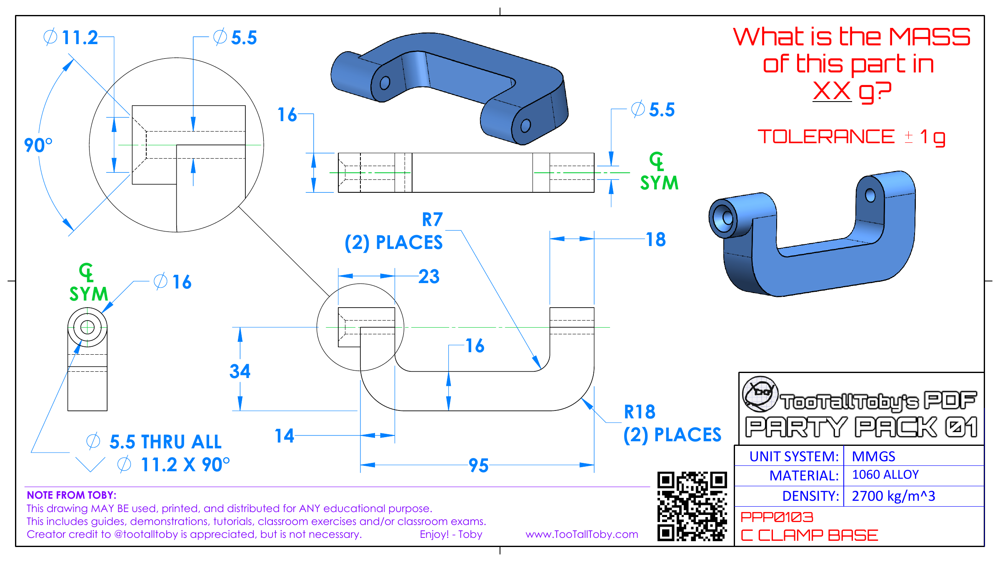

.. dropdown:: Object Mass

    96.13 g

.. dropdown:: Reference Implementation

    .. literalinclude:: assets/ttt/ttt-ppp0103.py

.. _ttt-ppp0104:

Party Pack 01-04 Angle Bracket
--------------------------------
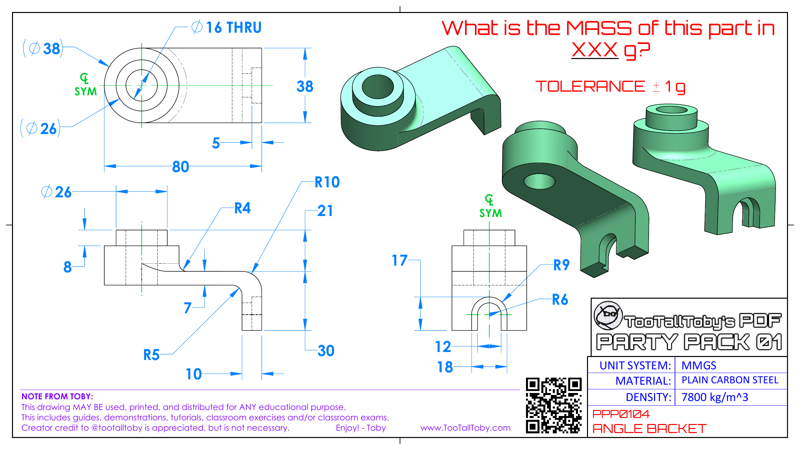

.. dropdown:: Object Mass

    310.00 g

.. dropdown:: Reference Implementation

    .. literalinclude:: assets/ttt/ttt-ppp0104.py

.. _ttt-ppp0105:

Party Pack 01-05 Paste Sleeve
--------------------------------
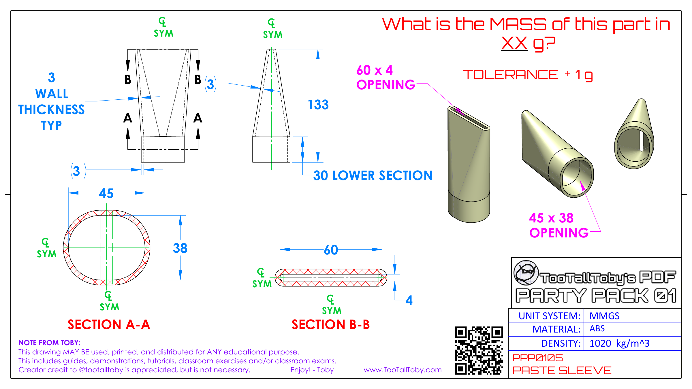

.. dropdown:: Object Mass

    57.08 g

.. dropdown:: Reference Implementation

    .. literalinclude:: assets/ttt/ttt-ppp0105.py

.. _ttt-ppp0106:

Party Pack 01-06 Bearing Jig
--------------------------------
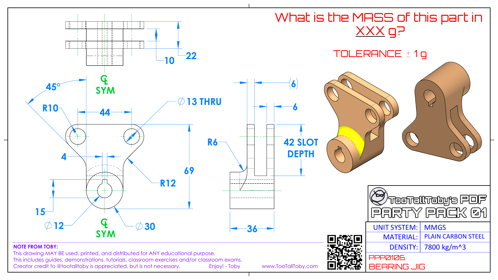

.. dropdown:: Object Mass

    328.02 g

.. dropdown:: Reference Implementation

    .. literalinclude:: assets/ttt/ttt-ppp0106.py

.. _ttt-ppp0107:

Party Pack 01-07 Flanged Hub
--------------------------------
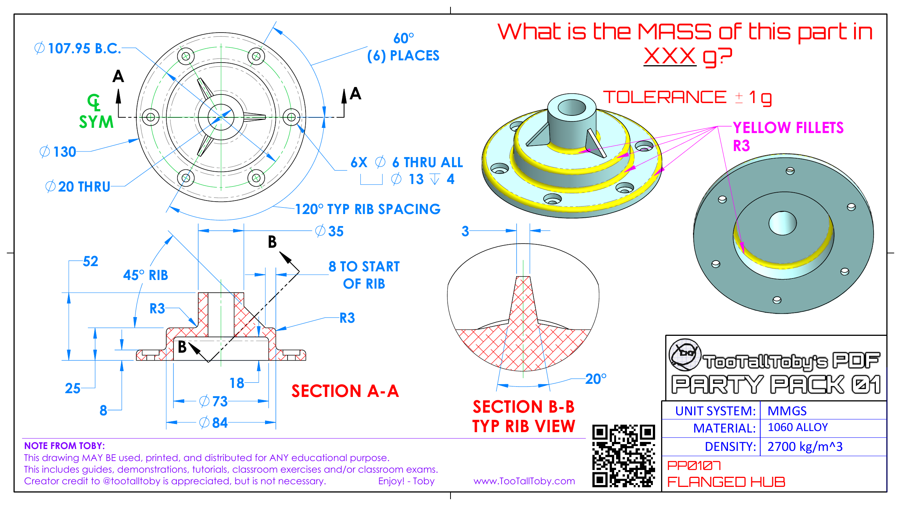

.. dropdown:: Object Mass

    372.99 g

.. dropdown:: Reference Implementation

    .. literalinclude:: assets/ttt/ttt-ppp0107.py

.. _ttt-ppp0108:

Party Pack 01-08 Tie Plate
--------------------------------
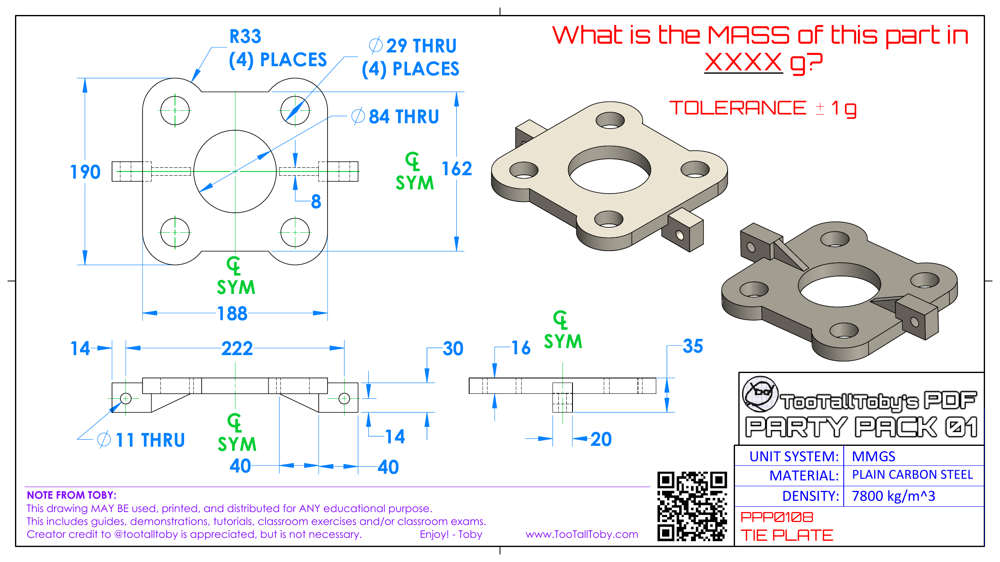

.. dropdown:: Object Mass

    3387.06 g

.. dropdown:: Reference Implementation

    .. literalinclude:: assets/ttt/ttt-ppp0108.py

.. _ttt-ppp0109:

Party Pack 01-09 Corner Tie
--------------------------------
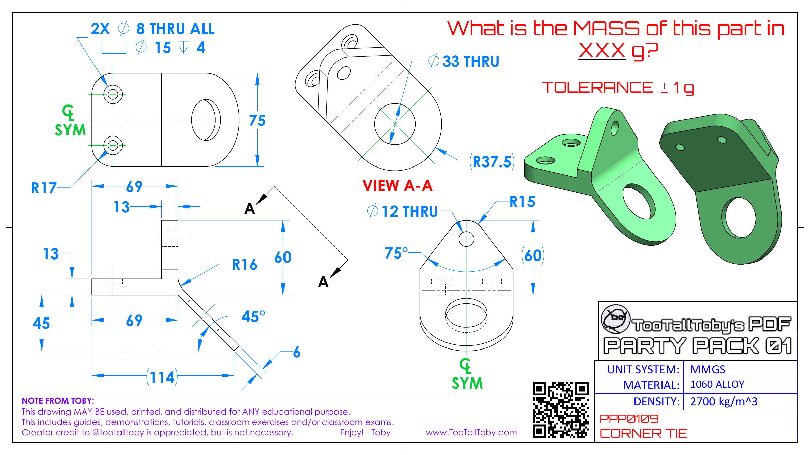

.. dropdown:: Object Mass

    307.23 g

.. dropdown:: Reference Implementation

    .. literalinclude:: assets/ttt/ttt-ppp0109.py

.. _ttt-ppp0110:

Party Pack 01-10 Light Cap
--------------------------------
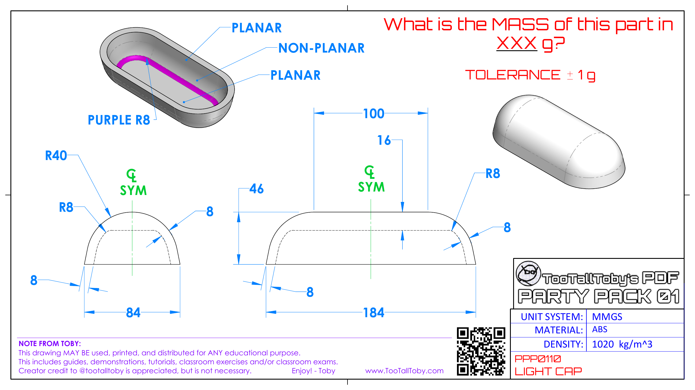

.. dropdown:: Object Mass

    211.30 g

.. dropdown:: Reference Implementation

    .. literalinclude:: assets/ttt/ttt-ppp0110.py

.. _ttt-23-02-02-sm_hanger:

23-02-02 SM Hanger
------------------
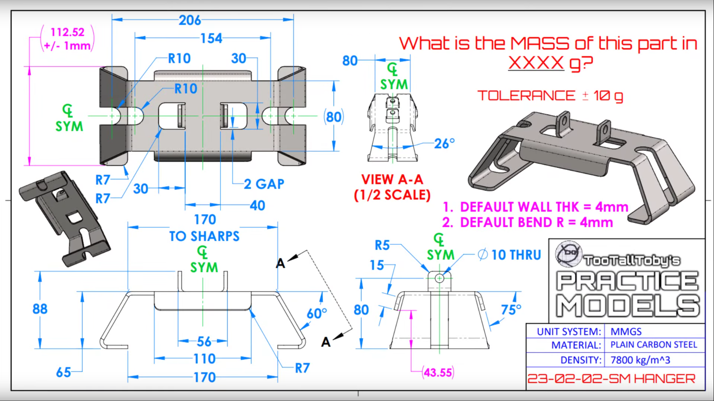

.. dropdown:: Object Mass

    1028g +/- 10g

.. dropdown:: Reference Implementation

    .. literalinclude:: assets/ttt/ttt-23-02-02-sm_hanger.py

.. _ttt-23-t-24:

23-T-24 Curved Support
----------------------

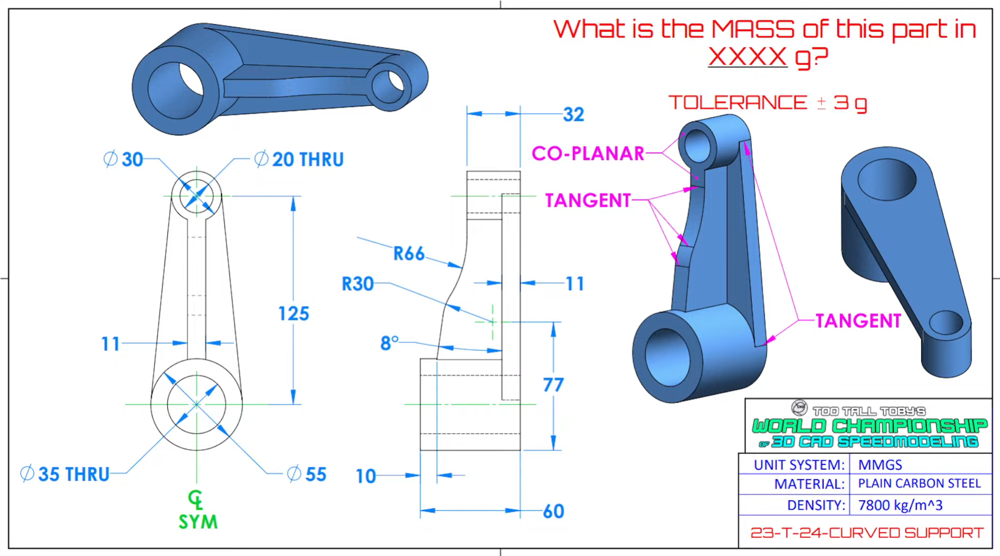

.. dropdown:: Object Mass

    1294 g

.. dropdown:: Reference Implementation

    .. literalinclude:: assets/ttt/ttt-23-t-24-curved_support.py

.. _ttt-24-spo-06:

24-SPO-06 Buffer Stand
----------------------

.. image:: assets/ttt/ttt-24-SPO-06-Buffer_Stand_object.png
  :align: center

.. dropdown:: Object Mass

    3.92 lbs

.. dropdown:: Reference Implementation

    .. literalinclude:: assets/ttt/ttt-24-SPO-06-Buffer_Stand.py
