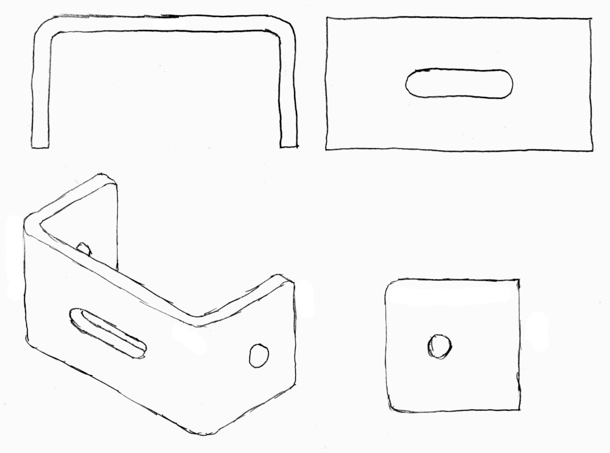
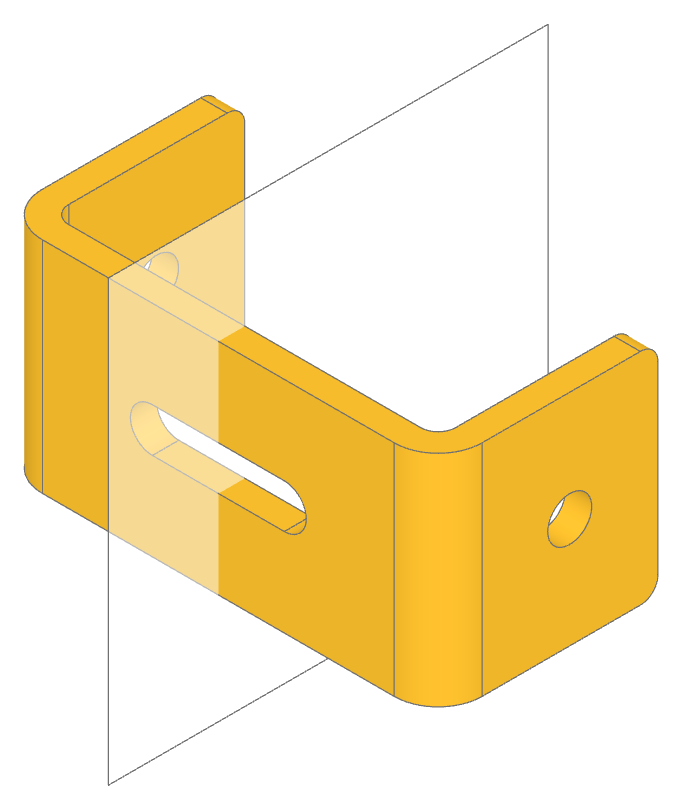
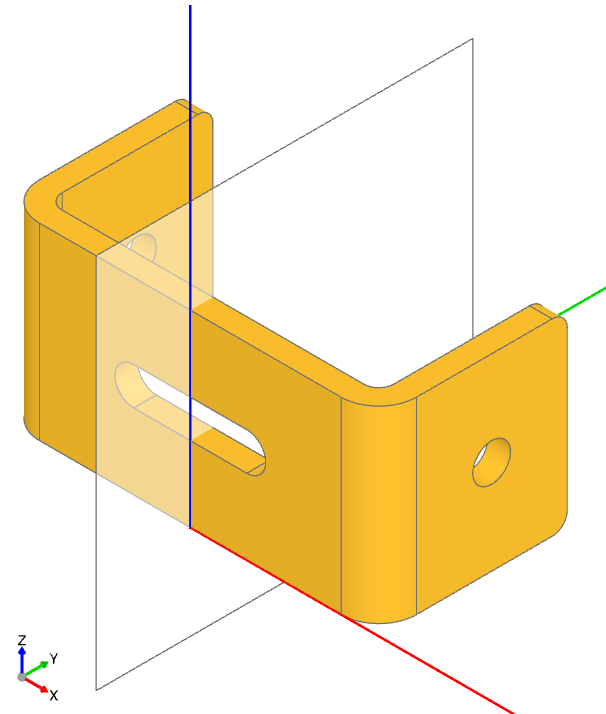
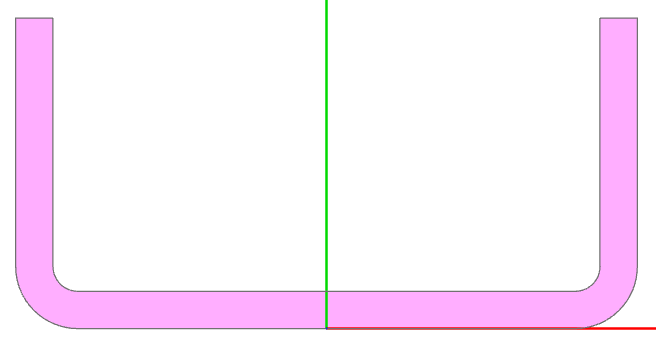
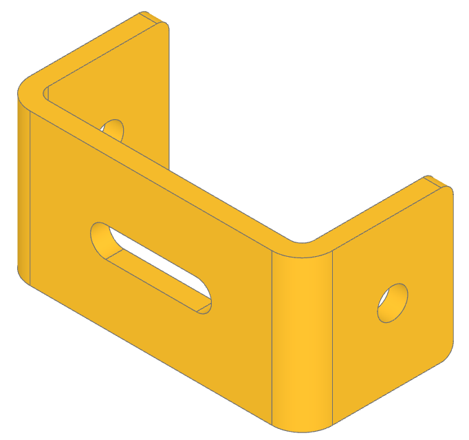

.. _design_tutorial:

#############################
Designing a Part in build123d
#############################

Designing a part with build123d involves a systematic approach that leverages the power 
of 2D profiles, extrusions, and revolutions. Where possible, always work in the lowest 
possible dimension, 1D lines before 2D sketches before 3D parts. The following guide will
get you started:

*As an example, we'll go through the design process for this bracket:*

Step 1. Examine the Part in All Three Orientations
**************************************************

Start by visualizing the part from the front, top, and side views. Identify any symmetries 
in these orientations, as symmetries can simplify the design by reducing the number of 
unique features you need to model.

*In the following view of the bracket one can see two planes of symmetry
so we'll only need to design one quarter of it.*

Step 2. Identify Rotational Symmetries
**************************************

Look for structures that could be created through the rotation of a 2D shape. For instance, 
cylindrical or spherical features are often the result of revolving a profile around an axis. 
Identify the axis of rotation and make a note of it.

*There are no rotational structures in the example bracket.*

Step 3. Select a Convenient Origin
**********************************

Choose an origin point that minimizes the need to move or transform components later in the 
design process. Ideally, the origin should be placed at a natural center of symmetry or a 
critical reference point on the part.

*The planes of symmetry for the bracket was identified in step 1, making it logical to 
place the origin at the intersection of these planes on the bracket's front face. Additionally, 
we'll define the coordinate system we'll be working in: Plane.XY (the default), where 
the origin is set at the global (0,0,0) position. In this system, the x-axis aligns with 
the front of the bracket, and the z-axis corresponds to its width. It’s important to note 
that all coordinate systems/planes in build123d adhere to the*
`right-hand rule <https://en.wikipedia.org/wiki/Right-hand_rule>`_ *meaning the y-axis is 
automatically determined by this convention.*

Step 4. Create 2D Profiles
**************************
Design the 2D profiles of your part in the appropriate orientation(s). These profiles are 
the foundation of the part's geometry and can often represent cross-sections of the part. 
Mirror parts of profiles across any axes of symmetry identified earlier.

*The 2D profile of the bracket is as follows:*

 
*The build123d code to generate this profile is as follows:*

.. code-block:: python

    with BuildSketch() as sketch:
        with BuildLine() as profile:
            FilletPolyline(
                (0, 0), (length / 2, 0), (length / 2, height), radius=bend_radius
            )
            offset(amount=thickness, side=Side.LEFT)
        make_face()
        mirror(about=Plane.YZ)

*This code creates a 2D sketch of a mirrored profile in the build123d CAD system. Here's a step-by-step explanation of what it does:*

    with BuildSketch() as sketch:
        *This starts a context for creating a 2D sketch, which defines the overall boundary and geometric features. The sketch will be stored in the variable sketch.*

    with BuildLine() as profile:
        *This starts another context, this time for drawing lines (or profiles) within the sketch. The profile consists of connected line segments, arcs, or polylines.*

    FilletPolyline((0, 0), (length / 2, 0), (length / 2, height), radius=bend_radius)
        *This object draws a polyline with three points: (0,0), (length/2, 0), and (length/2, height). A fillet (curved corner) with a radius of bend_radius is added where applicable between the segments of the polyline.*

    offset(amount=thickness, side=Side.LEFT)
        *This applies an offset to the polyline created earlier. The offset creates a parallel line at a distance of thickness to the left side of the original polyline. This operation essentially thickens the profile by a given amount.*

    make_face()
        *This command creates a 2D face from the closed profile. The offset operation ensures that the profile is closed, allowing the creation of a solid face from the boundary defined.*

    mirror(about=Plane.YZ)
        *This mirrors the entire face about the YZ plane (which runs along the center of the sketch), creating a symmetrical counterpart of the face. The mirrored geometry will complete the final shape.*

Step 5. Use Extrusion for Prismatic Features
********************************************
For solid or prismatic shapes, extrude the 2D profiles along the necessary axis. You can 
also combine multiple extrusions by intersecting or unionizing them to form complex shapes. 
Use the resulting geometry as sub-parts if needed.

*The next step in implmenting our design in build123d is to convert the above sketch into
a part by extruding it as shown in this code:*

.. code-block:: python

    with BuildPart() as bracket:
        with BuildSketch() as sketch:
            with BuildLine() as profile:
                FilletPolyline(
                    (0, 0), (length / 2, 0), (length / 2, height), radius=bend_radius
                )
                offset(amount=thickness, side=Side.LEFT)
            make_face()
            mirror(about=Plane.YZ)
        extrude(amount=width / 2)
        mirror(about=Plane.XY)

*In this example, we've wrapped the sketch within a BuildPart context, which is used 
for creating 3D parts. We utilized the extrude function to extend the 2D sketch into 
a solid object, turning it into a 3D part. Additionally, we applied the mirror function 
to replicate the partial part across a plane of symmetry, ensuring a symmetrical design.*

Step 6. Generate Revolved Features
**********************************
If any part of the geometry can be created by revolving a 2D profile around an axis, use 
the revolve operation. This is particularly useful for parts that include cylindrical, 
conical, or spherical features. Combine these revolved sub-parts with existing features 
using additive, subtractive, or intersecting operations.

*Our example has no revolved features.*

Step 7. Combine Sub-parts Intelligently
***************************************
When combining multiple sub-parts, keep in mind whether they need to be added, subtracted, 
or intersected. Subtracting or intersecting can create more refined details, while addition 
is useful for creating complex assemblies.

*Out example only has one sub-part but further sub-parts could be created in the
BuildPart context by defining more sketches and extruding or revolving them.*

Step 8. Apply Chamfers and Fillets
**********************************
Identify critical edges or vertices that need chamfering or filleting. Use build123d’s 
selectors to apply these operations accurately. Always visually inspect the results to 
ensure the correct edges have been modified.

*The back corners of the bracket need to be rounded off or filleted so the edges that
define these corners need to be isolated. The following code, placed to follow the previous
code block, captures just these edges:*

.. code-block:: python

    corners = bracket.edges().filter_by(Axis.X).group_by(Axis.Y)[-1]
    fillet(corners, fillet_radius)

*These lines isolates specific corner edges that are then filleted.*

    corners = bracket.edges().filter_by(Axis.X).group_by(Axis.Y)[-1]
        *This line is used to select specific edges from the 3D part (bracket) that was 
        created by the extrusion.*

        - bracket.edges() *retrieves all the edges of the bracket part.*
        - filter_by(Axis.X) *filters the edges to only those that are aligned along the 
          X-axis.*
        - group_by(Axis.Y) *groups the edges by their positions along the Y-axis. This 
          operation essentially organizes the filtered X-axis edges into groups based on 
          their Y-coordinate positions.*
        - [-1] *selects the last group of edges along the Y-axis, which corresponds 
          to the back of the part - the edges we are looking for.*

    fillet(corners, fillet_radius)
        *This function applies a fillet (a rounded edge) to the selected corners, with a 
        specified radius (fillet_radius). The fillet smooths the sharp edges at the corners, 
        giving the part a more refined shape.*

Step 9. Design for Assembly
***************************
If the part is intended to connect with others, add features like joints, holes, or other 
attachment points. Ensure that these features are precisely located to ensure proper fitment 
and functionality in the final assembly.

*Our example has two circular holes and a slot that need to be created. First we'll create
the two circular holes:*

.. code-block:: python

    with Locations(bracket.faces().sort_by(Axis.X)[-1]):
        Hole(hole_diameter / 2)

*This code creates a hole in a specific face of the bracket part.*

    with Locations(bracket.faces().sort_by(Axis.X)[-1]):
        *This context sets a location(s) for subsequent operations.*

        - bracket.faces() *retrieves all the faces of the bracket part.*
        - sort_by(Axis.X) *sorts these faces based on their position along the X-axis (from 
          one side of the bracket to the other).*
        - [-1] *selects the last face in this sorted list, which would be the face farthest 
          along the X-axis, the extreme right side of the part.*
        - Locations() *creates a new local context or coordinate system at the selected face, 
          effectively setting this face as the working location for any subsequent operations 
          inside the with block.*

    Hole(hole_diameter / 2)
        *This creates a hole in the selected face. The radius of the hole is specified as 
        hole_diameter / 2. The hole is placed at the origin of the selected face, based on 
        the local coordinate system created by Locations(). As the depth of the hole is
        not provided it is assumed to go entirely through the part.*

*Next the slot needs to be created in the bracket with will be done by sketching a slot on 
the front of the bracket and extruding the sketch through the part.*

.. code-block:: python

    with BuildSketch(bracket.faces().sort_by(Axis.Y)[0]):
        SlotOverall(20 * MM, hole_diameter)
    extrude(amount=-thickness, mode=Mode.SUBTRACT)

*Here’s a detailed explanation of what each part does:*

    with BuildSketch(bracket.faces().sort_by(Axis.Y)[0]):
        *This line sets up a sketching context.*

        - bracket.faces() *retrieves all the faces of the bracket part.*
        - sort_by(Axis.Y) *sorts the faces along the Y-axis, arranging them from the lowest 
          Y-coordinate to the highest.*
        - [0] *selects the first face in this sorted list, which is the one located at the 
          lowest Y-coordinate, the nearest face of the part.*
        - BuildSketch() *creates a new sketching context on this selected face, where 2D 
          geometry will be drawn.*

    SlotOverall(20, hole_diameter)
        *This command draws a slot (a rounded rectangle or elongated hole) on the selected 
        face. The slot has a total length of 20 mm and a width equal to hole_diameter. 
        The slot is defined within the 2D sketch on the selected face of the bracket.*

    extrude(amount=-thickness, mode=Mode.SUBTRACT)
        extrude() *takes the 2D sketch (the slot) and extends it into the 3D space by a 
        distance equal to -thickness, creating a cut into the part. The negative value 
        (-thickness) indicates that the extrusion is directed inward into the part (a cut).*
        mode=Mode.SUBTRACT *specifies that the extrusion is a subtractive operation, 
        meaning it removes material from the bracket, effectively cutting the slot through 
        the face of the part.*

*Although beyond the scope of this tutorial, joints could be defined for each of the
holes to allow programmatic connection to other parts.* 

Step 10. Plan for Parametric Flexibility
****************************************
Wherever possible, make your design parametric, allowing dimensions and features to be 
easily adjusted later. This flexibility can be crucial if the design needs modifications 
or if variations of the part are needed.

*The dimensions of the bracket are defined as follows:*

.. code-block:: python

    thickness = 3 * MM
    width = 25 * MM
    length = 50 * MM
    height = 25 * MM
    hole_diameter = 5 * MM
    bend_radius = 5 * MM
    fillet_radius = 2 * MM

Step 11. Test Fit and Tolerances
********************************
Visualize the fit of the part within its intended assembly. Consider tolerances for 
manufacturing, such as clearance between moving parts or shrinkage for 3D-printed parts. 
Adjust the design as needed to ensure real-world functionality.

Summary
*******
These steps should guide you through a logical and efficient workflow in build123d
(or any CAD tool), helping you to design parts with accuracy and ease.

*The entire code block for the bracket example is shown here:*

.. code-block:: python

    from build123d import *
    from ocp_vscode import show_all

    thickness = 3 * MM
    width = 25 * MM
    length = 50 * MM
    height = 25 * MM
    hole_diameter = 5 * MM
    bend_radius = 5 * MM
    fillet_radius = 2 * MM

    with BuildPart() as bracket:
        with BuildSketch() as sketch:
            with BuildLine() as profile:
                FilletPolyline(
                    (0, 0), (length / 2, 0), (length / 2, height), radius=bend_radius
                )
                offset(amount=thickness, side=Side.LEFT)
            make_face()
            mirror(about=Plane.YZ)
        extrude(amount=width / 2)
        mirror(about=Plane.XY)
        corners = bracket.edges().filter_by(Axis.X).group_by(Axis.Y)[-1]
        fillet(corners, fillet_radius)
        with Locations(bracket.faces().sort_by(Axis.X)[-1]):
            Hole(hole_diameter / 2)
        with BuildSketch(bracket.faces().sort_by(Axis.Y)[0]):
            SlotOverall(20 * MM, hole_diameter)
        extrude(amount=-thickness, mode=Mode.SUBTRACT)

    show_all()

