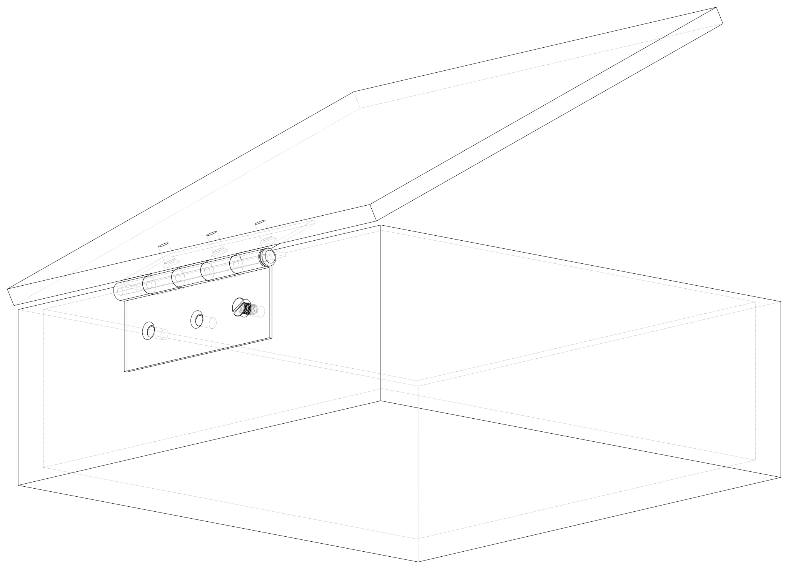
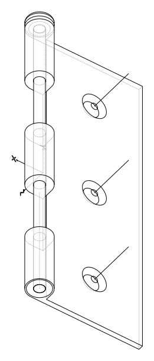
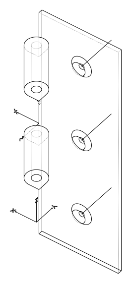
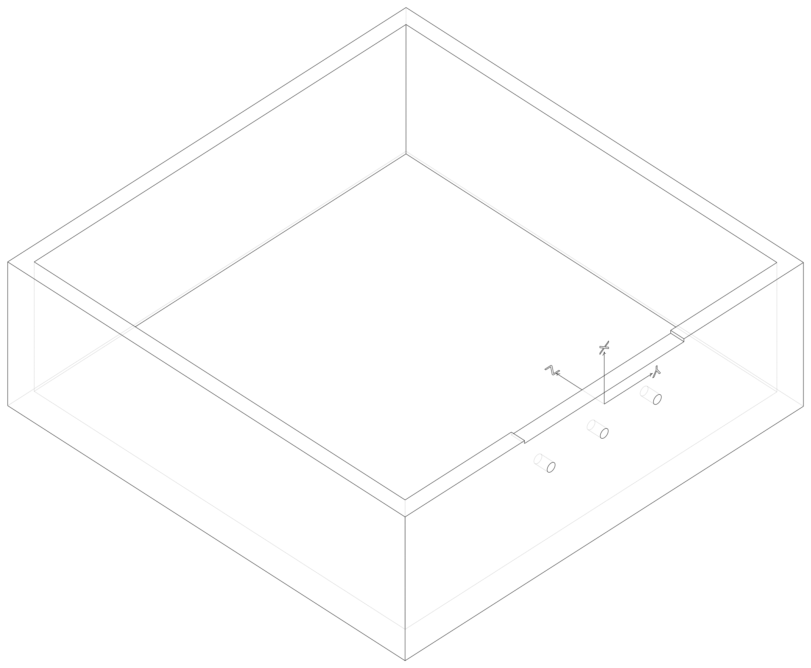
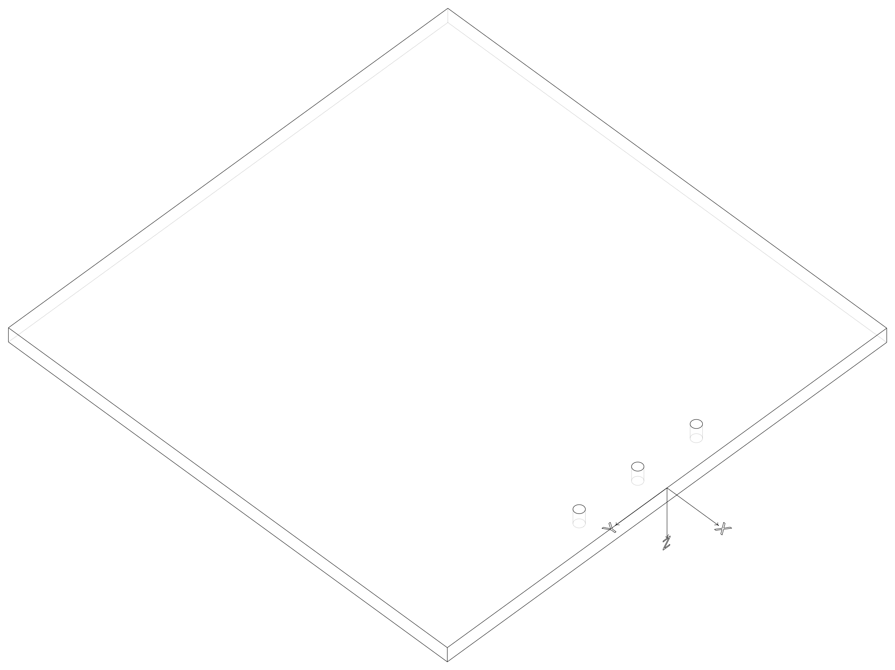
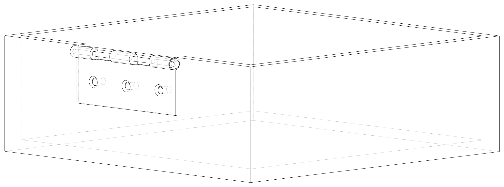
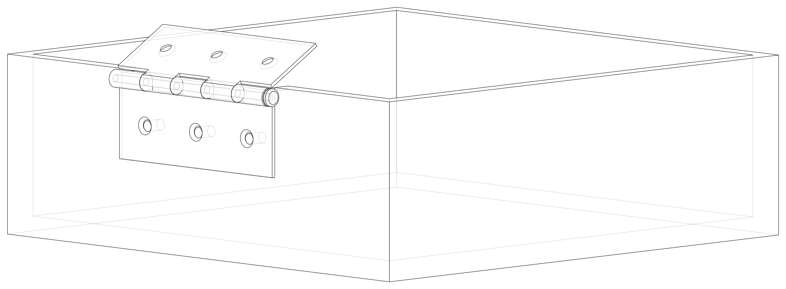

.. _joint_tutorial:

##############
Joint Tutorial
##############

This tutorial provides a step by step guide in using ``Joint``'s as we create
a box with a hinged lid. They allow Solid and Compound objects to be arranged
relative to each other in an intuitive manner - with the same degree of motion
that is found with the equivalent physical joints.  ``Joint``'s always work
in pairs - a ``Joint`` can only be connected to another ``Joint`` as follows:

+---------------------------------------+---------------------------------------------------------------------+--------------------+
| :class:`~direct_api.Joint`            | connect_to                                                          | Example            |
+=======================================+=====================================================================+====================+
| :class:`~direct_api.BallJoint`        |  :class:`~direct_api.RigidJoint`                                    | Gimbal             |
+---------------------------------------+---------------------------------------------------------------------+--------------------+
| :class:`~direct_api.CylindricalJoint` |  :class:`~direct_api.RigidJoint`                                    | Screw              |
+---------------------------------------+---------------------------------------------------------------------+--------------------+
| :class:`~direct_api.LinearJoint`      | :class:`~direct_api.RigidJoint`, :class:`~direct_api.RevoluteJoint` | Slider or Pin Slot |
+---------------------------------------+---------------------------------------------------------------------+--------------------+
| :class:`~direct_api.RevoluteJoint`    | :class:`~direct_api.RigidJoint`                                     | Hinge              |
+---------------------------------------+---------------------------------------------------------------------+--------------------+
| :class:`~direct_api.RigidJoint`       | :class:`~direct_api.RigidJoint`                                     | Fixed              |
+---------------------------------------+---------------------------------------------------------------------+--------------------+

Objects may have many joints bound to them each with an identifying label. All ``Joint``
objects have a ``symbol`` property that can be displayed to help visualize
their position and orientation.

In this tutorial, a box with a hinged lid will be created to illustrate the
use of three different ``Joint`` types.

*************
Step 1: Setup
*************

Before getting to the CAD operations, this selector script needs to import the build123d
environment.

.. literalinclude:: tutorial_joints.py
    :lines: 27

********************
Step 2: Create Hinge
********************

This example uses a common Butt Hinge to connect the lid to the box base so a ``Hinge`` class
is used to create that can create either of the two hinge leaves. As the focus of this
tutorial is the joints and not the CAD operations to create objects, this code is not
described in detail.

.. literalinclude:: tutorial_joints.py
    :lines: 27,32-132
    :emphasize-lines: 3-102

Once the two leaves have been created they will look as follows:

Note that the XYZ indicators and a circle around the hinge pin indicate
joints that are discussed below.

************************************
Step 3: Add Joints to the Hinge Leaf
************************************

The hinge includes five joints:

* A ``RigidJoint`` to attach the leaf
* A ``RigidJoint`` or ``RevoluteJoint`` as the hinge Axis
* Three ``CylindricalJoint``'s for the countersunk screws

Step 3a: Leaf Joint
-------------------

The first joint to add is a ``RigidJoint`` that is used to fix the hinge leaf to the box
or lid.

.. literalinclude:: tutorial_joints.py
    :lines: 134-141

Each joint has a label which identifies it - here the string "leaf" is used, the ``to_part``
binds the joint to ``leaf_builder.part`` (i.e. the part being built), and ``joint_location``
is specified as middle of the leaf along the edge of the pin. Note that
:class:`~direct_api.Location` objects describe both a position and orientation which is
why there are two tuples (the orientation listed is rotate about the X axis 90 degrees).

Step 3b: Hinge Joint
--------------------

The second joint to add is either a ``RigidJoint`` (on the inner leaf) or a ``RevoluteJoint``
(on the outer leaf) that describes the hinge axis.

.. literalinclude:: tutorial_joints.py
    :lines: 134-157
    :emphasize-lines: 9-24

The inner leaf just pivots around the outer leaf and therefore the simple ``RigidJoint`` is
used to define the Location of this pivot.  The outer leaf contains the more complex
``RevoluteJoint`` which defines an axis of rotation and angular limits to that rotation (90
and 270 in this example as the two leaves will interfere with each other outside of this range).
Note that the maximum angle must be greater than the minimum angle and therefore may be greater
than 360°. Other types of joints have linear ranges as well as angular ranges.

Step 3c: Fastener Joints
------------------------

The third set of joints to add are ``CylindricalJoint``'s that describe how the countersunk
screws used to attach the leaves move.

.. literalinclude:: tutorial_joints.py
    :lines: 134-167
    :emphasize-lines: 25-34

Much like the ``RevoluteJoint``, a ``CylindricalJoint`` has an Axis of motion but this type
of joint allows both movement around and along this axis - exactly as a screw would move.
Here is the Axis is setup such that a position of 0 aligns with the screw being fully set
in the hole and positive numbers indicate the distance the head of the screw is above the
leaf surface. One could have reversed the direction of the Axis such that negative position
values would correspond to a screw now fully in the hole - whatever makes sense to the situation.
The angular range of this joint is set to (0°, 360°) as there is no limit to the angular rotation
of the screw (one could choose to model thread pitch and calculate position from angle or
vice-versa).

Step 3d: Instantiate Hinge Leaves
---------------------------------

Now that the Hinge class is complete it can be used to instantiate the two hinge leaves
required to attach the box and lid together.

.. literalinclude:: tutorial_joints.py
    :lines: 172-187

**********************
Step 4: Create the Box
**********************

The box is created with ``BuildPart`` as a simple object - as shown below - let's focus on
the joint used to attach the outer hinge leaf.

.. literalinclude:: tutorial_joints.py
    :lines: 213-229
    :emphasize-lines: 13-17

Since the hinge will be fixed to the box another ``RigidJoint`` is used mark where the hinge
will go. Note that the orientation of this ``Joint`` will control how the hinge leaf is
attached and is independent of the orientation of the hinge as it was constructed.

Step 4a: Relocate Box
---------------------

Note that the position and orientation of the box's joints are given as a global ``Location``
when created but will be translated to a relative ``Location`` internally to allow the ``Joint``
to "move" with the parent object. This allows users the freedom to relocate objects without
having to recreate or modify ``Joint``'s. Here is the box is moved upwards to show this
property.

.. literalinclude:: tutorial_joints.py
    :lines: 213-231
    :emphasize-lines: 18-19

**********************
Step 5: Create the Lid
**********************

Much like the box, the lid is created in a ``BuildPart`` context and is assigned a ``RigidJoint``.

.. literalinclude:: tutorial_joints.py
    :lines: 236-246

Again, the original orientation of the lid and hinge inner leaf are not important, when the
joints are connected together the parts will move into the correct position.

*********************************************
Step 6: Import a Screw and bind a Joint to it
*********************************************

``Joint``'s can be bound to simple objects the a ``Compound`` imported - in this case a
screw.

.. literalinclude:: tutorial_joints.py
    :lines: 252-254

Here a simple ``RigidJoint`` is bound to the top of the screw head such that it can be
connected to the hinge's ``CylindricalJoint``.

***********************************
Step 7: Connect the Joints together
***********************************

This last step is the most interesting. Now that all of the joints have been defined
and bound to their parent objects, they can be connected together.

Step 7a: Hinge to Box
---------------------

To start, the outer hinge leaf will be connected to the box, as follows:

.. literalinclude:: tutorial_joints.py
    :lines: 262-263

Here the ``hinge_attachment`` joint of the ``box`` is connected to the ``leaf`` joint
of ``hinge_outer``. Note that the hinge leaf is the object to move.  Once this line
is executed, we get the following:

Step 7b: Hinge to Hinge
-----------------------

Next, the hinge inner leaf is connected to the hinge outer leaf which is attached to the
box.

.. literalinclude:: tutorial_joints.py
    :lines: 262-264
    :emphasize-lines: 3

As ``hinge_outer.joints["hinge_axis"]`` is a ``RevoluteJoint`` there is an ``angle``
parameter that can be set (angles default to the minimum range value) - here to 120°.
This is what that looks like:

Step 7c: Lid to Hinge
---------------------

Now the ``lid`` is connected to the ``hinge_inner``:

.. literalinclude:: tutorial_joints.py
    :lines: 262-265
    :emphasize-lines: 4

which results in:

.. image:: tutorial_joint_box_outer_inner_lid.svg

Note how the lid is now in an open position.  To close the lid just change the above ``angle``
parameter from 120° to 90°.

Step 7d: Screw to Hinge
-----------------------

The last step in this example is to place a screw in one of the hinges:

.. literalinclude:: tutorial_joints.py
    :lines: 262-266
    :emphasize-lines: 5

As the position is a positive number the screw is still proud of the hinge face as shown
here:

Try changing these position and angle values to "tighten" the screw.

**********
Conclusion
**********

Use a ``Joint`` to locate two objects relative to each other with some degree of motion.
Keep in mind that when using the ``connect_to`` method, ``self`` is always fixed
and ``other`` will move to the appropriate ``Location``.

.. note::

    The joint symbols can be displayed as follows (your viewer may use ``show`` instead
    of ``show_object``):

    .. code:: python

        show_object(box.joints["hinge_attachment"].symbol, name="box attachment point")

    or

    .. code:: python

        show_object(m6_joint.symbol, name="m6 screw symbol")

