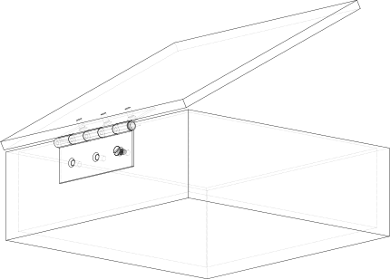
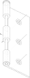
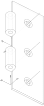
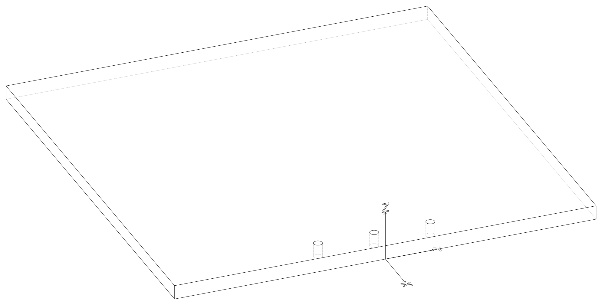
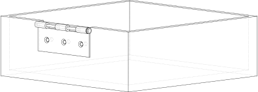
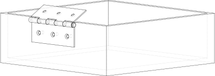
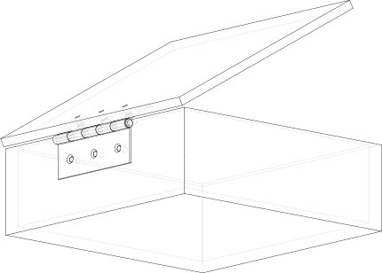

.. _joint_tutorial:

##############
Joint Tutorial
##############

This tutorial provides a step by step guide in using :class:`~topology.Joint`'s as we create
a box with a hinged lid to illustrate the use of three different :class:`~topology.Joint` types.

*************
Step 1: Setup
*************

Before getting to the CAD operations, this selector script needs to import the build123d
environment.

.. literalinclude:: tutorial_joints.py
    :start-after: [import]
    :end-before: [Hinge Class]

********************
Step 2: Create Hinge
********************

This example uses a common Butt Hinge to connect the lid to the box base so a ``Hinge`` class
is used to create that can create either of the two hinge leaves. As the focus of this
tutorial is the joints and not the CAD operations to create objects, this code is not
described in detail.

.. literalinclude:: tutorial_joints.py
    :start-after: [Hinge Class]
    :end-before: [Create the Joints]

Once the two leaves have been created they will look as follows:

Note that the XYZ indicators and a circle around the hinge pin indicate
joints that are discussed below.

************************************
Step 3: Add Joints to the Hinge Leaf
************************************

The hinge includes five joints:

* A :class:`~topology.RigidJoint` to attach the leaf
* A :class:`~topology.RigidJoint` or :class:`~topology.RevoluteJoint` as the hinge Axis
* Three :class:`~topology.CylindricalJoint`'s for the countersunk screws

Step 3a: Leaf Joint
-------------------

The first joint to add is a :class:`~topology.RigidJoint` that is used to fix the hinge leaf to the box
or lid.

.. literalinclude:: tutorial_joints.py
    :start-after: [Create the Joints]
    :end-before: [Hinge Axis]

Each joint has a label which identifies it - here the string "leaf" is used, the ``to_part``
binds the joint to ``leaf_builder.part`` (i.e. the part being built), and ``joint_location``
is specified as middle of the leaf along the edge of the pin. Note that
:class:`~geometry.Location` objects describe both a position and orientation which is
why there are two tuples (the orientation listed is rotate about the X axis 90 degrees).

Step 3b: Hinge Joint
--------------------

The second joint to add is either a :class:`~topology.RigidJoint` (on the inner leaf) or a :class:`~topology.RevoluteJoint`
(on the outer leaf) that describes the hinge axis.

.. literalinclude:: tutorial_joints.py
    :start-after: [Create the Joints]
    :end-before: [Fastener holes]
    :emphasize-lines: 10-24

The inner leaf just pivots around the outer leaf and therefore the simple :class:`~topology.RigidJoint` is
used to define the Location of this pivot.  The outer leaf contains the more complex
:class:`~topology.RevoluteJoint` which defines an axis of rotation and angular limits to that rotation (90
and 270 in this example as the two leaves will interfere with each other outside of this range).
Note that the maximum angle must be greater than the minimum angle and therefore may be greater
than 360°. Other types of joints have linear ranges as well as angular ranges.

Step 3c: Fastener Joints
------------------------

The third set of joints to add are :class:`~topology.CylindricalJoint`'s that describe how the countersunk
screws used to attach the leaves move.

.. literalinclude:: tutorial_joints.py
    :start-after: [Fastener holes]
    :end-before: [End Fastener holes]

Much like the :class:`~topology.RevoluteJoint`, a :class:`~topology.CylindricalJoint` has an Axis of motion but this type
of joint allows both movement around and along this axis - exactly as a screw would move.
Here is the Axis is setup such that a position of 0 aligns with the screw being fully set
in the hole and positive numbers indicate the distance the head of the screw is above the
leaf surface. One could have reversed the direction of the Axis such that negative position
values would correspond to a screw now fully in the hole - whatever makes sense to the situation.
The angular range of this joint is set to (0°, 360°) as there is no limit to the angular rotation
of the screw (one could choose to model thread pitch and calculate position from angle or
vice-versa).

Step 3d: Call Super
-------------------

To finish off, the base class for the Hinge class is initialized:

.. literalinclude:: tutorial_joints.py
    :start-after: [End Fastener holes]
    :end-before: [Hinge Class]

Step 3e: Instantiate Hinge Leaves
---------------------------------

Now that the Hinge class is complete it can be used to instantiate the two hinge leaves
required to attach the box and lid together.

.. literalinclude:: tutorial_joints.py
    :start-after: [Create instances of the two leaves of the hinge]
    :end-before: [Create the box with a RigidJoint to mount the hinge]

**********************
Step 4: Create the Box
**********************

The box is created with :class:`~build_part.BuildPart` as a simple object - as shown below - let's focus on
the joint used to attach the outer hinge leaf.

.. literalinclude:: tutorial_joints.py
    :start-after: [Create the box with a RigidJoint to mount the hinge]
    :end-before: [Demonstrate that objects with Joints can be moved and the joints follow]
    :emphasize-lines: 13-16

Since the hinge will be fixed to the box another :class:`~topology.RigidJoint` is used mark where the hinge
will go. Note that the orientation of this :class:`~topology.Joint` will control how the hinge leaf is
attached and is independent of the orientation of the hinge as it was constructed.

Step 4a: Relocate Box
---------------------

Note that the position and orientation of the box's joints are given as a global :class:`~geometry.Location`
when created but will be translated to a relative :class:`~geometry.Location` internally to allow the :class:`~topology.Joint`
to "move" with the parent object. This allows users the freedom to relocate objects without
having to recreate or modify :class:`~topology.Joint`'s. Here is the box is moved upwards to show this
property.

.. literalinclude:: tutorial_joints.py
    :start-after: [Demonstrate that objects with Joints can be moved and the joints follow]
    :end-before: [The lid with a RigidJoint for the hinge]

**********************
Step 5: Create the Lid
**********************

Much like the box, the lid is created in a :class:`~build_part.BuildPart` context and is assigned a :class:`~topology.RigidJoint`.

.. literalinclude:: tutorial_joints.py
    :start-after: [The lid with a RigidJoint for the hinge]
    :end-before: [A screw to attach the hinge to the box]
    :emphasize-lines: 6-9

Again, the original orientation of the lid and hinge inner leaf are not important, when the
joints are connected together the parts will move into the correct position.

*********************************************
Step 6: Import a Screw and bind a Joint to it
*********************************************

:class:`~topology.Joint`'s can be bound to simple objects the a :class:`~topology.Compound` imported - in this case a
screw.

.. literalinclude:: tutorial_joints.py
    :start-after: [A screw to attach the hinge to the box]
    :end-before: [End of screw creation]

Here a simple :class:`~topology.RigidJoint` is bound to the top of the screw head such that it can be
connected to the hinge's :class:`~topology.CylindricalJoint`.

***********************************
Step 7: Connect the Joints together
***********************************

This last step is the most interesting. Now that all of the joints have been defined
and bound to their parent objects, they can be connected together.

Step 7a: Hinge to Box
---------------------

To start, the outer hinge leaf will be connected to the box, as follows:

.. literalinclude:: tutorial_joints.py
    :start-after: [Connect Box to Outer Hinge]
    :end-before: [Connect Box to Outer Hinge]

Here the ``hinge_attachment`` joint of the ``box`` is connected to the ``leaf`` joint
of ``hinge_outer``. Note that the hinge leaf is the object to move.  Once this line
is executed, we get the following:

Step 7b: Hinge to Hinge
-----------------------

Next, the hinge inner leaf is connected to the hinge outer leaf which is attached to the
box.

.. literalinclude:: tutorial_joints.py
    :start-after: [Connect Hinge Leaves]
    :end-before: [Connect Hinge Leaves]

As ``hinge_outer.joints["hinge_axis"]`` is a :class:`~topology.RevoluteJoint` there is an ``angle``
parameter that can be set (angles default to the minimum range value) - here to 120°.
This is what that looks like:

Step 7c: Lid to Hinge
---------------------

Now the ``lid`` is connected to the ``hinge_inner``:

.. literalinclude:: tutorial_joints.py
    :start-after: [Connect Hinge to Lid]
    :end-before: [Connect Hinge to Lid]

which results in:

Note how the lid is now in an open position.  To close the lid just change the above ``angle``
parameter from 120° to 90°.

Step 7d: Screw to Hinge
-----------------------

The last step in this example is to place a screw in one of the hinges:

.. literalinclude:: tutorial_joints.py
    :start-after: [Connect Screw to Hole]
    :end-before: [Connect Screw to Hole]

As the position is a positive number the screw is still proud of the hinge face as shown
here:

Try changing these position and angle values to "tighten" the screw.

**********
Conclusion
**********

Use a :class:`~topology.Joint` to locate two objects relative to each other with some degree of motion.
Keep in mind that when using the ``connect_to`` method, ``self`` is always fixed
and ``other`` will move to the appropriate :class:`~geometry.Location`.

.. note::

    The joint symbols can be displayed as follows (your viewer may use ``show`` instead
    of ``show_object``):

    .. code:: python

        show_object(box.joints["hinge_attachment"].symbol, name="box attachment point")

    or

    .. code:: python

        show_object(m6_joint.symbol, name="m6 screw symbol")

    or, with the ocp_vscode viewer

    .. code:: python

        show(box, render_joints=True)

