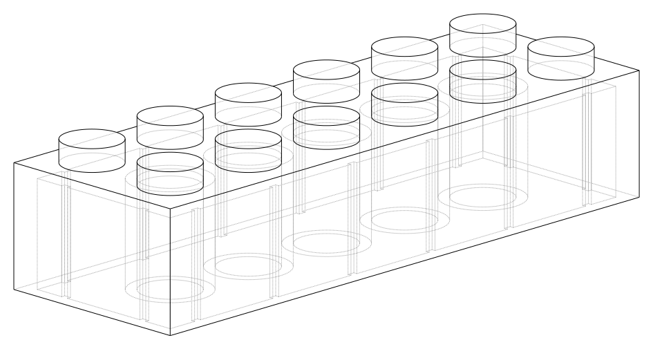
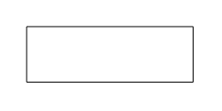
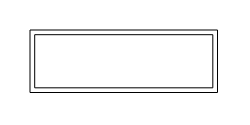
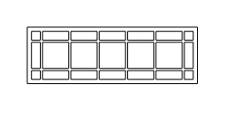
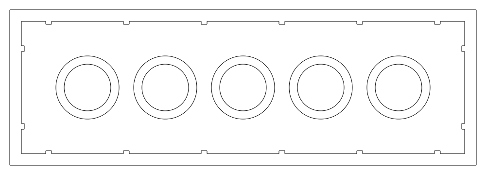
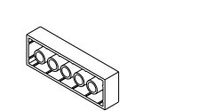
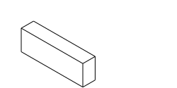

#############
Lego Tutorial
#############

This tutorial provides a step by step guide to creating a script to build a parametric
Lego block as shown here:

*************
Step 1: Setup
*************

Before getting to the CAD operations, this Lego script needs to import the build123d
environment. There are over 100 python classes in build123d so we'll just import them
all with a ``from build123d import *`` but there are other options that we won't explore
here.

The dimensions of the Lego block follow. A key parameter is ``pip_count``, the length
of the Lego blocks in pips. This parameter must be at least 2.

.. literalinclude:: ../examples/lego.py
    :lines: 29-44

********************
Step 2: Part Builder
********************

The Lego block will be created by the ``BuildPart`` builder as it's a discrete three
dimensional part; therefore, we'll instantiate a ``BuildPart`` with the name ``lego``.

.. literalinclude:: ../examples/lego.py
    :lines: 52

**********************
Step 3: Sketch Builder
**********************

Lego blocks have quite a bit of internal structure. To create this structure we'll
draw a two dimensional sketch that will later be extruded into a three dimensional
object.  As this sketch will be part of the lego part, we'll create a sketch builder
in the context of the part builder as follows:

.. literalinclude:: ../examples/lego.py
    :lines: 52-54
    :emphasize-lines: 3

Note that builder instance names are optional - we'll use ``plan`` to reference the sketch.
Also note that all sketch objects are filled or 2D faces not just perimeter lines.

***************************
Step 4: Perimeter Rectangle
***************************

The first object in the sketch is going to be a rectangle with the dimensions of the outside
of the Lego block. The following step is going to refer to this rectangle, so it will
be assigned the identifier ``perimeter``.

.. literalinclude:: ../examples/lego.py
    :lines: 52-56
    :emphasize-lines: 5

Once the ``Rectangle`` object is created the sketch appears as follows:

******************************
Step 5: Offset to Create Walls
******************************

To create the walls of the block the rectangle that we've created needs to be
hollowed out. This will be done with the ``Offset`` operation which is going to
create a new object from ``perimeter``.

.. literalinclude:: ../examples/lego.py
    :lines: 52-56,60-66
    :emphasize-lines: 7-12

The first parameter to ``Offset`` is the reference object. The ``amount`` is a
negative value to indicate that the offset should be internal. The ``kind``
parameter controls the shape of the corners - ``Kind.INTERSECTION`` will create
square corners. Finally, the ``mode`` parameter controls how this object will
be placed in the sketch - in this case subtracted from the existing sketch.
The result is shown here:

Now the sketch consists of a hollow rectangle.

****************************
Step 6: Create Internal Grid
****************************

The interior of the Lego block has small ridges on all four internal walls.
These ridges will be created as a grid of thin rectangles so the positions
of the centers of these rectangles need to be defined. A pair of
``GridLocations`` location contexts will define these positions, one for
the horizontal bars and one for the vertical bars. As the ``Rectangle``
objects are in the scope of a location context (``GridLocations`` in this case)
that defined multiple points, multiple rectangles are created.

.. literalinclude:: ../examples/lego.py
    :lines: 52-56,60-66,70-74
    :emphasize-lines: 13-17

Here we can see that the first ``GridLocations`` creates two positions which causes
two horizontal rectangles to be created.  The second ``GridLocations`` works in the same way
but creates ``pip_count`` positions and therefore ``pip_count`` rectangles. Note that keyword
parameter are optional in this case.

The result looks like this:

*********************
Step 7: Create Ridges
*********************

To convert the internal grid to ridges, the center needs to be removed. This will be done
with another ``Rectangle``.

.. literalinclude:: ../examples/lego.py
    :lines: 52-56,60-66,70-74,79-83
    :emphasize-lines: 18-22

The ``Rectangle`` is subtracted from the sketch to leave the ridges as follows:

**********************
Step 8: Hollow Circles
**********************

Lego blocks use a set of internal hollow cylinders that the pips push against
to hold two blocks together. These will be created with ``Circle``.

.. literalinclude:: ../examples/lego.py
    :lines: 52-56,60-66,70-74,79-83,87-92
    :emphasize-lines: 23-28

Here another ``GridLocations`` is used to position the centers of the circles.  Note
that since both ``Circle`` objects are in the scope of the location context, both
Circles will be positioned at these locations.

Once the Circles are added, the sketch is complete and looks as follows:

***********************************
Step 9: Extruding Sketch into Walls
***********************************

Now that the sketch is complete it needs to be extruded into the three dimensional
wall object.

.. literalinclude:: ../examples/lego.py
    :lines: 52-56,60-66,70-74,79-83,87-92,96-97
    :emphasize-lines: 29-30

Note how the ``Extrude`` operation is no longer in the ``BuildSketch`` scope and has returned
back into the ``BuildPart`` scope. This causes ``BuildSketch`` to exit and transfer the
sketch that we've created to ``BuildPart`` for further processing by ``Extrude``.

The result is:

*********************
Step 10: Adding a Top
*********************

Now that the walls are complete, the top of the block needs to be added. Although this
could be done with another sketch, we'll add a box to the top of the walls.

.. literalinclude:: ../examples/lego.py
    :lines: 52-56,60-66,70-74,79-83,87-92,96-97,101-109
    :emphasize-lines: 31-39

To position the top, we'll describe the top center of the lego walls with a ``Locations`` context.
To determine the height we'll extract that from the
``lego.part`` by using the ``vertices()`` method which returns a list of the positions
of all of the vertices of the Lego block so far. Since we're interested in the top,
we'll sort by the vertical (Z) axis and take the top of the list ``sort_by(Axis.Z)[-1]``. Finally,
the ``Z`` property of this vertex will return just the height of the top. Note that
the ``X`` and ``Y`` values are not used from the selected vertex as there are no
vertices in the center of the block.

Within the scope of this ``Locations`` context, a ``Box`` is created, centered at
the intersection of the x and y axis but not in the z thus aligning with the top of the walls.

The base is closed now as shown here:

********************
Step 11: Adding Pips
********************

The final step is to add the pips to the top of the Lego block. To do this we'll create
a new workplane on top of the block where we can position the pips.

.. literalinclude:: ../examples/lego.py
    :lines: 52-56,60-66,70-74,79-83,87-92,96-97,101-109,120-128
    :emphasize-lines: 40-48

In this case, the workplane is created from the top Face of the Lego block by using the
``faces`` method and then sorted vertically and taking the top one ``sort_by(Axis.Z)[-1]``.

On the new workplane, a grid of locations is created and a number of ``Cylinder``'s are positioned
at each location.

.. image:: tutorial_step11.svg
  :align: center

This completes the Lego block. To access the finished product, refer to the builder's internal
object as shown here:

+-------------+--------+
| Builder     | Object |
+=============+========+
| BuildLine   | line   |
+-------------+--------+
| BuildSketch | sketch |
+-------------+--------+
| BuildPart   | part   |
+-------------+--------+

so in this case the Lego block is ``lego.part``. To display the part use ``show_object(lego.part)``
or ``show(lego.part)`` depending on the viewer. The part could also be exported to a STL or STEP
file by referencing ``lego.part``.

.. note::
    Viewers that don't directly support build123d my require a raw OpenCascade object. In this
    case, append ``.wrapped`` to the object (e.g.) ``show_object(lego.part.wrapped)``.
