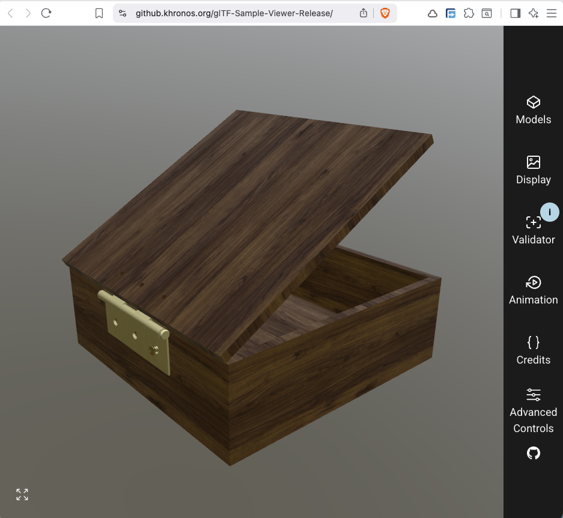

.. _material_tutorial:

#################
Material Tutorial
#################

This tutorial enhances the :ref:`Joints tutorial <joint_tutorial>` with materials for realistic rendering.

*********************
Step 1: Prerequisites
*********************

Assume we have the 5 variables from the joints tutorial:

- ``box``
- ``lid``
- ``hinge_inner``
- ``hinge_outer``
- ``m6_screw``

with their labels

.. code-block:: python

    box.label = "box"
    lid.label = "lid"
    hinge_outer.label = "outer hinge"
    hinge_inner.label = "inner hinge"
    m6_screw.label = "M6 screw"

***********************
Step 2: Apply materials
***********************

The box and lid should be made of walnut wood, the hinges and the screw from brass.
Build123d uses `bd_materials <https://github.com/bernhard-42/bd_materials>`_ as its source for material definitions. It provides materials from `different categories <https://github.com/bernhard-42/bd_materials#2-materials--finishes--organised-by-manufacturing-process>`_, e.g.

- metals: Stainless steel, Aluminum, Copper, ...
- plastics: Nylon, PLA, ABS, PETG, ...
- ...

Brass is available in `bd_materials`, so let's import it and assign it to the ``hinge_inner``, ``hinge_outer``, and ``m6_screw``:

.. code-block:: python

    from bd_materials import metals, wood, finishes

    box.material = wood.walnut()
    lid.material = wood.walnut()

    hinge_inner.material = metals.brass()
    hinge_outer.material = metals.brass()
    m6_screw.material = metals.brass()

In a normal manufacturing process the creation of an object is followed by applying a finish to it. So in order to have brushed or matte brass, use

.. code-block:: python

    hinge_inner.material = metals.brass(finish=finishes.brushed())
    hinge_outer.material = metals.brass(finish=finishes.fine_sanding())

***************************
Step 3: Material properties
***************************

Three properties can be access from ``<shape>.material``:

- The **physical material**

    .. code-block:: python

        hinge_inner.material.material

        # MetalMaterial(
        #     name='Brass_C360_HALF_HARD',
        #     density=8500,
        #     family='brass',
        #     transparent=False,
        #     tensile_strength=Range(min=380, max=450),
        #     modulus_of_elasticity=Range(min=100, max=110),
        #     shear_modulus=Range(min=37, max=40),
        #     poisson_ratio=Range(min=0.32, max=0.35),
        #     specific_heat_capacity=Range(min=380, max=390),
        #     max_service_temp=Range(min=150, max=250),
        #     thermal_expansion=Range(min=1.9e-05, max=2.1e-05),
        #     thermal_conductivity=Range(min=110, max=130),
        #     yield_strength=Range(min=200, max=250),
        #     shear_strength=Range(min=210, max=270),
        #     hardness=Range(min=90, max=120),
        #     hardness_scale='HB',
        #     melting_temperature=Range(min=880, max=950)
        # )  

    Note that density is a typical value for the material (to allow mass calculation in build123d), but all other properties are ranges for the typical values

    These units are used for the properties:

    .. code-block:: python

        from bd_materials.core import PROPERTY_UNITS as pu
        
        pprint(pu)

        # {
        #    'areal_density': 'g/m²',
        #    'compressive_strength_parallel': 'MPa',
        #    'density': 'kg/m³',
        #    'elongation_at_break': '%',
        #    'glass_transition_temperature': '°C',
        #    'hardness': 'per hardness_scale',
        #    'heat_deflection_temperature': '°C',
        #    'janka_hardness': 'N',
        #    'max_service_temp': '°C',
        #    'melting_temperature': '°C',
        #    'modulus_of_elasticity': 'GPa',
        #    'modulus_of_rupture': 'MPa',
        #    'poisson_ratio': '',
        #    'shear_modulus': 'GPa',
        #    'shear_strength': 'MPa',
        #    'specific_heat_capacity': 'J/(kg·K)',
        #    'tensile_strength': 'MPa',
        #    'thermal_conductivity': 'W/(m·K)',
        #    'thermal_expansion': '1/K',
        #    'thickness': 'mm',
        #    'yield_strength': 'MPa'
        # }

- The **finish**

    .. code-block:: python

        hinge_inner.material.finish

        # AppliedFinish(
        #     finish=Finish(name='Brushed', notes=None),
        #     color=None,
        #     sheen=None,
        #     scale=(1.0, 1.0),
        #     rotation=0.0
        # )

- The **physical based rendering properties**

    .. code-block:: python

        hinge_inner.material.pbr

        # PbrProperties(name='brass_brushed', source='physicallybased', license='CC0 1.0')
        #   values: PbrValues(
        #               color=[0.9593465889662697, 0.8952268365504931, 0.6821586160863968], 
        #               metalness=1.0, 
        #               roughness=1.0, 
        #               specular_intensity=1.0, 
        #               specular_color=[0.952, 0.979, 1.021]
        #           )
        #   maps:    PbrMaps(roughness='roughness.png', normal='normal.png')
        #   maps_dir: .venv/lib/python3.13/site-packages/threejs_materials/pbr_properties/_assets/_brush

    This can be use as:

    .. code-block:: python

        print(hinge_inner.material.material.density, pu["density"])
        # 8500 kg/m³
        
        print(hinge_inner.material.material.tensile_strength, pu["tensile_strength"])
        # Range(min=380, max=450) MPa

    ``Range.value_at(r)`` samples the range at the fractional position ``r``: ``value_at(0)`` returns ``min``, ``value_at(1)`` returns ``max``, and values in between interpolate linearly. ``r`` is not clamped — outside ``[0, 1]`` the value extrapolates.

    .. code-block:: python

        print(hinge_inner.material.material.tensile_strength.value_at(0.2), pu["tensile_strength"])
        394.0 MPa

**Volume and mass calculation**

- ``volume`` is a property and returns a bare number — it carries no unit. The number is the volume in whatever length unit the model was drawn in, cubed.

    .. code-block:: python

        print(f"{hinge_outer.volume=:9.3f}")
        # hinge_outer.volume=16116.838

- ``mass()`` multiplies that volume by ``<shape>.material.material.density``. Since ``volume`` is unitless, ``mass(mass_unit, length_unit)`` takes both the unit the volume should be read as and the unit the result is reported in. Both are optional and default to *gram* and *millimeter*. A shape without a material raises a ``ValueError``.

    -  Volume read as *mm³*, mass reported in *g* (the defaults):

        .. code-block:: python

            print(f"{hinge_outer.mass()=:9.3f} g")
            # hinge_outer.mass()=  136.993 g

    -  The same model read as *in³*, mass reported in *lb*:

        .. code-block:: python

            print(f"{hinge_outer.mass(Unit.LB, Unit.IN)=:9.3f} lb")
            # hinge_outer.mass(Unit.LB, Unit.IN)= 4949.191 lb

    The volume number is identical in both cases — only its interpretation changes. One inch is 25.4 mm, so reading the model in inches makes it 25.4³ ≈ 16000 times heavier.

The same for ``box``:

.. code-block:: python

    print(f"{box.volume=:9.3f}")
    # box.volume=1940751.770

    print(f"{box.mass()=:9.3f} g")  # volume read as mm³
    # box.mass()= 1242.081 g

    print(f"{box.mass(Unit.LB, Unit.IN)=:9.3f} lb")  # volume read as in³
    # box.mass(Unit.LB, Unit.IN)=44873.028 lb

*****************************************************
Step 4: Visualization in OCP CAD Viewer's Studio mode
*****************************************************

bd_materials uses the material and the finish to determine the appropriate physical based rendering properties that work in OCP CAD Viewer's Studio (and can be exported to glTF files):

.. code-block:: python

    show(box, lid, hinge_outer, hinge_inner, m6_screw)

.. image:: assets/pbr_hinges_brass.png
    :alt: pbr_hinges_brass

***********************************
Step 5: External viewers (optional)
***********************************

``export_gltf`` automatically integrates the PBR properties into the gltf/glb file on export:

.. code-block:: python

    b = Compound(label="Box", children=[box, lid, hinge_outer, hinge_inner, m6_screw])
    export_gltf(b, "box.glb")

The file ``"box.glb"`` can then be visualized in any glTF viewer, e.g. here the `Khronos glTF viewer <https://github.khronos.org/glTF-Sample-Viewer-Release>`_:

****************************
Appendix 1: Custom materials
****************************

.. code-block:: python

    from threejs_materials import PbrProperties
    from bd_materials import plastics

    mat = plastics.custom_plastic(
        "carbon fiber", 
        density=1500,  # kg/m^3
        pbr=PbrProperties.from_gpuopen("Carbon biColor Coat")
    )

    box.material = mat
    lid.material = mat
    hinge_inner.material = metals.mild_steel(finish=finishes.black_oxide())
    hinge_outer.material = metals.mild_steel(finish=finishes.black_oxide())
    m6_screw.material = metals.stainless()

.. note::
    For ``pbr=PbrProperties.from_gpuopen`` to work, ensure that `materialx <https://pypi.org/project/MaterialX/>`_  is installed. It is a binary package that might not be on pypi for a given OS or Python version, and needs to be compiled then (done automatically at install time). To avoid this as a hard dependency, ``materialx`` is optional. You can always test with ``import MaterialX``.

.. code-block:: python

    show(box, lid, hinge_outer, hinge_inner, m6_screw)

.. image:: assets/pbr_hinges_carbon.png
    :alt: pbr_hinges_carbon

.. code-block:: python

    print(f"{hinge_outer.material.material.density=} {pu['density']}")
    # hinge_outer.material.material.density=7800 kg/m³

    print(f"{box.material.material.density=} {pu['density']}")
    # box.material.material.density=1500 kg/m³

    print(f"{hinge_outer.volume=:9.3f}")
    # hinge_outer.volume=16116.838

    print(f"{hinge_outer.mass()=:9.3f} g")
    # hinge_outer.mass()=  125.711 g

    print(f"{hinge_outer.mass(Unit.LB, Unit.IN)=:9.3f} lb")
    # hinge_outer.mass(Unit.LB, Unit.IN)= 4541.610 lb

    print(f"{box.volume=:9.3f}")
    # box.volume=1940751.770

    print(f"{box.mass()=:9.3f} g")
    # box.mass()= 2911.128 g
    
    print(f"{box.mass(Unit.LB, Unit.IN)=:9.3f} lb")
    # box.mass(Unit.LB, Unit.IN)=105171.159 lb