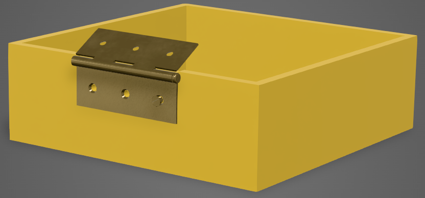
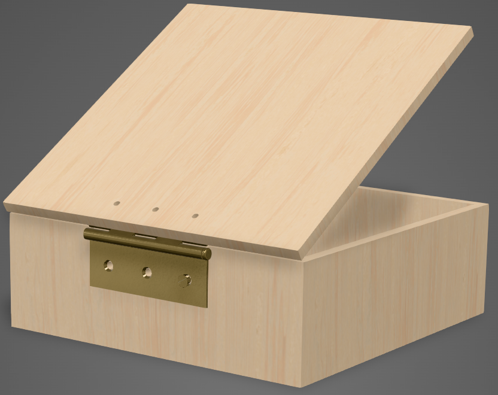

.. _material_tutorial:

#################
Material Tutorial
#################

This tutorial enhances the :ref:`Joints tutorial <joint_tutorial>` with materials for realistic rendering.

*********************
Step 1: Prerequisites
*********************

Assume we have the 5 variables from the joints tutorial:

- ``box``
- ``lid``
- ``hinge_inner``
- ``hinge_outer``
- ``m6_screw``

with their labels

.. code-block:: python

    box.label = "box"
    lid.label = "lid"
    hinge_outer.label = "outer hinge"
    hinge_inner.label = "inner hinge"
    m6_screw.label = "M6 screw"

*********************
Step 2: The materials
*********************

The box and lid should be made of dark maple wood, the hinges and the screw from brass.
Build123d uses `py-materials <https://github.com/MorePET/mat>`_ as its hierarchical material database. It provides materials from `different categories <https://github.com/MorePET/mat?tab=readme-ov-file#material-categories>`_, e.g.

- Metals: Stainless steel, aluminum, copper, ...
- Plastics: Nylon, PLA, ABS, PETG, ...
- ...

For each material it contains properties of different `material property groups <https://github.com/MorePET/mat?tab=readme-ov-file#property-groups>`_ like mechanical or thermal properties.

Brass is available in py-materials, so let's import it:

.. code-block:: python

    from pymat import brass

and assign it to the ``hinge_inner``, ``hinge_outer``, and ``m6_screw``:

.. code-block:: python

    hinge_inner.material = brass
    hinge_outer.material = brass
    m6_screw.material = brass

***************************
Step 3: Material properties
***************************

While py-materials supports a lot of different material properties, its internal database currently sets a small subset only, e.g.

.. code-block:: python

    print(hinge_inner.material.mechanical.density, hinge_inner.material.mechanical.density_unit)
    # 8.5 g/cm^3

    print(hinge_inner.material.thermal.melting_point, hinge_inner.material.thermal.melting_point_unit)
    # 97 g/cm^3

    print(hinge_inner.material.mechanical.youngs_modulus, hinge_inner.material.mechanical.density_unit)
    # 900 degC

The ``mass`` property of ``Shape``, ``Shell`` and ``Compopund`` uses the value of ``.material.mechanical.density`` to calculate the mass from the volume:

.. code-block:: python

    print(f"{hinge_outer.volume:9.3f} mm^3")
    print(f"{hinge_outer.mass:9.3f} g")
    # 16116.838 mm^3
    #   136.993 g

*********************
Step 4: Visualization
*********************

py-materials also sets some visualization properties which are already sufficient for the hinges to look like brass in OCP CAD Viewer's Studio:

.. image:: assets/pbr_hinges_brass.png
    :alt: pbr_hinges_brass

The PBR (physically based rendering) properties of py-materials do not provide more sophisticated visualization features like textures. In order to assign better PBR properties, the package `threejs-materials <https://github.com/bernhard-42/threejs-materials>`_ needs to be imported and a brass definition needs to be downloaded, e.g. from `GPUOpen <https://matlib.gpuopen.com/main/materials/all>`_.

.. code-block:: python

    from threejs_materials import PbrProperties

    brass_pbr = PbrProperties.from_gpuopen("Brass Satin").scale(6, 6)

This downloads the "Brass Brushed" definition from `GPUOpen Materials lib <https://matlib.gpuopen.com/main/materials/all?category=Metal>`_, converts it to threejs (a process called "baking"), and stores it locally in a cache. ``scale(6,6)`` scales the texture relative to the uv coordinates by factor 6. This changes the look in OCP CAD Viewer's Studio:

The same approach allows to assign a wooden material to the box and lid. The database of py-materials does not contain materials like wood, hence it needs to be created with a density of e.g. 0.70 g/mm^3:

.. code-block:: python

    wood_pbr = PbrProperties.from_gpuopen("Wood Beech Raw").scale(4, 4)
    wood = Material.create("beech", density=0.70, pbr=wood_pbr)
    box.material = wood
    lid.material = wood

The new material definition will be respected by the ``mass`` property:

.. code-block:: python

    print(f"{box.volume:11.3f} mm^3")
    print(f"{box.mass:11.3f} g")
    # 1940751.770 mm^3
    # 1397.341 g

The final rendering now looks like this:

