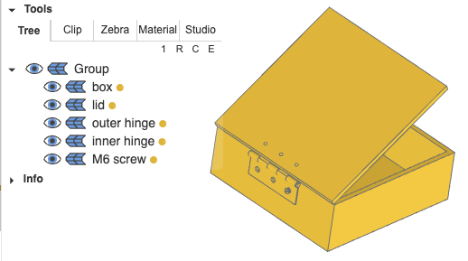
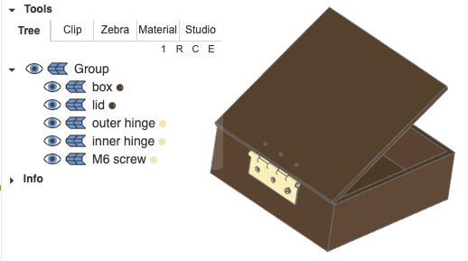
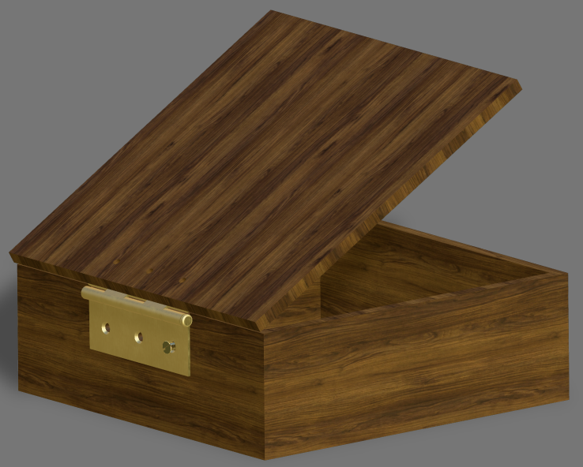
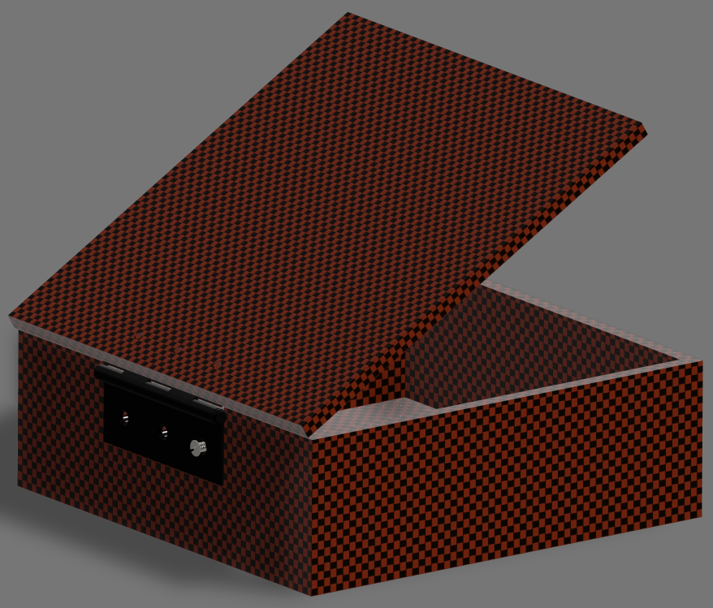

.. _material_tutorial:

#################
Material Tutorial
#################

This tutorial enhances the :ref:`Joints tutorial <joint_tutorial>` with materials for realistic rendering.

*********************
Step 1: Prerequisites
*********************

Assume we have the 5 variables from the joints tutorial:

- ``box``
- ``lid``
- ``hinge_inner``
- ``hinge_outer``
- ``m6_screw``

with their labels

.. code-block:: python

    box.label = "box"
    lid.label = "lid"
    hinge_outer.label = "outer hinge"
    hinge_inner.label = "inner hinge"
    m6_screw.label = "M6 screw"

***********************
Step 2: Apply materials
***********************

The box and lid should be made of walnut wood, the hinges and the screw from brass.
Build123d uses `bd_materials <https://github.com/bernhard-42/bd_materials>`_ as its source for material definitions. It provides materials from `different categories <https://github.com/bernhard-42/bd_materials#2-materials--finishes--organised-by-manufacturing-process>`_, e.g.

- metals: Stainless steel, Aluminum, Copper, ...
- plastics: Nylon, PLA, ABS, PETG, ...
- ...

Brass is available in `bd_materials`, so let's import it and assign it to the ``hinge_inner``, ``hinge_outer``, and ``m6_screw``:

.. code-block:: python

    from bd_materials import metals, finishes

    hinge_inner.material = metals.brass()
    hinge_outer.material = metals.brass()
    m6_screw.material = metals.brass()

In a normal manufacturing process the creation of an object is followed by applying a finish to it. So in order to have brushed or matte brass, use

.. code-block:: python

    hinge_inner.material = metals.brass(finish=finishes.brushed())
    hinge_outer.material = metals.brass(finish=finishes.fine_sanding())

***************************
Step 3: Material properties
***************************

Material properties can be accessed via ``<shape>.material.material.*`` using the following units

.. code-block:: python
        
    from bd_materials.core import PROPERTY_UNITS as pu

    pprint(pu)

    {'areal_density': 'g/m²',
     'compressive_strength_parallel': 'MPa',
     'density': 'kg/m³',
     'elongation_at_break': '%',
     'glass_transition_temperature': '°C',
     'hardness': 'per hardness_scale',
     'heat_deflection_temperature': '°C',
     'janka_hardness': 'N',
     'max_service_temp': '°C',
     'melting_temperature': '°C',
     'modulus_of_elasticity': 'GPa',
     'modulus_of_rupture': 'MPa',
     'poisson_ratio': '',
     'shear_modulus': 'GPa',
     'shear_strength': 'MPa',
     'specific_heat_capacity': 'J/(kg·K)',
     'tensile_strength': 'MPa',
     'thermal_conductivity': 'W/(m·K)',
     'thermal_expansion': '1/K',
     'thickness': 'mm',
     'yield_strength': 'MPa'}

Note that density is a typical value for the material (to allow mass calculation in build123d), but all other properties are ranges for the typical values:

.. code-block:: python

    print(hinge_inner.material.material.density, pu["density"])
    # 8500 kg/m³
    
    print(hinge_inner.material.material.tensile_strength, pu["tensile_strength"])
    # Range(min=380, max=450) MPa

The ``mass`` property of ``Shape``, ``Shell`` and ``Compopund`` uses the value of ``<shape>.material.material.density`` to calculate the mass from the volume:

.. code-block:: python

    print(f"{hinge_outer.material.material.density=} {pu['density']}")
    # hinge_outer.material.material.density=8500 kg/m³

    print(f"{box.material.material.density=} {pu['density']}")
    # box.material.material.density=640 kg/m³

    print(f"{hinge_outer.volume=:9.3f} {get_units()['length_unit'].value}^3")
    print(f"{hinge_outer.mass=:9.3f} {get_units()['mass_unit'].value}")
    # hinge_outer.volume=16116.838 mm^3
    # hinge_outer.mass=  136.993 g

    print(f"{box.volume=:9.3f} {get_units()['length_unit'].value}^3")
    print(f"{box.mass=:9.3f} {get_units()['mass_unit'].value}")
    # box.volume=1940751.770 mm^3
    # box.mass= 1242.081 g

**********************************
Step 4 : Auto coloring in CAD view
**********************************

After adding materials to objects, one can select whether the objects in CAD view should get colors that approximate the PBR material color automatically:

.. code-block:: python

    auto_set_color(False) # default

    # set materials again, as in box.material = ..., 
    # since the color will be set at material assignment time

.. code-block:: python

    auto_set_color(True)

    # set materials again, as in box.material = ..., 
    # since the color will be set at material assignment time

*****************************************************
Step 5: Visualization in OCP CAD Viewer's Studio mode
*****************************************************

bd_materials uses the material and the finish to determine the approapriate physical based rendering properties that work in in OCP CAD Viewer's Studio (and can be exported to glTF files):

.. code-block:: python

    show(box, lid, hinge_outer, hinge_inner, m6_screw)

**************************
Appendix: Custom materials
**************************

.. code-block:: python

    from threejs_materials import PbrProperties
    from bd_materials import plastics

    mat = plastics.custom_plastic(
        "carbon fiber", 
        density=1500,  # kg/m^3
        pbr=PbrProperties.from_gpuopen("Carbon biColor Coat")
    )

    box.material = mat
    lid.material = mat
    hinge_inner.material = metals.stainless(finish=finishes.black_oxide())
    hinge_outer.material = metals.stainless(finish=finishes.black_oxide())
    m6_screw.material = metals.stainless()

.. note::
    For ``pbr=PbrProperties.from_gpuopen`` to work, ensure that `materialx <https://pypi.org/project/MaterialX/>`_  is installed. It is a binary package that might not be on pypi for a given OS or Python version, and needs to be compiled then (done automatically at install time). To avoid this as a hard dependency, ``materialx`` is optional. You can always test with ``import MaterialX``.

.. code-block:: python

    show(box, lid, hinge_outer, hinge_inner, m6_screw)

.. code-block:: python

    print(f"{hinge_outer.material.material.density=} {pu['density']}")
    # hinge_outer.material.material.density=7930 kg/m³

    print(f"{box.material.material.density=} {pu['density']}")
    # box.material.material.density=1500 kg/m³

    print(f"{hinge_outer.volume=:9.3f} {get_units()['length_unit'].value}^3")
    print(f"{hinge_outer.mass=:9.3f} {get_units()['mass_unit'].value}")
    # hinge_outer.volume=16116.838 mm^3
    # hinge_outer.mass=  127.807 g

    print(f"{box.volume=:9.3f} {get_units()['length_unit'].value}^3")
    print(f"{box.mass=:9.3f} {get_units()['mass_unit'].value}")
    # box.volume=1940751.770 mm^3
    # box.mass= 2911.128 g
