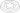

#################
Selector Tutorial
#################

This tutorial provides a step by step guide in using selectors as we create
this part:

.. note::
    One can see any object in the following tutorial by using the ``ocp_vscode`` (or
    any other supported viewer) by using the ``show(object_to_be_viewed)`` command.
    Alternatively, the ``show_all()`` command will display all objects that have been 
    assigned an identifier.

*************
Step 1: Setup
*************

Before getting to the CAD operations, this selector script needs to import the build123d
environment.

.. literalinclude:: selector_example.py
    :start-after: [Code]
    :end-before: [End]
    :lines: 1-2

**********************************
Step 2: Create Base with BuildPart
**********************************

To start off, the part will be based on a cylinder so we'll use the :class:`~objects_part.Cylinder` object
of :class:`~build_part.BuildPart`:

.. literalinclude:: selector_example.py
    :start-after: [Code]
    :end-before: [End]
    :lines: 1-5
    :emphasize-lines: 4-5

***********************************
Step 3: Place Sketch on top of base
***********************************

The next set of features in this design will be created on the top of the cylinder
and be described by a planar sketch (:class:`~build_sketch.BuildSketch` is the tool for drawing on planar
surfaces) , so we'll create a sketch centered on the top of the cylinder.  To locate
this sketch we'll use the cylinder's top Face as shown here:

.. literalinclude:: selector_example.py
    :start-after: [Code]
    :end-before: [End]
    :lines: 1-6
    :emphasize-lines: 6

Here we're using selectors to find that top Face - let's break down
``example.faces().sort_by(Axis.Z)[-1]``:

Step 3a: Extract Faces from a part
----------------------------------

The first sub-step is the extraction of all of the Faces from the part that we're
building. The :class:`~build_part.BuildPart` instance was assigned the identifier ``example`` so
``example.faces()`` will extract all of the Faces from that part into a custom
python ``list`` - a :class:`~topology.ShapeList`.

Step 3b: Get top Face
---------------------

The next sub-step is to sort the ShapeList of Faces by their position with
respect to the Z Axis. The ``sort_by`` method will sort the list by relative position
of the object's center to the ``Axis.Z`` and ``[-1]``
selects the last item on that list - or return the top Face of the ``example`` part.

*************************
Step 4: Create hole shape
*************************

The object has a hexagonal hole in the top with a central cylinder which we'll describe
in the sketch.

.. literalinclude:: selector_example.py
    :start-after: [Code]
    :end-before: [End]
    :lines: 1-8
    :emphasize-lines: 7-8

Step 4a: Draw a hexagon
-----------------------

We'll create a hexagon with the use of :class:`~objects_sketch.RegularPolygon` object with six sides.

Step 4b: Create a hole in the hexagon
-------------------------------------

To create the hole we'll subtract a :class:`~objects_sketch.Circle` from the sketch by using
``mode=Mode.SUBTRACT``. The sketch now described the hexagonal hole that we
want to make in the :class:`~objects_part.Cylinder`.

***********************
Step 5: Create the hole
***********************

To create the hole we'll :func:`~operations_part.extrude` the sketch we just created into
the :class:`~objects_part.Cylinder` and subtract it.

.. literalinclude:: selector_example.py
    :start-after: [Code]
    :end-before: [End]
    :lines: 1-9
    :emphasize-lines: 9

Note that ``amount=-2`` indicates extruding into the part and - just like
with the sketch - ``mode=Mode.SUBTRACT`` instructs the builder to subtract
this hexagonal shape from the part under construction.

At this point the part looks like:

*************************************
Step 6: Fillet the top perimeter Edge
*************************************

The final step is to apply a fillet to the top perimeter.

.. literalinclude:: selector_example.py
    :start-after: [Code]
    :end-before: [End]
    :lines: 1-9,18-24,33-34
    :emphasize-lines: 10-16

Here we're using the :func:`~operations_generic.fillet` operation which needs two things:
the edge(s) to fillet and the radius of the fillet. To provide
the edge, we'll use more selectors as described in the following
sub-steps.

Step 6a: Extract all the Edges
------------------------------

Much like selecting Faces in Step 3a, we'll select all of the ``example``
part's edges with ``example.edges()``.

Step 6b: Filter the Edges for circles
-------------------------------------

Since we know that the edge we're looking for is a circle, we can
filter the edges selected in Step 6a for just those that are of
geometric type ``CIRCLE`` with ``example.edges().filter_by(GeomType.CIRCLE)``.
This step removes all of the Edges of the hexagon hole.

Step 6c: Sort the circles by radius
-----------------------------------

The perimeter are the largest circles - the central cylinder must be
excluded - so we'll sort all of the circles by their radius with:
``example.edges().filter_by(GeomType.CIRCLE).sort_by(SortBy.RADIUS)``.

Step 6d: Slice the list to get the two largest
----------------------------------------------

We know that the ``example`` part has two perimeter circles so we'll
select just the top two edges from the sorted circle list with:
``example.edges().filter_by(GeomType.CIRCLE).sort_by(SortBy.RADIUS)[-2:]``.  The
syntax of this slicing operation is standard python list slicing.

Step 6e: Select the top Edge
----------------------------

The last sub-step is to select the top perimeter edge, the one with
the greatest Z value which we'll do with the ``sort_by(Axis.Z)[-1]`` method just like
Step 3b - note that these methods work on all Shape objects (Edges, Wires,
Faces, Solids, and Compounds) - with:
``example.edges().filter_by(GeomType.CIRCLE).sort_by(SortBy.RADIUS)[-2:].sort_by(Axis.Z)[-1]``.

**********
Conclusion
**********

By using selectors as we have in this example we've used methods
of identifying features that are robust to features changing within
the part. We've also avoided the classic CAD "Topological naming problem"
by never referring to features with names or tags that could become obsolete
as the part changes.

When possible, avoid using static list indices to refer to features
extracted from methods like ``edges()`` as the order within the list
is not guaranteed to remain the same.
