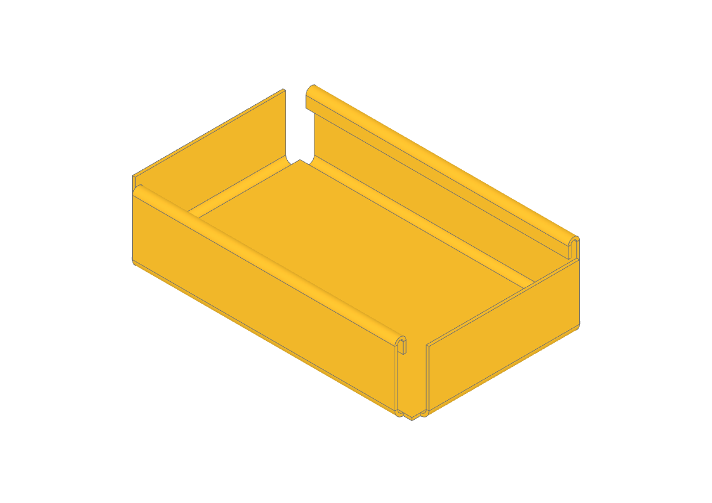

####################
Sheet Metal Tutorial
####################

This tutorial builds a small open-top sheet metal box with hemmed rims,
introducing the ``BuildSheet`` builder and the sheet metal operations
``flange`` and ``hem``.

**********************
Step 1: The base sheet
**********************

Sheet metal parts start from a flat base. Inside ``BuildSheet``, a closed
sketch region becomes a planar face in the builder's reference shell. The
shell is thickened only when the context exits:

.. code-block:: python

    from build123d import *

    with BuildSheet(thickness=1, bend_radius=2) as box:
        with BuildSketch():
            Rectangle(100, 60)

**********************
Step 2: Fold the walls
**********************

``flange`` folds a wall from selected free shell edges. The initial face normal
points in ``+Z`` and a positive angle folds toward that normal. The gaps keep
neighbouring walls from intersecting at the corners:

.. code-block:: python

        flange(
            box.edges().filter_by(GeomType.LINE),
            length=20,
            gaps=3.1,
        )

********************
Step 3: Hem the rims
********************

Raw sheet edges are sharp; a hem folds them back for a safe rim. The two long
walls are the planar reference faces whose normals are parallel to ``Axis.Y``.
The top edge of each is the rim to hem:

.. code-block:: python

        long_walls = box.faces().filter_by(Axis.Y).sort_by(Axis.Y)
        rims = [
            long_walls[0].edges().sort_by(Axis.Z)[-1],
            long_walls[-1].edges().sort_by(Axis.Z)[-1],
        ]
        hem(rims, hem_type=HemType.OPEN, width=6, opening=2)

*****************
The result
*****************

``box.sheet`` is the analytic reference ``Shell`` used for selection and future
unfolding. ``box.part`` is the thickened ``Part`` to export, measure, or combine
with another part. When ``BuildSheet`` is nested in ``BuildPart``, this Part is
published to the parent automatically.
