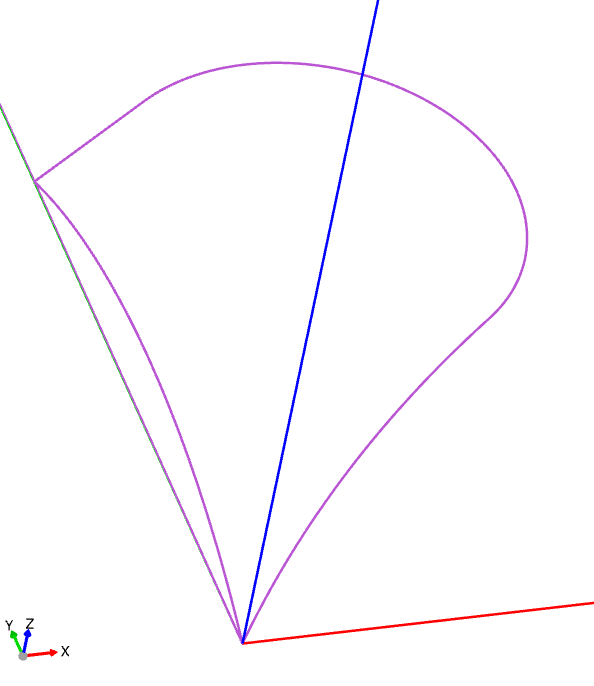
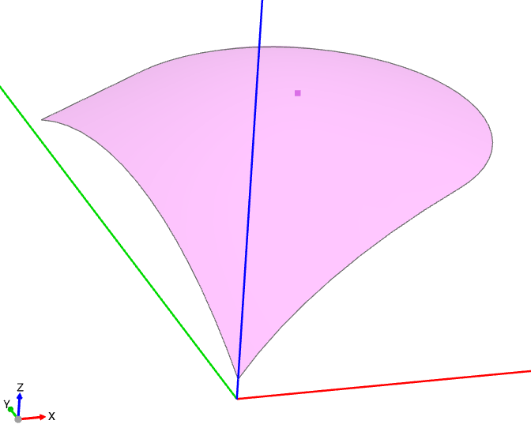
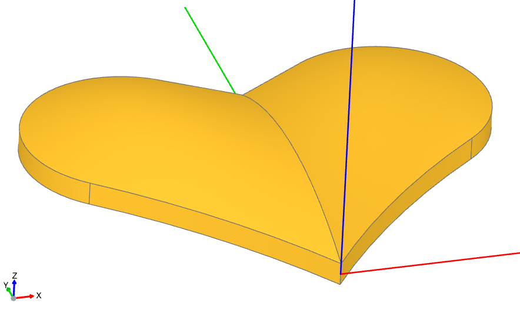

################
Surface Modeling
################

Surface modeling is employed to create objects with non-planar surfaces that can't be 
generated using functions like :func:`~operations_part.extrude`, 
:func:`~operations_generic.sweep`, or :func:`~operations_part.revolve`. Since there are no 
specific builders designed to assist with the creation of non-planar surfaces or objects, 
the following should be considered a more advanced technique.

As described in the `topology_` section, a BREP model consists of vertices, edges, faces, 
and other elements that define the boundary of an object. When creating objects with 
non-planar faces, it is often more convenient to explicitly create the boundary faces of 
the object. To illustrate this process, we will create the following game token:

.. raw:: html

    
    <model-viewer poster="_images/heart_token.png" src="_static/heart_token.glb" alt="Game Token" auto-rotate camera-controls style="width: 100%; height: 50vh;"></model-viewer>

There are several methods of the :class:`~topology.Face` class that can be used to create 
non-planar surfaces:

* :meth:`~topology.Face.make_bezier_surface`,
* :meth:`~topology.Face.make_surface`, and
* :meth:`~topology.Face.make_surface_from_array_of_points`.

In this case, we'll use the ``make_surface`` method, providing it with the edges that define 
the perimeter of the surface and a central point on that surface.

To create the perimeter, we'll use a ``BuildLine`` instance as follows. Since the heart is 
symmetric, we'll only create half of its surface here:

.. code-block:: python

    with BuildLine() as heart_half:
        l1 = JernArc((0, 0), (1, 1.4), 40, -17)
        l2 = JernArc(l1 @ 1, l1 % 1, 4.5, 175)
        l3 = IntersectingLine(l2 @ 1, l2 % 1, other=Edge.make_line((0, 0), (0, 20)))
        l4 = ThreePointArc(l3 @ 1, Vector(0, 0, 1.5) + (l3 @ 1 + l1 @ 0) / 2, l1 @ 0)

Note that ``l4`` is not in the same plane as the other lines; it defines the center line
of the heart and archs up off ``Plane.XY``.

In preparation for creating the surface, we'll define a point on the surface:

.. code-block:: python

    surface_pnt = l2.edge().arc_center + Vector(0, 0, 1.5)

We will then use this point to create a non-planar ``Face``:

.. code-block:: python

    top_right_surface = -Face.make_surface(heart_half.wire(), [surface_pnt]).locate(
        Pos(Z=0.5)
    )

Note that the surface was raised up by 0.5 using the locate method. Also, note that 
the ``-`` in front of ``Face`` simply flips the face normal so that the colored side 
is up, which isn't necessary but helps with viewing.

Now that one half of the top of the heart has been created, the remainder of the top 
and bottom can be created by mirroring:

.. code-block:: python

    top_left_surface = top_right_surface.mirror(Plane.YZ)
    bottom_right_surface = top_right_surface.mirror(Plane.XY)
    bottom_left_surface = -top_left_surface.mirror(Plane.XY)

The sides of the heart are going to be created by extruding the outside of the perimeter 
as follows:

.. code-block:: python

    left_wire = Wire([l3.edge(), l2.edge(), l1.edge()])
    left_side = Face.extrude(left_wire, (0, 0, 1)).locate(Pos(Z=-0.5))
    right_side = left_side.mirror(Plane.YZ)

.. image:: ./assets/token_sides.png
  :align: center
  :alt: token sides

With the top, bottom, and sides, the complete boundary of the object is defined. We can 
now put them together, first into a :class:`~topology.Shell` and then into a 
:class:`~topology.Solid`:

.. code-block:: python

    heart = Solid(
        Shell(
            [
                top_right_surface,
                top_left_surface,
                bottom_right_surface,
                bottom_left_surface,
                left_side,
                right_side,
            ]
        )
    )

.. note::
    When creating a Solid from a Shell, the Shell must be "water-tight," meaning it 
    should have no holes. For objects with complex Edges, it's best practice to reuse 
    Edges in adjoining Faces whenever possible to avoid slight mismatches that can 
    create openings.

Finally, we'll create the frame around the heart as a simple extrusion of a planar 
shape defined by the perimeter of the heart and merge all of the components together:

  .. code-block:: python

    with BuildPart() as heart_token:
        with BuildSketch() as outline:
            with BuildLine():
                add(l1)
                add(l2)
                add(l3)
                Line(l3 @ 1, l1 @ 0)
            make_face()
            mirror(about=Plane.YZ)
            center = outline.sketch
            offset(amount=2, kind=Kind.INTERSECTION)
            add(center, mode=Mode.SUBTRACT)
        extrude(amount=2, both=True)
        add(heart)

Note that an additional planar line is used to close ``l1`` and ``l3`` so a ``Face`` 
can be created. The :func:`~operations_generic.offset` function defines the outside of 
the frame as a constant distance from the heart itself.

Summary
-------

In this tutorial, we've explored surface modeling techniques to create a non-planar 
heart-shaped object using build123d. By utilizing methods from the :class:`~topology.Face`
class, such as :meth:`~topology.Face.make_surface`, we constructed the perimeter and 
central point of the surface. We then assembled the complete boundary of the object 
by creating the top, bottom, and sides, and combined them into a :class:`~topology.Shell` 
and eventually a :class:`~topology.Solid`. Finally, we added a frame around the heart 
using the :func:`~operations_generic.offset` function to maintain a constant distance 
from the heart.